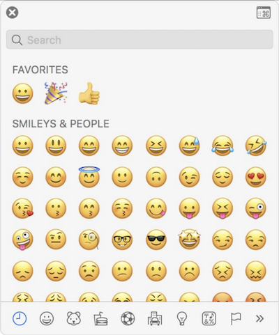

# Лекція 1

## Двійкова система

-   На найнижчому рівні комп'ютер зберігає дані у вигляді двійкової системи, тобто використовуючи цифри 1 і 0. Це також показує, як електрика, яку можна легко ввімкнути або вимкнути, використовується на комп'ютерах.

-   Ми, люди, знаємо, що число нижче означає сто двадцять три.

    ```
    1 2 3
    ```

    -   3 знаходиться у колонці одиниць, 2 — десятків, 1 — сотень.
    -   Тобто 123 — це 100×1 + 10×2 + 1×3 = 100 + 20 + 3 = 123.

-   У двійковій системі лише дві цифри, існує два значення для кожного місця:

    ```
    4 2 1
    0 0 0
    ```

    -   Така сума все ще дорівнюватиме 0.

-   Тепер, якщо ми замінимо бінарне значення на, скажімо, 0 1 1, то десяткове значення дорівнюватиме 3.

    ```
    4 2 1
    0 1 1
    ```

-   За достатньої кількості бітів або двійкових цифр комп'ютери можуть розраховувати набагато більші числа.
-   Для відображення літер все, що потрібно зробити, це вирішити, які числа їм відповідають. Багато років тому було колективно створено стандартну систему їх представлення, яку називали ASCII. Наприклад, літера «А» відповідає 65, а «В» — 66 і так далі.
    -   Байт — це 8 біт, його використовують як одиницю для упорядкування бітів. Наприклад, цифра 72 вписується в один байт.
-   Виходячи зі свого коду, комп'ютерні програми розуміють, як слід трактувати двозначні числа: як цифри, літери або інші види медіа.

## Подання даних

Абстракція — це концепція у комп'ютерних науках, коли рішення нижчого рівня (наприклад, що дані зберігаються в двійковій системі) спрощуються або приймаються як належні, тому ми можемо застосувати їх на вищому рівні (наприклад, відображення літер, які ми можемо потім використати в наших програмах).

-   На стандартній американській клавіатурі на видно літери з діакритичними знаками та багато інших символів

    

-   Аби розв’язати цю проблему, комп'ютери можуть відображати літери за іншими стандартами на додачу до ASCII.
-   Виходить, що обидві літери з діакритичними знаками, як і смайлики, можуть бути представлені кількома байтами зі стандартною назвою Unicode (одна версій якого називається UTF-8)

    

-   Коли ми отримуємо смайлик, наш комп'ютер просто отримує десяткове число, як-от 128514 (11111011000000010 в бінарній системі, якщо ви можете це легко прочитати) яке він потім перетворює на зображення смайлика.

-   Комп'ютер також може використовувати бінарну систему для картинок. Взявши 3 байта, кожен з яких відповідає певній кількості червоного, зеленого та синього, можна передати мільйони кольорів

    

    -   Значення червоного, зеленого та синього поєднують, щоб отримати світло-жовтий колір

        

-   Кожне зображення складається із тисяч чи мільйонів пікселів, кольорових квадратиків, які можна побачити, достатньо збільшивши картинку

    

-   Відео — це багато картинок, які програються одна за одною в певній кількості за секунду.
-   Відео можна розглядати як приклад абстракції картинок, картинки — абстракція пікселів, а ті, в свою чергу, абстракція бітів.
