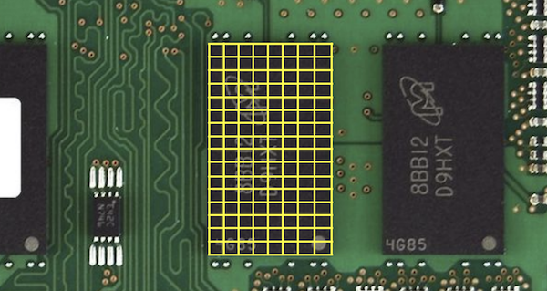
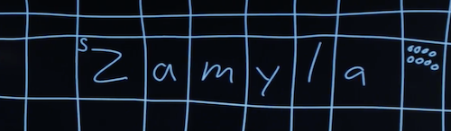

# Лекція 2

## Компіляція вихідного коду у машинний

-   Препроцессінг
-   Компіляція
-   Збирання
-   Компонування

### Препроцессінг

Препроцессінг — складається з перегляду рядків, які починаються з `#`, як-от `#include`, перед тим, як виконувати все інше. Наприклад, `#include <cs50.h>` скаже `clang` знайти спочатку цей заголовковий файл, оскільки там міститься контент, який ми хочемо використати у нашій програмі. Потім, `clang` замінить вміст цих файлів в нашій програмі:

```c
...
string get_string(string prompt);
int printf(const char *format, ...);
...
int main(void)
{
    string name = get_string("Name: ");
    printf("hello, %s\n", name);
}
```

### Компіляція

Компіляція — бере наш вихідний код на С та конвертує на код асемблера, який виглядає ось так:

```
...
main:                 # @main
    .cfi_startproc
# BB#0:
    pushq %rbp
.Ltmp0:
    .cfi_def_cfa_offset 16
.Ltmp1:
    .cfi_offset %rbp, -16
    movq %rsp, %rbp
.Ltmp2:
    .cfi_def_cfa_register %rbp
    subq $16, %rsp
    xorl %eax, %eax
    movl %eax, %edi
    movabsq $.L.str, %rsi
    movb $0, %al
    callq get_string
    movabsq $.L.str.1, %rdi
    movq %rax, -8(%rbp)
    movq -8(%rbp), %rsi
    movb $0, %al
    callq printf
    ...
```

-   Це низькорівневі інструкції, тому краще зрозумілі центральному процессору, і вцілому працюють з байтами, а не з такими абстракціями, як назви змінних.

### Збирання

Збирання — код асемблера перекладається на інструкції у двійковій системі.

### Компонування

Компонування — вміст пов'язаних бібліотек, як `cs50.c`, фактично включаються до нашої програми у двійковому вигляді.

## Пам’ять

-   В середині наших комп'ютерів містяться чіпи RAM, тобто оперативна пам'ять, що зберігає дані для короткочасного використання. Можна зберігати файли на жорсткому диску (або SSD) для довготривалого зберігання, але коли ми його відкриємо та будемо вносити зміни, все копіюється до RAM. Попри те, що обсяг RAM значно менший та вона є тимчасовою (поки не буде вимкнене живлення), вона значно швидша.
-   Можна розглядати байти, які зберігаються в RAM, у вигляді сітки:

    

    -   Насправді там розташовані мільйони або навіть мільярди байтів на кожному чіпі.

-   У мові програмування С коли ми створюєму змінну типу `char` розміром в один байт, вона буде фізично збережена в одній із таких комірок у RAM. Ціле число на чотири байти займе чотири таких комірки.

## Масиви

-   У пам’яті ми можемо зберігати змінні послідовно, одна за одною. І в мові програмування С список збережених змінних, які розташовуються у суміжних комірках пам'яті, називається масивом.
-   За допомогою масивів ми можемо зібрати результати в циклі, а потім одержати до них доступ, також в циклі:
-   Передавши весь масив `scores` та кількість результатів `count` які ми хочемо вивести, ми можемо використати функцію `chart` для ітерування крізь масив `scores`.
-   Ми можемо за допомогою функції `chart` вивести всі результати, а не по одному стовпчику за раз:

```c
// Generates a bar chart of three scores using an array

#include <cs50.h>
#include <stdio.h>

void chart(int score);

int main(void)
{
    // Get scores from user
    int scores[3];

    for (int i = 0; i < 3; i++)
    {
        scores[i] = get_int("Score %i: ", i + 1);
    }

    // Chart scores
    chart(3, scores);
}

// Generate bars
void chart(int count, int scores[])
{
    // Output one hash per point
    for (int i = 0; i < count; i++)
    {
        for (int j = 0; j < scores[i]; j++)
        {
            printf("#");
        }

        printf("\n");
    }
}
```

-   Зверніть увагу, що ми застосовуємо `int scores[3]` для ініціалізації масиву з трьома цілими числами. Потім ми використовуємо `scores[i] = ...`, щоб зберегти значення в цьому масиві, використовуючи для цього індекс i від 0 до 2 (оскільки в нас три елементи).
-   Після цього ми використовуємо `scores[i]` для доступу до усіх значень в масиві за кожним індексом.
-   У нас повторюється число 3 кілька разів, тому ми можемо виокремити його у константу, тобто число, яке ми можемо один раз задати й використовувати глобально:

```c
// Generates a bar chart of three scores using an array

#include <cs50.h>
#include <stdio.h>

const int COUNT = 3;

void chart(int score);

int main(void)
{
    // Get scores from user
    int scores[3];

    for (int i = 0; i < COUNT; i++)
    {
        scores[i] = get_int("Score %i: ", i + 1);
    }

    // Chart scores
    chart(COUNT, scores);
}
```

-   На початку ми використовуємо ключове слово `const` щоб визначити, що це незмінне значення. Його можна використовувати по всьому коду, і якщо ми захочемо щось змінити, достатньо змінити лише один раз. Врешті, назва `COUNT` написана великими літерами, щоб показати, що це константа (за домовленістю).

## Рядки

Рядки — це насправді просто масиви символів. Це можна побачити у string0.c:

```c
#include <cs50.h>
#include <stdio.h>
#include <string.h>

int main(void)
{
    string s = get_string("Input: ");

    printf("Output: ");

    for (int i = 0; i < strlen(s); i++)
    {
        printf("%c\n", s[i]);
    }
}
```

-   Спочатку нам знадобиться нова бібліотека, `string.h`, для `strlen`, що показує нам довжину рядка. Далі ми використовуємо той же синтаксис для доступу до елементів масиву, `s[i]`, аби вести окремі символи рядка `s`.

-   Ми можемо покращити дизайн нашої програми. string0 була не надто ефективна, оскільки перевіряємо довжину рядка після введення кожного символу, в нашій умові. Проте оскільки довжина рядка не змінюється, то ми можемо перевіряти її лише один раз:

```c
#include <cs50.h>
#include <stdio.h>
#include <string.h>

int main(void)
{
    string s = get_string("Input: ");

    printf("Output:\n");

    for (int i = 0, n = strlen(s); i < n; i++)
    {
        printf("%c\n", s[i]);
    }
}
```

-   Зараз, на початку нашого циклу, ми ініціалізуємо дві змінні `i` та `n` та записуємо довжину рядка у `n`. Далі ми можемо щоразу перевіряти значення без вираховування довжини рядка.
-   `n` буде доступна виключно в межах циклу `for` хоча ми можемо ініціалізувати її і поза ним, якщо нам потрібно буде її повторне використання.

-   Коли рядок зберігається у пам'яті, кожен символ розміщується в одному байті в таблиці байтів. Десь, наприклад, слово `Zamyla` збережено у 6 байтах. Але нам потрібен ще один байт, для позначення кінця рядка.

      

    -   Байт пам'яті, де збережено перший символ рядка, `Z`, позначено як `s`, оскільки ми назвали наш рядок `s` у коді вище. Далі, після останнього символу, `a`, ми маємо один байт з усіма `0` для позначення кінця рядку. І байт з усіма `0` називається нульовим символом, який можна також позначати як `\0`.

-   Якби ми хотіли написати власну версію `strlen`, наприклад, то нам треба знати наступне:

```c
#include <cs50.h>
#include <stdio.h>

int main(void)
{
    // Prompt for user's name
    string s = get_string("Name: ");

    // Count number of characters up until '\0' (aka NUL)
    int n = 0;

    while (s[n] != '\0')
    {
        n++;
    }

    printf("%i\n", n);
}
```

-   Тут ми перебираємо кожен символ рядка `s`, використовуючи той же синтаксис, що й для доступу до елементів масивів, і ми інкрементуємо лічильник, `n`, поки символ не дорівнюватиме нульовому символу, `\0`. Якщо він дорівнює, значить, ми в кінці рядка й можемо вивести значення `n`.

-   Оскільки ми знаємо, що кожен символ має числове, ASCII значення, то можна вивести й таке:

```c
#include <cs50.h>
#include <stdio.h>
#include <string.h>

int main(void)
{
    string s = get_string("String: ");

    for (int i = 0; i < strlen(s); i++)
    {
        int c = (int) s[i];
        printf("%c %i\n", s[i], c);
    }
}
```

-   За допомогою `(int) s[i]`, ми беремо значення `s[i]` та перетворюємо символьний тип на цілочисельний. Після цього ми можемо вивести як символи, так і їхні числові значення.
-   Технічно ми навіть можемо зробити `printf("%c %i\n", s[i], s[i]);`, а `printf` розпізнає значення `s[i]` як ціле число.
-   Тепер ми можемо поєднати те, що ми розглянули, аби створити програму, яка замінює маленькі літери на великі:

```c
#include <cs50.h>
#include <stdio.h>
#include <string.h>

int main(void)
{
    string s = get_string("Before: ");

    printf("After: ");

    for (int i = 0, n = strlen(s); i < n; i++)
    {
        if (s[i] >= 'a' && s[i] <= 'z')
        {
            printf("%c", s[i] - ('a' - 'A'));
        }
        else
        {
            printf("%c", s[i]);
        }
    }
    printf("\n");
}
```

-   Спочатку ми отримуємо рядок `s`. Тоді, для кожного символу в рядку, якщо він в нижньому регістрі (його значення знаходиться між `a` та `z`), ми конвертуємо його на велику літеру. В іншому випадку, ми його просто виводимо.
-   Ми можемо перетворити малі літери у великі шляхом віднімання різниці між малою `a` та великою `A`. (Ми знаємо, що у малих літер більші значення, тому можна відняти різницю між ними та перетворити малі літери на великі.)
-   Також є функції з бібліотек, які ми можемо використати для досягнення того ж ефекту:

```c
#include <cs50.h>
#include <ctype.h>
#include <stdio.h>
#include <string.h>

int main(void)
{
    string s = get_string("Before: ");

    printf("After: ");

    for (int i = 0, n = strlen(s); i < n; i++)
    {
        if (islower(s[i]))
        {
            printf("%c", toupper(s[i]));
        }
        else
        {
            printf("%c", s[i]);
        }
    }

    printf("\n");
}
```

-   Можна використати функції `islower()` та `toupper()` з бібліотеки `ctype`. (Про це можна довідатись виключно з документації до бібліотеки, яку інші люди написали задовго до нас).

-   Ми можемо використовувати програму командного рядка, `man`, щоб прочитати інструкцію з використання інших програм, якщо така існує. Наприклад, ми можемо запустити `man toupper` для перегляду документації для цієї функції. Ми побачимо, що `toupper` повертає символ таким, яким він є, якщо він не написаний маленькими літерами, тож отримаємо:

```c
for (int i = 0, n = strlen(s); i < n; i++)
{
    printf("%c", toupper(s[i]));
}
```

## Аргументи командного рядка

-   Ми використовували такі програми як `make` та `clang`, які приймають додаткові слова після своєї назви в командному рядку. Але насправді, наші програми також можуть приймати аргументи командного рядка.

-   У `argv0.c`, ми змінюємо вигляд нашої функції `main`:

```c
#include <cs50.h>
#include <stdio.h>

int main(int argc, string argv[])
{
    if (argc == 2)
    {
        printf("hello, %s\n", argv[1]);
    }
    else
    {
        printf("hello, world\n");
    }
}
```

-   `argc` та `argv` — це дві змінні, які одержить функція `main` коли ми запустимо нашу програму з командного рядка. `argc` — це лічильник аргументів, тобто їх кількість, а `argv` — масив рядків, що є аргументами. Найперший аргумент, `argv[0]`, буде назвою нашої програми (найперше надруковане слово, наприклад, `./hello`). У цьому прикладі ми перевіримо, чи маємо ми два аргументи, і, якщо так, виведемо другий.

-   Ми також можемо вивести кожен символ кожного аргументу:

```c
#include <cs50.h>
#include <stdio.h>
#include <string.h>

int main(int argc, string argv[])
{
    for (int i = 0; i < argc; i++)
    {
        for (int j = 0, n = strlen(argv[i]); j < n; j++)
        {
            printf("%c\n", argv[i][j]);
        }

        printf("\n");
    }
}
```

-   За допомогою `argv[i]`, ми отримуємо поточний аргумент із масиву аргументів, а з `argv[i][j]`, символ з цього рядка.

## Шифрування

-   Якби ми хотіли надіслати комусь повідомлення, ми б, можливо, захотіли його зашифрувати, тобто певним чином змінити повідомлення, щоб іншим було важко його прочитати. Оригінальний текст тоді ми назвемо звичайний текст, а текст після шифрування — зашифрований текст.
-   Таке повідомлення, як `HI`! може бути перетворене в ASCII, `72 73 33`. Проте, кожен може з легкістю виконати цю дію і в зворотному порядку.
-   Розглянемо приклади шифрів з історії, починаючи ще з Першої світової війни, до поеми про поїздку Пола Рівера.
-   Загалом шифрування потребує не тільки самого тексту на вхід, а й додаткової інформації. Потрібен ключ, іноді це просто секретне число. Відкритий текст може бути зашифрований та розшифрований за допомогою ключа за певним алгоритмом.
-   Наприклад, якщо ми хочемо надіслати текст `I L O V E Y O U`, ми спочатку можемо його перетворити на ASCII: `73 76 79 86 69 89 79 85`. Тоді, ми можемо зашифрувати його ключем `1` простим алгоритмом, де ми лише додаємо ключ до значення кожного елемента: `74 77 80 87 70 90 80 86`. Після цього, якщо хтось перетворить ASCII назад в текст, то отримає `J M P W F Z P V`. Для розшифровки потрібно буде здогадатися значення кожної букви, методом спроб та поразок, але напевне знати без ключа неможливо. Цей алгоритм відомий під назвою **шифр Цезаря**.

## Коди виходу

-   Виявляється, що ми можемо вказувати на помилки в нашій програмі, повертаючи значення з функції main:

```c
#include <cs50.h>
#include <stdio.h>

int main(int argc, string argv[])
{
    if (argc != 2)
    {
        printf("missing command-line argument\n");
        return 1;
    }

    printf("hello, %s\n", argv[1]);

    return 0;
}
```

-   Значення, що повертається `main` в нашій програмі, називається кодом виходу, і ми можемо це побачити в командному рядку. Якщо ми запустимо нашу програму через `./exit`, можемо потім набрати `echo $?`, яка виведе повернене останньою програмою значення.
-   Коли ми почнемо писати складніші програми, то такі коди виходу допоможуть нам вчасно зрозуміти, що пішло не так, навіть якщо вони невидимі або незрозумілі для користувача.
