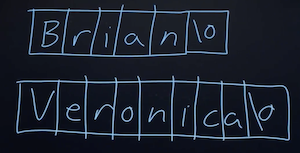
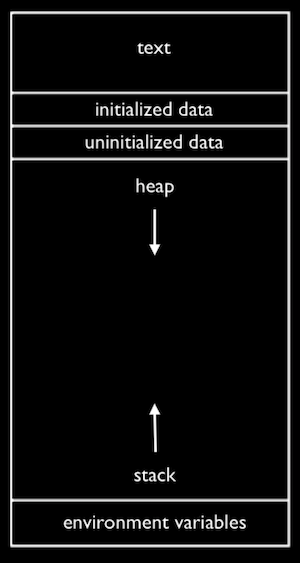
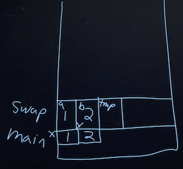

# Лекція 3

## Рядки

-   До цього ми використовували так корисні функції з бібліотеки CS50, як `get_int` чи `get_string`, щоб отримати вхідні дані певного типу від користувача. Ці функції загалом непросто написати, тому що ми хочемо запитувати користувачів знову і знову, якщо їхні вхідні дані не є допустимими.

-   Сьогодні ми розглянемо тип `string`. Як ми вже дізналися, рядок — це просто масив символів, розташованих послідовно. Але давайте дізнаємося, що ж таке насправді змінна `string`.

-   Відкриємо `compare0.c`:

```c
#include <cs50.h>
#include <stdio.h>

int main(void)
{
    // Get two integers
    int i = get_int("i: ");
    int j = get_int("j: ");

    // Compare integers
    if (i == j)
    {
        printf("same\n");
    }
    else
    {
        printf("different\n");
    }
}
```

-   Як і можна було очікувати, якщо ми введемо однакові значення для `i` та `j`, то побачимо, що вони однакові.

-   У `compare1.c`, спробуємо виконати те ж саме, але вже з рядками:

```c
#include <cs50.h>
#include <stdio.h>

int main(void)
{
    // Get two strings
    string s = get_string("s: ");
    string t = get_string("t: ");

    if (s == t)
    {
        printf("same\n");
    }
    else
    {
        printf("different\n");
    }
}
```

-   Виявляється, кожний байт у пам'яті має числове розташування або ж адресу. Наприклад, символ `B` може мати адресу 100, а `V` може опинитися у 900 (це залежить від того, які частини пам'яті були доступні, тобто вільні):

-   Пам'ятайте, що рядки — просто масив символів, тому коли ми виконуємо програму `compare1`, то вхідними даними користувача будуть два рядки, які у пам'яті можуть зберігатися ось так:



-   Кожний символ — один байт; і десь у нашій пам'яті зберігаються байти, які містять значення для кожного рядка.

-   Виявляється, кожний байт у пам'яті має числове розташування або ж адресу. Наприклад, символ `B` може мати адресу 100, а `V` може опинитися у 900 (це залежить від того, які частини пам'яті були доступні, тобто вільні):


-   Зауважте, що оскільки кожен рядок — масив символів, то усі символи в межах певного рядка мають послідовні адреси, оскільки вони зберігаються поряд у пам'яті. Проте власне рядки можуть мати адреси, які дуже сильно відрізняються.

-   Отже, `get_string` насправді повертає лише адресу першого символу в рядку. (Ми можемо сказати, де він закінчується, поглянувши на символ `null`, або `\0`). Тепер ми можемо зробити висновок, що порівняння двох «рядків» насправді порівнює дві адреси (які завжди будуть відрізнятися, оскільки `get_string` зберігає вхідні дані щоразу у новому місці), навіть якщо символи, що зберігаються за цими адресами, однакові.

-   Інші типи даних у С, як `int` чи `float`, зазвичай передаються і зберігаються у вигляді їхніх значень, оскільки вони завжди представлені фіксованим числом байтів. А рядки, на противагу, передаються у вигляді власних адрес, оскільки вони можуть бути дуже довгими.

-   Якщо ми хочемо порівняти два рядки, то, здається, нам потрібно порівнювати кожний символ окремо:

```c
#include <cs50.h>
#include <stdio.h>
#include <string.h>

bool compare_strings(string a, string b);

int main(void)
{
    // Get two strings
    string s = get_string("s: ");
    string t = get_string("t: ");

    // Compare strings for equality
    if (compare_strings(s, t))
    {
        printf("same\n");
    }
    else
    {
        printf("different\n");
    }
}

bool compare_strings(string a, string b)
{
    // Compare strings' lengths
    if (strlen(a) != strlen(b))
    {
        return false;
    }

    // Compare strings character by character
    for (int i = 0, n = strlen(a); i < n; i++)
    {
        // Different
        if (a[i] != b[i])
        {
            return false;
        }
    }

    // Same
    return true;
}
```

-   Ми пишемо функцію під назвою `compare_strings`, яка приймає два рядки як аргументи та повертає `bool`, тобто булевий вираз.

-   Спершу ми порівнюємо довжину двох рядків і робимо `return false` якщо вони не однакові. Після цього ми можемо перевірити кожен символ і робимо `return false` якщо ми дійдемо до пари символів, які не збігаються.

-   Ми також повинні не забути додати вгору прототип `bool compare_strings(string a, string b);`.

-   `string` — синонім до `char *`. `*` у С означає, що типом даних є адреса. Таким чином `char *` — адреса для `char`. Більш формально такий тип змінної називається вказівник.

-   Тепер ми можемо замінити `char *` там, де ми використовували `string`:

```c
#include <cs50.h>
#include <stdio.h>
#include <string.h>

bool compare_strings(char *a, char *b);

int main(void)
{
    // Get two strings
    char *s = get_string("s: ");
    char *t = get_string("t: ");

    // Compare strings for equality
    if (compare_strings(s, t))
    {
        printf("same\n");
    }
    else
    {
        printf("different\n");
    }
}

bool compare_strings(char *a, char *b)
{
    // Compare strings' lengths
    if (strlen(a) != strlen(b))
    {
        return false;
    }

    // Compare strings character by character
    for (int i = 0, n = strlen(a); i < n; i++)
    {
        // Different
        if (a[i] != b[i])
        {
            return false;
        }
    }

    // Same
    return true;
}
```

-   Виявляється, що у `string.h` включена бібліотечна функція під назвою `strcmp`, написана іншими багато років тому, що порівнює два рядки:

```c
#include <cs50.h>
#include <stdio.h>
#include <string.h>

int main(void)
{
    // Get two strings
    char *s = get_string("s: ");
    char *t = get_string("t: ");

    // Compare strings for equality
    if (strcmp(s, t) == 0)
    {
        printf("same\n");
    }
    else
    {
        printf("different\n");
    }
}
```

-   Значення, що повертає `strcmp`, на основі документації на кшталт CS50 Reference, буде `0` якщо рядки рівні, або інші значення, якщо вони відрізняються.

-   Ми також повинні проводити перевірку на помилки, на які ми раніше не звертали увагу.

-   `get_string` повинна повертати адресу до першого байту рядка, але іноді вона може повертати `NULL`, недійсну адресу, яка позначає, що щось пішло не так. (І ця адреса має значення `0`, спеціальна адреса, що не використовується для зберігання жодних даних).

-   Для перевірки наявності помилок ми можемо зробити таке:

```c
#include <cs50.h>
#include <stdio.h>
#include <string.h>

int main(void)
{
    // Get a string
    char *s = get_string("s: ");
    if (s == NULL)
    {
        return 1;
    }

    // Get another string
    char *t = get_string("t: ");
    if (t == NULL)
    {
        return 1;
    }

    // Compare strings for equality
    if (strcmp(s, t) == 0)
    {
        printf("same\n");
    }
    else
    {
        printf("different\n");
    }
    return 0;
}
```

-   Якщо з якоїсь причини `get_string` не повертає дійсну адресу, ми власноруч повернемо код виходу `1`, щоб указати, що відбулася помилка. Якщо ми продовжимо, то можливо відбудеться помилка сегментації, ми намагалися отримати доступ до пам'яті, до якої доступу не маємо (наприклад, до адреси `NULL`).

-   Ми можемо спростити умову до просто `if (!s)`, оскільки «не `s`» буде «не `0`», коли s — це `NULL`, що врешті вираховується у `true`.

```c
int main(void)
{
    // Get a string
    char *s = get_string("s: ");
    if (!s)
    {
        return 1;
    }

    // Get another string
    char *t = get_string("t: ");
    if (!t)
    {
        return 1;
    }

    // Compare strings for equality
    if (strcmp(s, t) == 0)
    {
        printf("same\n");
    }
    else
    {
        printf("different\n");
    }
    return 0;
}
```

-   Тепер давайте спробуємо скопіювати рядок:

```c
#include <cs50.h>
#include <ctype.h>
#include <stdio.h>
#include <string.h>

int main(void)
{
    // Get a string
    string s = get_string("s: ");

    // Copy string's address
    string t = s;

    // Capitalize first letter in string
    if (strlen(t) > 0)
    {
        t[0] = toupper(t[0]);
    }

    // Print string twice
    printf("s: %s\n", s);
    printf("t: %s\n", t);
}
```

-   Ми беремо рядок `s`, копіюємо значення `s` у `t`. Після цього ми замінюємо великою першу літеру у рядку `t`.

-   Проте коли ми запускаємо нашу програму, то бачимо, що і `s`, і `t` тепер починаються з великих літер.

-   Оскільки ми надали однакового значення `s` і `t`, то вони стали покажчиками одного й того ж символу, тому ми замінили великими літерами один і той самий символ:


-   Для того, щоб насправді скопіювати рядок, попрацювати доведеться більше:

```c
#include <cs50.h>
#include <ctype.h>
#include <stdio.h>
#include <string.h>

int main(void)
{
    // Get a string
    char *s = get_string("s: ");
    if (!s)
    {
        return 1;
    }

    // Allocate memory for another string
    char *t = malloc((strlen(s) + 1) * sizeof(char));
    if (!t)
    {
        return 1;
    }

    // Copy string into memory
    for (int i = 0, n = strlen(s); i <= n; i++)
    {
        t[i] = s[i];
    }

    // Capitalize first letter in copy
    if (strlen(t) > 0)
    {
        t[0] = toupper(t[0]);
    }

    // Print strings
    printf("s: %s\n", s);
    printf("t: %s\n", t);

    // Free memory
    free(t);
    return 0;
}
```

-   Ми створюємо нову змінну `t` типу `char *` за допомогою `char *t`. Тепер ми хочемо, щоб вона вказувала на новий блок пам'яті, що є достатньо великим для збереження копії рядка. За допомогою `malloc`, ми можемо виділити певну кількість байтів у пам'яті (яка ще не використовується для збереження інших даних), і ми передаємо ту кількість байтів, яку хочемо. Ми вже знаємо довжину `s`, тому ми додаємо `1` до термінального нуль-символу і множимо отримане на `sizeof(char)` (в результаті чого ми отримуємо кількість байтів для кожного окремого символу) для того, щоб запевнитися, що ми маємо достатньо пам'яті. Отже, наш остаточний рядок коду виглядає наступним чином `char *t = malloc((strlen(s) + 1) * sizeof(char));`.

-   Тепер ми копіюємо кожний символ окремо, тому тепер ми можемо замінити великою літерою лише першу літеру рядка `t`. Ми використовуємо `i <= n`, оскільки хочемо піднятися до однієї останньої `n`, щоб запевнитися, що ми копіюємо термінальний символ у рядку. Врешті-решт, після завершення попередніх дій, ми викликаємо `free(t)`, яка сигналізує нашому комп'ютеру, що ці байти більш не використовуються програмою, тому ці байти у пам'яті можуть бути знову використані.

-   Витік пам'яті відбувається, коли ми виділяємо все більше і більше пам'яті для використання, проте не звільняємо її. В результаті наш комп'ютер починає працювати все повільніше і повільніше (оскільки він повинен компенсувати скорочення вільної пам'яті).

-   Давайте поглянемо, чому можуть виникати труднощі з отриманням вхідних даних від користувача:

```c
#include <stdio.h>

int main(void)
{
    int x;
    printf("x: ");
    scanf("%i", &x);
    printf("x: %i\n", x);
}
```

-   `scanf` — функція, що отримує вхідні дані від користувача відповідно до певного формату. Ми передаємо `%i` на позначення того, що ми очікуємо на ціле число, `&x` ми використовуємо для отримання адреси `x`, тобто `scanf` може розмістити значення у правильному місці пам'яті.

-   Давайте тепер спробуємо отримати рядок:

```c
#include <stdio.h>

int main(void)
{
    char *s;
    printf("s: ");
    scanf("%s", s);
    printf("s: %s\n", s);
}
```

-   Оскільки ми не виділили пам'яті для байтів рядка, `scanf` не має місця для збереження вхідних даних.

-   Ми можемо виділити певну кількість байтів у вигляді масиву символів:

```c
int main(void)
{
    char s[5];
    printf("s: ");
    scanf("%s", s);
    printf("s: %s\n", s);
}
```

-   Тепер у нас є 5 байтів, в яких ми можемо зберігати вхідні дані.

-   Зауважте, що ми можемо передавати `s` як адресу, оскільки масиви можуть розглядатися як вказівники на перший елемент масиву.

-   Але якщо ми хочемо ввести значно довший рядок, врешті-решт відбудеться «помилка сегментації», за якої ми намагаємося отримати доступ до пам'яті, до якої доступу не маємо або не повинні мати. Виявляється, що `scanf` не знає скільки пам'яті виділено, отже, вона продовжує запис до пам'яті, починаючи з адреси `s`, такого об'єму вхідних даних, який був введений, навіть якщо було виділено менший об'єм пам'яті. `get_string` вирішує для нас цю проблему і виділяє достатній об'єм пам'яті.

## Пам'ять

-   Щоб пов'язати все зазначене вище, пригадайте, що у комп'ютерах є фізичні мікросхеми для оперативної пам'яті (RAM), що зберігають усі наявні байти. Кожен байт має окрему адресу. Це ми можемо побачити за допомогою `addresses.c`:

```c
#include <cs50.h>
#include <stdio.h>

int main(void)
{
    // Get two strings
    string s = get_string("s: ");
    string t = get_string("t: ");

    // Print strings' addresses
    printf("s: %p\n", s);
    printf("t: %p\n", t);
}
```

-   У цьому випадку ми кажемо `printf` розглядати `s` та `t` як вказівники за допомогою `%p`, тому ми бачимо такі адреси, як `0x2331010` і `0x2331050`.

-   Значення надзвичайно великі (тому що у пам'яті багато комірок) і вони зазвичай записуються у шістнадцятковій системі числення. Як двійкова і десяткова системи числення, шістнадцяткова — це спосіб представлення чисел: в ній є 16 можливих значень для однієї цифри, 0-9 і A-F. (Просто так сталося, що адреси для `s` і `t` не мали абеткових символів). Значення у шістнадцятковій системі зазвичай починається з `0x`, для позначення системи числення.

-   Раніше ми бачили значення `0x0` у дебаггері для змінної `name`, а потім інше значення після вводу рядка, що і було адресою нашого рядка.

-   Ми можемо подивитися на приклад переведення трьох байтів з десяткової системи у двійкову та у шістнядцяткову:

```
      255          216          255
1111 1111    1101 1000    1111 1111
   f    f       d    8       f    f
```

-   Оскільки кожна цифра у шістнадцятковій системі має 16 можливих значень, що перетворюються на 4 двійкових цифри, кожний байт може бути виражений як дві шістнадцяткові цифри `0xff` і `0xd8`. Чотири 1 у двійковій — це 16 у десятковій і `f` у шістнадцятковій системі.

-   Припустимо, що тепер ми хочемо обміняти значення двох цілих чисел.

```c
void swap(int a, int b)
{
    int tmp = a;
    a = b;
    b = tmp;
}
```

-   Ми можемо виконати цю задачу дуже просто, якщо матимемо третю змінну як тимчасовий простір для зберігання.

-   Проте якщо ми спробуємо застосувати цю функцію у програмі, то не побачимо жодних змін:

```c
#include <stdio.h>

void swap(int a, int b);

int main(void)
{
    int x = 1;
    int y = 2;

    printf("x is %i, y is %i\n", x, y); // x is 1, y is 2
    swap(x, y);
    printf("x is %i, y is %i\n", x, y); // x is 1, y is 2
}

void swap(int a, int b)
{
    int tmp = a;
    a = b;
    b = tmp;
}
```

-   Виявляється, що функція `swap` отримує свої власні змінні: `a` і `b`, коли вони передаються, що є копіями `x` та `y`, таким чином зміна їх значень не змінює `x` та `y` у функції `main`.

-   Наша функція `swap` може працювати шляхом передачі адрес `x` та `y`:

```c
#include <stdio.h>

void swap(int *a, int *b);

int main(void)
{
    int x = 1;
    int y = 2;

    printf("x is %i, y is %i\n", x, y);
    swap(&x, &y);
    printf("x is %i, y is %i\n", x, y);
}

void swap(int *a, int *b)
{
    int tmp = *a;
    *a = *b;
    *b = tmp;
}
```

-   Адреси `x` та `y` передаються з `main` до `swap`, а ми використовуємо синтаксис `*a`, щоб перейти за вказівником та отримати значення, що там зберігається. Ми зберігаємо це до `tmp`, а потім ми беремо значення за адресою `b` та зберігаємо його як значення за адресою `a`. Врешті, ми зберігаємо значення `tmp` як значення за адресою `b`, на чому і завершуємо.

## Розподіл пам'яті

-   Всередині пам'яті комп'ютера різні типи даних, які повинні зберігатися для роботи нашої програми, організовані у різних областях:



-   Область `text` — скомпільований двійковий код нашої програми. Коли ми запускаємо програму, то цей код завантажується у верхній частині пам'яті.

-   `heap` — відкритий простір, в якому `malloc` може отримати вільну пам'ять для використання нашою програмою.

-   Область `stack` використовується функціями нашої програми, коли вони викликаються. Наприклад, функція `main` знаходиться внизу стека та має змінні `x` та `y`. Функція `swap` коли її викликають, займає певну кількість пам'яті зверху над `main`, зі змінними `a`, `b`, та `tmp`:



-   Щойно функція `swap` поверне значення, пам'ять, яку вона використовувала, звільнюється для наступного виклику функцій; і ми втрачаємо все, що робили, окрім поверненого значення.

-   Отже, шляхом передачі адрес `x` та `y` з `main` до `swap`, ми насправді можемо змінити значення `x` та `y`.

-   Глобальні змінні розташовані в областях ініціалізованих та неініціалізованих даних, а змінні середовища з командного рядка також зберігаються у відповідній області.

-   Давайте поглянемо на частину коду з помилками:

```c
int main(void)
{
    int *x;
    int *y;

    x = malloc(sizeof(int));

    *x = 42;
    *y = 13;

    y = x;

    *y = 13;
}
```

-   Тут ми оголошуэмо два вказівники з назвами `x` та `y`. Ми виділяємо пам'ять для цілого числа для `x`, проте не для `y`. Отже, спроба зберегти значення `13` до `*y` може призвести до помилки сегментації.

-   Ви можете скористатись веб-сайтом StackOverflow, сайт з питаннями та відповідями, який часто використовують для знаходження відповідей на питання з програмування. Тепер ми розуміємо, що назва сайту походить від відсилки до переповнення стеку або ж викликів завеликої кількості функцій, які не можуть вміститися у пам'яті нашого комп'ютера.

## Структури

-   Ми можемо створювати змінні нашого власного типу за допомогою концепції під назвою структури — struct.

-   Наприклад, якщо ми хочемо зберегти й імена, і гуртожитки кожного окремого студента, то можемо зробити масиви для кожного:

```c
#include <cs50.h>
#include <stdio.h>

int main(void)
{
    // Space for students
    int enrollment = get_int("Enrollment: ");
    string names[enrollment];
    string dorms[enrollment];

    // Prompt for students' names and dorms
    for (int i = 0; i < enrollment; i++)
    {
        names[i] = get_string("Name: ");
        dorms[i] = get_string("Dorm: ");
    }

    // Print students' names and dorms
    for (int i = 0; i < enrollment; i++)
    {
        printf("%s is in %s.\n", names[i], dorms[i]);
    }
}
```

-   Проте, можливо, надалі ми захочемо додати інші фрагменти даних, тому треба запевнитися, що усі масиви мають правильну довжину і дані для однієї особи знаходяться за одним і тим же індексом та ін. Натомість, ми можемо використати структури у файлі `struct.h`, який містить:

```c
typedef struct
{
    char *name;
    char *dorm;
}
student;
```

-   І файл `struct.c`, який містить:

```c
#include <cs50.h>
#include <stdio.h>

#include "struct.h"

int main(void)
{
    // Space for students
    int enrollment = get_int("Enrollment: ");
    student students[enrollment];

    // Prompt for students' names and dorms
    for (int i = 0; i < enrollment; i++)
    {
        students[i].name = get_string("Name: ");
        students[i].dorm = get_string("Dorm: ");
    }

    // Print students' names and dorms
    for (int i = 0; i < enrollment; i++)
    {
        printf("%s is in %s.\n", students[i].name, students[i].dorm);
    }
}
```

-   Тепер student — наш власний тип змінної, що містить в собі дві змінні: `name` та `dorm`, до яких ми зможемо пізніше отримати доступ за допомогою `.name` і `.dorm`.

-   Ми навіть можемо відкривати і зберігати файли за допомогою фрагментів коду, на кшталт:

```c
FILE *file = fopen("students.csv", "w");
if (file)
{
    for (int i = 0; i < enrollment; i++)
    {
        fprintf(file, "%s,%s\n", students[i].name, students[i].dorm);
    }
    fclose(file);
}
```

-   Це лише короткий огляд того, що ми будемо розглядати у домашньому завданні!
