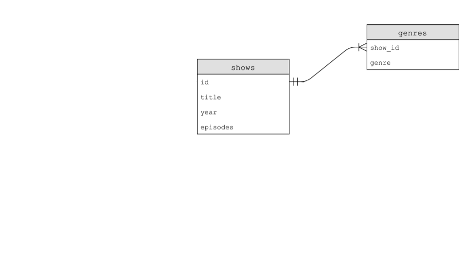

# Лекція 7

## База даних плоских файлів

- Як ви, ймовірно, бачили раніше, дані часто можна описати шаблонами стовпців і таблиць.

- Електронні таблиці, створені в Microsoft Excel і Google Таблицях, можна виводити у файл `csv` або файл зі значеннями, розділеними комами.

- Якщо ви подивіться на файл `csv`, ви помітите, що файл плоский, оскільки всі наші дані зберігаються в одній таблиці, представленій текстовим файлом. Ми називаємо цю форму даних плоскою базою даних.

- Python постачається з вбудованою підтримкою файлів `csv`.

- У вікні терміналу введіть код `favorites.py` і запишіть наступний код:

```py
# Prints all favorites in CSV using csv.reader

import csv

# Open CSV file
with open("favorites.csv", "r") as file:

    # Create reader
    reader = csv.reader(file)

    # Skip header row
    next(reader)

    # Iterate over CSV file, printing each favorite
    for row in reader:
        print(row[1])
```

Зверніть увагу, що бібліотеку `csv` імпортовано. Крім того, ми створили `reader`, який зберігатиме результат `csv.reader(file)`. Функція `csv.reader` читає кожен рядок із файлу, і в нашому коді ми зберігаємо результати в `reader`. `print(row[1]`), отже, надрукує мову з файлу `favorites.csv`.

- Ви можете покращити свій код наступним чином:

```py
# Stores favorite in a variable

import csv

# Open CSV file
with open("favorites.csv", "r") as file:

    # Create reader
    reader = csv.reader(file)

    # Skip header row
    next(reader)

    # Iterate over CSV file, printing each favorite
    for row in reader:
        favorite = row[1]
        print(favorite)
```

Зверніть увагу, що `favorite` зберігається, а потім друкується. Також зауважте, що ми використовуємо функцію `next` для переходу до наступного рядка нашого читача.

- Python також дозволяє індексувати за ключами списку. Змініть свій код наступним чином:

```py
with open("favorites.csv", "r") as file:

    # Create DictReader
    reader = csv.DictReader(file)

    # Iterate over CSV file, printing each favorite
    for row in reader:
        print(row["language"])
```

Зверніть увагу, що в цьому прикладі безпосередньо використовується ключ `language` в операторі друку.

- Щоб підрахувати кількість улюблених мов, виражених у файлі 'csv', ми можемо зробити наступне:

```py
# Counts favorites using variables

import csv

# Open CSV file
with open("favorites.csv", "r") as file:

    # Create DictReader
    reader = csv.DictReader(file)

    # Counts
    scratch, c, python = 0, 0, 0

    # Iterate over CSV file, counting favorites
    for row in reader:
        favorite = row["language"]
        if favorite == "Scratch":
            scratch += 1
        elif favorite == "C":
            c += 1
        elif favorite == "Python":
            python += 1

# Print counts
print(f"Scratch: {scratch}")
print(f"C: {c}")
print(f"Python: {python}")
```

Зверніть увагу, що кожна мова підраховується за допомогою операторів if.

- Python дозволяє нам використовувати словник для підрахунку кількості кожною мовою. Розгляньте наступне вдосконалення нашого коду:

```py
# Counts favorites using dictionary

import csv

# Open CSV file
with open("favorites.csv", "r") as file:

    # Create DictReader
    reader = csv.DictReader(file)

    # Counts
    counts = {}

    # Iterate over CSV file, counting favorites
    for row in reader:
        favorite = row["language"]
        if favorite in counts:
            counts[favorite] += 1
        else:
            counts[favorite] = 1

# Print counts
for favorite in counts:
    print(f"{favorite}: {counts[favorite]}")
```

Зауважте, що значення в `counts` із ключем `favorite` збільшується, якщо воно вже існує. Якщо його не існує, ми визначаємо `counts[favorite]` і встановлюємо йому значення 1. Крім того, відформатований рядок було вдосконалено, щоб представити `counts[favorite]`.

- Python також дозволяє сортувати `counts`. Покращуйте свій код наступним чином:

```py
# Sorts favorites by key

import csv

# Open CSV file
with open("favorites.csv", "r") as file:

    # Create DictReader
    reader = csv.DictReader(file)

    # Counts
    counts = {}

    # Iterate over CSV file, counting favorites
    for row in reader:
        favorite = row["language"]
        if favorite in counts:
            counts[favorite] += 1
        else:
            counts[favorite] = 1

# Print counts
for favorite in sorted(counts):
    print(f"{favorite}: {counts[favorite]}")
```

Зверніть увагу на `sorted(counts)` внизу коду.

- Якщо ви подивитеся на параметри функції `sorted` в документації Python, ви побачите, що вона має багато вбудованих параметрів. Ви можете використовувати деякі з цих вбудованих параметрів таким чином:

```py
# Sorts favorites by value

import csv

# Open CSV file
with open("favorites.csv", "r") as file:

    # Create DictReader
    reader = csv.DictReader(file)

    # Counts
    counts = {}

    # Iterate over CSV file, counting favorites
    for row in reader:
        favorite = row["language"]
        if favorite in counts:
            counts[favorite] += 1
        else:
            counts[favorite] = 1

def get_value(language):
    return counts[language]

# Print counts
for favorite in sorted(counts, key=get_value, reverse=True):
    print(f"{favorite}: {counts[favorite]}")
```

Зауважте, що створюється функція під назвою `get_value`, а сама функція передається як аргумент для `sorted` функції. `key` аргумент дозволяє вам вказати Python метод, який ви бажаєте використовувати для сортування елементів.

- Python має унікальну здатність, якої ми не бачили досі: вона дозволяє використовувати анонімні або лямбда-функції. Ці функції можна використовувати, коли ви не хочете створювати зовсім іншу функцію. Зверніть увагу на такі зміни:

```py
# Sorts favorites by value using lambda function

import csv

# Open CSV file
with open("favorites.csv", "r") as file:

    # Create DictReader
    reader = csv.DictReader(file)

    # Counts
    counts = {}

    # Iterate over CSV file, counting favorites
    for row in reader:
        favorite = row["language"]
        if favorite in counts:
            counts[favorite] += 1
        else:
            counts[favorite] = 1

# Print counts
for favorite in sorted(counts, key=lambda language: counts[language], reverse=True):
    print(f"{favorite}: {counts[favorite]}")
```

Зверніть увагу, що функцію `get_value` видалено. Натомість `lambda language: counts[language]` робить в одному рядку те, що робила наша попередня дворядкова функція.

- Ми можемо змінити стовпець, який розглядаємо, зосередившись замість цього на нашій улюбленій проблемі:

```py
# Favorite problem instead of favorite language

import csv

# Open CSV file
with open("favorites.csv", "r") as file:

    # Create DictReader
    reader = csv.DictReader(file)

    # Counts
    counts = {}

    # Iterate over CSV file, counting favorites
    for row in reader:
        favorite = row["problem"]
        if favorite in counts:
            counts[favorite] += 1
        else:
            counts[favorite] = 1

# Print counts
for favorite in sorted(counts, key=lambda problem: counts[problem], reverse=True):
    print(f"{favorite}: {counts[favorite]}")
```

Зверніть увагу, що `problem` замінила `language`.

- Що, якби ми хотіли дозволити користувачам вводити дані безпосередньо в терміналі? Ми можемо змінити наш код, використовуючи наші попередні знання про введення користувача:

```py
# Favorite problem instead of favorite language

import csv

# Open CSV file
with open("favorites.csv", "r") as file:

    # Create DictReader
    reader = csv.DictReader(file)

    # Counts
    counts = {}

    # Iterate over CSV file, counting favorites
    for row in reader:
        favorite = row["problem"]
        if favorite in counts:
            counts[favorite] += 1
        else:
            counts[favorite] = 1

# Print count
favorite = input("Favorite: ")
if favorite in counts:
    print(f"{favorite}: {counts[favorite]}")
```

Зверніть увагу, наскільки компактний наш код порівняно з нашим досвідом роботи з C.

## Реляційні бази даних

- Google, Twitter і Meta використовують реляційні бази даних для зберігання інформації в масштабі.

- Реляційні бази даних зберігають дані в рядках і стовпцях у структурах, які називаються таблицями.

- SQL допускає чотири типи команд:

```
Create
Read
Update
Delete
```

- Ці чотири операції називають CRUD.

- Ми можемо створити базу даних SQL на терміналі, ввівши `sqlite3 favorites.db`. Коли буде запропоновано, ми погодимося створити `favorites.db`, натиснувши `y`.

- Ви помітите іншу підказку, оскільки ми зараз перебуваємо всередині програми під назвою `sqlite3`.

- Ми можемо перевести `sqlite3` у режим `csv`, ввівши `.mode csv`. Потім ми можемо імпортувати наші дані з файлу `csv`, ввівши `.import favorites.csv favorites`. Здається, нічого не сталося!

- Ми можемо ввести `.schema`, щоб побачити структуру бази даних.

- Ви можете прочитати елементи з таблиці за допомогою синтаксису `SELECT columns FROM table`.

- Наприклад, ви можете ввести `SELECT * FROM favorites`; який буде повторювати кожен рядок у вибраному.

- Ви можете отримати підмножину даних за допомогою команди `SELECT language FROM favorites;`.

- SQL підтримує багато команд для доступу до даних, у тому числі:

```
AVG
COUNT
DISTINCT
LOWER
MAX
MIN
UPPER
```

- Наприклад, ви можете ввести `SELECT COUNT(language) FROM favorites;`. Крім того, ви можете ввести `SELECT DISTINCT(language) FROM favorites;` щоб отримати список окремих мов у базі даних. Ви навіть можете ввести `SELECT COUNT(DISTINCT(language)) FROM favorites;` щоб підрахувати їх.

```py
# Searches database popularity of a problem

import csv

from cs50 import SQL

# Open database
db = SQL("sqlite:///favorites.db")

# Prompt user for favorite
favorite = input("Favorite: ")

# Search for title
rows = db.execute("SELECT COUNT(*) FROM favorites WHERE problem LIKE ?", "%" + favorite + "%")

# Get first (and only) row
row = rows[0]

# Print popularity
print(row["COUNT(*)"])
```

- SQL пропонує додаткові команди, які ми можемо використовувати в наших запитах:

```sql
WHERE       -- adding a Boolean expression to filter our data
LIKE        -- filtering responses more loosely
ORDER BY    -- ordering responses
LIMIT       -- limiting the number of responses
GROUP BY    -- grouping responses together
```

Зверніть увагу, що ми використовуємо `--` для написання коментаря в SQL.

- Наприклад, ми можемо виконати` SELECT COUNT(*) FROM favorites WHERE language = 'C';`. Порахувавши кількість повторювань.

- Так само ми можемо виконати `SELECT language, COUNT(*) FROM favorites GROUP BY language;`. Це запропонує тимчасову таблицю, яка покаже мову та кількість.

- Ми могли б покращити це, набравши `SELECT language, COUNT(*) FROM favorites GROUP BY language ORDER BY COUNT(*);`. Це впорядкує отриману таблицю за кількістю.

- Ми також можемо `INSERT` у базу даних SQL, використовуючи форму `INSERT INTO table (column...) VALUES(value, ...);`.

- Ми також можемо використати команду `UPDATE` для оновлення ваших даних.

- Наприклад, ви можете виконати `UPDATE favorites SET language = 'C++' WHERE language = 'C';`. Це призведе до перезапису всіх попередніх операторів, де С була улюбленою мовою програмування.

- Зауважте, що ці запити мають величезну силу. Відповідно, у реальних умовах вам слід враховувати, хто має дозволи на виконання певних команд.

- `DELETE` дозволяє видалити частину ваших даних. Наприклад, ви можете `DELETE FROM favorites WHERE problem = 'Tideman';`.

## IMDb

- IMDb пропонує базу даних людей, шоу, сценаристів, зірок, жанрів і рейтингів. Кожна з цих таблиць пов'язана одна з одною таким чином:


- Після завантаження `shows.db` ви можете запустити `sqlite3 shows.db` у вікні терміналу.

- Після виконання `.schema` ви знайдете не лише кожну з таблиць, але й окремі поля всередині кожного з цих полів.

- Як ви можете бачити на зображенні вище, `shows` має поле `id`. У таблиці `genres` є поле `show_id`, яке містить дані, спільні для неї та таблиці `shows`.

- Як ви також можете бачити на зображенні вище, `show_id` існує в усіх таблицях. У таблиці `shows` це просто називається `id`. Це спільне поле між усіма полями називається ключем. Первинні ключі використовуються для ідентифікації унікального запису в таблиці. Зовнішні ключі використовуються для побудови зв'язків між таблицями шляхом вказівки на первинний ключ в іншій таблиці.

- Зберігаючи дані в реляційній базі даних, як зазначено вище, дані можуть зберігатися більш ефективно.

- У `sqlite` ми маємо п'ять типів даних, зокрема:

```sql
BLOB       -- binary large objects that are groups of ones and zeros
INTEGER    -- an integer
NUMERIC    -- for numbers that are formatted specially like dates
REAL       -- like a float
TEXT       -- for strings and the like
```

- Крім того, стовпці можна встановити для додавання спеціальних обмежень:

```
NOT NULL
UNIQUE
```

- Щоб додатково проілюструвати зв'язок між цими таблицями, ми можемо виконати таку команду: `SELECT * FROM people LIMIT 10;`. Вивчивши результат, ми можемо виконати `SELECT * FROM shows LIMIT 10;`. Крім того, ми могли б виконати `SELECT * FROM stars LIMIT 10;`. `show_id` є зовнішнім ключем у цьому останньому запиті, оскільки `show_id` відповідає унікальному полю `id` в шоу. `person_id` відповідає унікальному полю `id` в стовпці `people`.

- Ми можемо далі попрацювати з цими даними, щоб зрозуміти ці зв'язки. Виконайте` SELECT * FROM genres;`. Жанрів дуже багато!

- Ми можемо додатково обмежити ці дані, виконавши `SELECT * FROM genres WHERE genre = 'Comedy' LIMIT 10;`. З цього запиту ви можете побачити, що представлено 10 шоу.

- Ви можете дізнатися, що це за шоу, виконавши `SELECT * FROM шоу WHERE id = 626124;`.

- Ми можемо зробити наш запит більш ефективним, виконавши його

```sql
SELECT title
FROM shows
WHERE id IN (
    SELECT show_id
    FROM genres
    WHERE genre = 'Comedy'
)
LIMIT 10;
```

Зверніть увагу, що цей запит об'єднує два запити. Внутрішній запит використовується зовнішнім запитом.

- Ми можемо вдосконалити далі, виконавши

```sql
SELECT title
FROM shows
WHERE id IN (
    SELECT show_id
    FROM genres
    WHERE genre = 'Comedy'
)
ORDER BY title LIMIT 10;
```

Що, якби ви хотіли знайти всі шоу, в яких знімається Стів Карелл? Ви можете виконати `SELECT * FROM people WHERE name = 'Steve Carell';` Ви знайдете його особистий ідентифікатор. Ви можете використати цей ідентифікатор, щоб знайти багато шоу, у яких він з’являється. Однак спробувати це по одному було б утомливо. Як ми можемо виконати наші запити, щоб зробити це більш раціональним? Зверніть увагу на наступне:

````sql
SELECT title FROM shows WHERE id IN
  (SELECT show_id FROM stars WHERE person_id =
    (SELECT * FROM people WHERE name = 'Steve Carell'));
    ```
````

Зверніть увагу, що цей довгий запит призведе до кінцевого результату, який буде корисним для виявлення відповіді на наше запитання.

## `JOIN`s

- Розглянемо наступні дві таблиці:



- Як ми можемо тимчасово об’єднати таблиці? Таблиці можна об’єднати за допомогою команди `JOIN`.

- Виконайте таку команду:

```sql
SELECT * FROM shows
  JOIN ratings on shows.id = ratings.show_id
  WHERE title = 'The Office';
```

- Тепер ви можете переглянути всі шоу, які називаються «Офіс».

- Ви також можете застосувати `JOIN` до нашого запиту Steve Carell вище, виконавши наступне:

```sql
SELECT title FROM people
  JOIN stars ON people.id = stars.person_id
  JOIN shows ON stars.show_id = shows.id
  WHERE name = `Steve Carell`;
```

Зверніть увагу, як кожна команда `JOIN` повідомляє нам, які стовпці вирівнюються з іншими стовпцями.

- Це можна аналогічно реалізувати наступним чином:

```sql
SELECT title FROM people, stars, shows
WHERE people.id = stars.person_id
AND stars.show_id = shows.id
AND name = 'Steve Carell';
```

Зауважте, що це дає ті самі результати.

- Оператор підстановки `%` можна використовувати для пошуку всіх людей, імена яких починаються на `Steve C`, можна використати синтаксис` SELECT * FROM people WHERE name LIKE 'Steve C%';`.

## Індекси

- Хоча реляційні бази даних можуть бути швидшими та надійнішими, ніж використання файлу `csv`, дані можна оптимізувати в таблиці за допомогою індексів.

- Індекси можна використовувати для прискорення наших запитів.

- Ми можемо відстежувати швидкість наших запитів, виконавши `.timer у sqlite3`.

- Щоб зрозуміти, як індекси можуть пришвидшити наші запити, виконайте наступне: `SELECT * FROM показує WHERE title = 'The Office';` Зверніть увагу на час, який відображається після виконання запиту.

- Потім ми можемо створити індекс із синтаксисом `CREATE INDEX title_index on shows (title);`. Це вказує `sqlite3` створити індекс і виконати деяку спеціальну приховану оптимізацію, пов'язану з цим заголовком стовпця.

- Це створить структуру даних під назвою B Tree, структуру даних, схожу на бінарне дерево. Однак, на відміну від бінарного дерева, дочірніх нотаток може бути більше двох.


- Виконання запиту `SELECT * FROM shows WHERE title = 'The Office';`, ви помітите, що запит виконується набагато швидше!

- На жаль, індексація всіх стовпців призведе до використання додаткового місця для зберігання. Тому є компроміс для підвищення швидкості.

## Стан перегонів

- Використання SQL іноді може призвести до деяких проблем.
- Ви можете уявити собі випадок, коли кілька користувачів можуть мати доступ до однієї бази даних і виконувати команди одночасно.
- Це може призвести до збоїв, коли код переривається діями інших людей. Це може призвести до втрати даних.
- Вбудовані функції SQL, такі як `BEGIN TRANSACTION`, `COMMIT` і `ROLLBACK`, допомагають уникнути деяких із цих проблем з перегонами.

## Атаки ін'єкції SQL

- Однією з проблем, яка може виникнути в реальних програмах SQL, є те, що називається ін'єкційною атакою. Ін'єкційна атака — це ситуація, коли зловмисник може ввести шкідливий код SQL.

- Наприклад, розглянемо такий екран входу:


- Без належного захисту в нашому власному коді зловмисник може запустити шкідливий код. Зверніть увагу на наступне:

```py
rows = db.execute("SELECT COUNT(*) FROM favorites WHERE problem LIKE?", "%" + favorite + "%")
```

Зверніть увагу на те, що `?` на місці, перевірку можна запустити на `favorite`, перш ніж він буде сліпо прийнятий запитом.

- Ви ніколи не хочете використовувати відформатовані рядки в запитах, як описано вище, або сліпо довіряти введеним користувачами.
- Використовуючи бібліотеку CS50, бібліотека дезінфікує та видаляє будь-які потенційно шкідливі символи.
