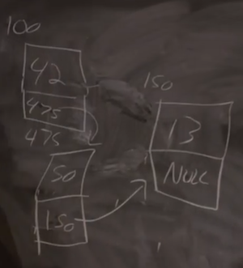
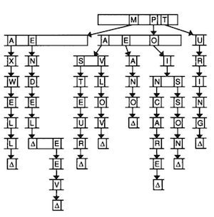

# Лекція 4

## Структури даних

- Створимо файл під назвою `struct.h`:

```c
typedef struct
{
    char *name;
    char *dorm;
}
student;
```

- Це приклад заголовного файлу, який ми можемо використовувати між різними `.c` файлами.

- До функції `struct0.c`, імпортуємо заголовний файл:

```c
#include <cs50.h>
#include <stdio.h>
#include <string.h>

#include "struct.h"

int main(void)
{
    // Allocate space for students
    int enrollment = get_int("Enrollment: ");
    student students[enrollment];

    // Prompt for students' names and dorms
    for (int i = 0; i < enrollment; i++)
    {
        students[i].name = get_string("Name: ");
        students[i].dorm = get_string("Dorm: ");
    }

    // Print students' names and dorms
    for (int i = 0; i < enrollment; i++)
    {
        printf("%s is in %s.\n", students[i].name, students[i].dorm);
    }
}
```

- Зауважте, що зараз ми маємо тип `student` та масив під назвою `students` зі структурою даних цього типу.
- Потім ми можемо отримувати доступ до кожної змінної всередині структури даних `student` за допомогою нотації `.`.
- Тип `student` — це ніби абстракція, в якій ми інкапсулюємо кілька змінних разом.

## Зв'язані списки

- До цього моменту, масиви повинні були мати фіксований розмір під час ініціалізації. Якщо б ми хотіли щось додати до нашого масиву, ми б повинні були ініціалізувати більший за розміром масив та скопіювати значення з початкового масиву. Але час виконання зміни розміру масиву на разі є `O(n)`, де `n` — це розмір початкового масиву.

- Ми можемо використати функцію `realloc`, яка перерозподіляє пам'ять. Ми можемо передати їй адресу комірки пам'яті та кількість пам'яті, яка нам потрібна, і операційна система поверне нову адресу, в якій ми матимемо потрібну кількість безперервної пам'яті. Ця функція також виконує копіювання масиву даних до нової області у пам'яті. Але цей процес матиме також лінійний час виконання залежно від того, наскільки великим за розміром є масив даних.

- Також ми можемо діяти навпаки та робити запит на достатню кількість пам'яті для одного елементу, наприклад, для одного цілого числа, за раз. Але ці числа та елементи можуть зберігатися будь-де в купі (`heap`), тому потрібен спосіб, який допоможе з'єднати кожен елемент з наступним, через збережений вказівник.

- У цій структурі даних, яку називають зв'язаним списком, втрачається можливість довільного доступу до елементів масиву. Наприклад, ми більше не можемо звертатися до 5 елемента у списку, кожного разу обчислюючи його місце знаходження за сталий час. (Оскільки ми знаємо, що масиви зберігають свої елементи один за одним, ми можемо додати 1 чи 4 або ж розмір елемента, щоб вирахувати адресу пам'яті). Замість цього, ми повинні слідувати за кожним елементом по черзі.

- Таким чином ми створюємо зв'язний список, виділяючи для кожного елемента достатньо пам'яті для власне значення, а також вказівника до наступного елемента. Назвемо це вузлами (`nodes`):



- Ми маємо три вузли у різних адресах пам'яті, `100`, `150`, та `475`. Кожен вузол має певне значення, яке ми хочемо зберегти, а також вказівник до наступного вузла. Кінцевий вузол має вказівник `NULL`, який вказує на закінчення нашого зв'язаного списку.

- В коді ми можемо створити нашу власну структуру даних під назвою `node`, з `int` та вказівником наступного `node` (вузла) під назвою `next`:

```c
typedef struct node
{
    int n;
    struct node *next;
}
node;
```

- Ми починаємо структуру з `typedef struct node`, щоб можна було звертатися до `node` всередині структури.

- Давайте подивимось це на прикладі. Для початку, ми можемо зберегти фіксовану кількість цілих чисел в масиві:

```c
#include <cs50.h>
#include <stdio.h>

int main(void)
{
    // Prompt for number of numbers
    int capacity;
    do
    {
        capacity = get_int("Capacity: ");
    }
    while (capacity < 1);

    // Memory for numbers
    int numbers[capacity];

    // Prompt for numbers
    int size = 0;
    while (size < capacity)
    {
        // Prompt for number
        int number = get_int("Number: ");

        // Add to list
        numbers[size] = number;
        size++;
    }

    // Print numbers
    for (int i = 0; i < size; i++)
    {
        printf("%i\n", numbers[i]);
    }
}
```

- Ми отримуємо `capacity` від користувача та створюємо масив місткості `capacity`. Потім ми додаємо числа до масиву, аж поки ми не досягнемо межі місткості. Після цього, ми виводимо кожне число у масиву.

- Але програма обмежена значенням місткості, яке було обрано спочатку.

- Ми можемо динамічно змінювати розмір масиву:

```c
#include <cs50.h>
#include <stdio.h>

int main(void)
{
    // Memory for numbers
    int *numbers = NULL;
    int capacity = 0;

    // Prompt for numbers (until EOF)
    int size = 0;
    while (true)
    {
        // Prompt for number
        int number = get_int("Number: ");

        // Check for EOF
        if (number == INT_MAX)
        {
            break;
        }

        // Check whether enough space for number
        if (size == capacity)
        {
            // Allocate space for number
            int *tmp = realloc(numbers, sizeof(int) * (size + 1));
            if (!tmp)
            {
                if (numbers)
                {
                    free(numbers);
                }
                return 1;
            }
            numbers = tmp;
            capacity++;
        }

        // Add number to list
        numbers[size] = number;
        size++;
    }

    // Print numbers
    printf("\n");
    for (int i = 0; i < size; i++)
    {
        printf("%i\n", numbers[i]);
    }

    // Free memory
    if (numbers)
    {
        free(numbers);
    }
}
```

- Ми отримуємо одне число за раз.
- Спершу ми ініціалізуємо покажчик під назвою `numbers`, але не одразу. Ми відстежуємо місткість масиву `capacity`, а також його розмір `size`.
- Після цього ми отримуємо одне число за раз від користувача. `get_int` поверне `INT_MAX` якщо вказати індикатор EOF (end of file), який означає кінець вводу даних (control + d в терміналі), тож якщо це відбувається, ми можемо вийти з циклу за допомогою `break`.
- Якщо ми досягли межі місткості capacity масиву `numbers`, ми використовуємо функцію `realloc` щоб виділити місце для додаткового цілого числа в масиві. Ми перевіряємо, що функція `realloc` повернула вказівник, який не є `null`, а якщо ні, викликаємо функцію `free` для `numbers` щоб звільнити пам'ять від масиву, якщо у нас є такий, та повернути значення 1 `return 1`. Якщо навпаки є достатньо місця, ми можемо додавати нове число до масиву.
- Нарешті ми можемо вивести кожне число в масиві та звільнити пам'ять від нього. Якщо це не зробити, то `valgrind ./list1` покаже нам помилку.

- А тепер давайте напишемо таку ж програму з використанням зв'язаних списків:

```c
#include <cs50.h>
#include <stdio.h>

typedef struct node
{
    int number;
    struct node *next;
}
node;

int main(void)
{
    // Memory for numbers
    node *numbers = NULL;

    // Prompt for numbers (until EOF)
    while (true)
    {
        // Prompt for number
        int number = get_int("number: ");

        // Check for EOF
        if (number == INT_MAX)
        {
            break;
        }

        // Allocate space for number
        node *n = malloc(sizeof(node));
        if (!n)
        {
            return 1;
        }

        // Add number to list
        n->number = number;
        n->next = NULL;
        if (numbers)
        {
            for (node *ptr = numbers; ptr != NULL; ptr = ptr->next)
            {
                if (ptr->next == NULL)
                {
                    ptr->next = n;
                    break;
                }
            }
        }
        else
        {
            numbers = n;
        }
    }

    // Print numbers
    printf("\n");
    for (node *ptr = numbers; ptr != NULL; ptr = ptr->next)
    {
        printf("%i\n", ptr->number);
    }

    // Free memory
    node *ptr = numbers;
    while (ptr != NULL)
    {
        node *next = ptr->next;
        free(ptr);
        ptr = next;
    }
}
```

- Початок програми майже однаковий, хоча ми визначаємо node (вузол) в верхній частині програми.
- Тепер ми виділяємо достатньо пам'яті для нового вузла та вказуємо на нього вказівником `n`. Якби `n` було `NULL` після виклику функції `malloc`, тоді ми виходимо з помилкою. За допомогою синтаксису `->` ми йдемо за вказівником, щоб отримати змінну в структурі даних, таким чином ми зберігаємо нове число у вузлі, на який вказує `n`, разом зі значенням `NULL` для вказівника `next`. (Якби `n` був вузлом, а не вказівником, ми б використали синтаксис `n.number`).
- Всередині циклу, якщо `ptr` не має вказівника `next` (наприклад, якщо це останній вузол в зв'язному списку), ми задаємо вказівнику `next` значення `n` та виходимо з циклу. В іншому випадку, наш цикл продовжиться, тимчасовий вказівник `ptr` стане `ptr->next`, тобто ми будемо дивитись на наступний вузол.
- Якщо ж ми не маємо чинного вказівника `numbers` ми можемо надати йому значення `n`, тобто початок нашого нового списку.
- Врешті-решт, ми виводимо числа, проходячи по зв'язаному списку таким же чином, а також звільняємо кожен вузол, слідуючи за його вказівником `next`.

## Ще більше структур даних

- Якщо б ми мали невпорядкований масив або зв'язаний список, який зберігає імена, нам потрібно було б продивитися кожне значення по одному.
- Люди можуть робити менші зв'язані списки, де кожна людина, ім'я якої починається з «A» буде в одному списку, з «B» в іншому списку і так далі. Ми можемо представити цю ідею за допомогою хеш-таблиці, де кожне збережене значення є хешованим за допомогою хеш-функції. Отриманий хеш може бути числом, а в даному випадку може мати `0` для рядка, який починається з `A`, `1` для рядка, який починається з `B`, і так далі, але важливим є те, що ми можемо використати це число для того, щоб створити індекси у будь-якому масиві. В свою чергу, масив матиме зв'язаний список для кожної літери алфавіту (в ширшому сенсі - зв'язаний список для кожного кошика), тому цей вид структури даних називається хеш-таблицею.
- В такому випадку, кожен зв'яазний список (в нашому прикладі рядків) в середньому складатиме 1/26 розміру всього списку з усіма рядками. В гіршому випадку, всі рядки опиняться в одному кошику (якщо вони будуть починатися з однієї літери) та час виконання буде дорівнювати `O(n)`, як у випадку з невпорядкованим масивом. Ми можемо використати іншу хеш-функція, яка, можливо, допоможе розподілити елементи масиву рівномірніше. Але на практиці, час виконання, ймовірно, буде нижчий з використанням хеш-таблиці, в нас може бути більше кошиків в таблиці, що робить список пропорційно ще меншим.

### Дерева

- Дерево — ще один вид структур даних, в якому кожен вузол вказує на два інші, один зліва (з меншим значенням), а інший справа (з більшим значенням)


- Тепер ми можемо легко виконати двійковий пошук, і оскільки кожен вузол вказує на інший, ми можемо додавати вузли до деревоподібної структури без їх переміщення, яке б знадобилось в масиві. Рекурсивний пошук по такій деревоподібній структурі матиме подібний вигляд:

```c
typedef struct node
{
    int n;
    struct node *left;
    struct node *right;
} node;

bool search(int n, node *tree)
{
    if (tree == NULL)
    {
        return false;
    }

    if (n < tree->n)
    {
        return search(n, tree->left);
    }

    if (n > tree->n)
    {
        return search(n, tree->right);
    }

    return true;
}
```

- Також ми можемо використовувати іншу структуру даних, яка називається префіксне дерево (trie — вимовляється як англійське слово “try” та є скороченням від слова “retrieval”):



- Уявіть, що ми хочемо зберегти словник та мати сталий час доступу до кожного слова. Префіксне дерево схоже на попередню структуру даних, але різниця полягає в тому, що в такій структурі кожен вузол є масивом. Кожен масив матиме кожну літеру, A-Z. Для кожного слова, перша літера вказує на масив, де наступна правильна для цього слова літера буде вказувати на інший масив, і так далі, доки ми не досягнемо чогось, що вказує на кінець нашого слова. Якщо слова немає в структурі даних, в такому випадку один з масивів не матиме вказівника чи кінцевого символу для нашого слова.
