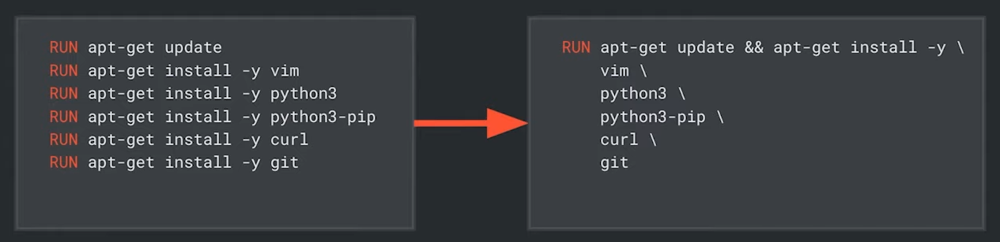

# Docker

У світі розробки програмного забезпечення можуть виникати проблеми через різноманітність конфігурацій робочого середовища. Щоб уникнути цього хаосу, ми звертаємося до Docker — інструмента для контейнеризації, який дозволяє створювати ізольовані середовища для розробки та деплою, забезпечуючи однаковість середовища для всіх учасників проєкту.

## Основні переваги Docker

- Вирішення залежностей — ізолює середовище, усуваючи ризик конфліктів у версіях і пакетах.
- Доставка «у коробці» — забезпечує консистентність між розробкою та виробництвом.
- Ізольованість від інших програм — гарантує, що ваше програмне забезпечення не впливає на інші застосунки.
- Стандартизація — уніфікує середовище розробки для всієї команди.
- Відтворюваність — забезпечує легкість відтворення середовища на різних машинах.
- Відкат — дозволяє швидко відновлювати попередні версії середовища.

## Віртуальна машина і Docker

Хоча Docker схожий на віртуальну машину, вони використовують різні підходи.

- Віртуальна машина — запускає віртуальний комп'ютер з власною операційною системою, вимагаючи багато ресурсів.
- Docker — створює ізольовані контейнери на поточній системі, економлячи місце та ресурси.

<figure>
    
    <figcaption>Різниця між віртуальною машиною і докером</figcaption>
</figure>

## Основні сутності Docker

- Image (образ) — файлова система, що містить інструкції для створення контейнера.
- Image Layers (шари образу) — розділяють образ на компоненти, що спрощує оновлення.
- Daemon (демон) — фоновий процес, що керує Docker об'єктами.
- Client (клієнт) — інтерфейс для взаємодії з демоном.
- Container (контейнер) — запущений процес в ізольованому середовищі з образу.
- Host (хост) — комп'ютер, на якому встановлено Docker.
- Registry (репозиторій) — сервер для зберігання образів.

## Dockerfile

Створення файлу `Dockerfile` — перший крок для налаштування Docker.

```dockerfile
# Базовий образ з Python 3.
FROM python:3

# Копіювання поточного каталогу в контейнер.
COPY . /usr/src/app

# Визначення робочого каталогу у контейнері.
WORKDIR /usr/src/app

# Встановлення залежностей.
RUN pip install -r requirements.txt

# Команди для виконання при запуску контейнера.
CMD ["python3", "manage.py", "runserver", "0.0.0.0:8000"]
```

## Docker Compose

Файл `docker-compose.yml` визначає конфігурацію для декількох контейнерів:

```yaml
# Встановлення версії 3 Docker Compose.
version: "3"

# Опис двох служби.
services:
  # Налаштування контейнера для бази даних
  db:
    # на основі образу, написаного Postgres.
    image: postgres

  # Налаштування контейнера веб-сервера.
  web:
    # Використовувати Docker File у поточному каталозі.
    build: .
    # Використовувати вказаний шлях всередині контейнера.
    volumes:
      - .:/usr/src/app
    ports:
      # Зв'язати порт 8000 у контейнері з портом 8000 на нашому комп'ютері.
      - "8000:8000"
```

## Команди та практики

- docker-compose up --build -V — запуск проекту.
- docker compose up — запуск контейнера.
- docker compose down — зупинка контейнера.
- docker system prune -a — видаляє всі ресурси Docker.

Для використання команд в нашому контейнері Docker (наприклад, щоб додати записи бази даних або запустити тести). Виконаємо `docker ps`, щоб показати всі запущені контейнери Docker. Знайдемо `CONTAINER ID` контейнеру, до якого хочемо увійти, та запустимо `docker exec -it CONTAINER_ID bash -l`. Це перемістить нас усередину каталогу `usr/src/app` який ми налаштували в нашому контейнері. Можемо виконати будь-які команди всередині цього контейнера, а потім вийти, натиснувши CTRL-D.

## Volume та Bind Mount:

- Bind Mount — монтує файли/директорії з хоста в контейнер.
- Volume — монтує директорії в спеціально відведеному місці (`/var/lib/docker/volumes`).

### Різниця

- Volumes — незалежні від операційної системи.
- Volumes — безпечніші.
- Volumes — розташовані у спеціальному місці.

## Зберігання образів

Образи можна зберігати в різних репозиторіях, таких як Docker Hub, власний сервер, GitLab Container Registry, Google Cloud або GitHub Container Registry.

## Найкращі практики

- Використовуйте `.dockerignore` файл.
- Встановлюйте лише необхідні компоненти.
- Зменшуйте кількість шарів образу для оптимізації.

<figure>
    
    <figcaption>Приклад зменшення кількості шарів</figcaption>
</figure>
