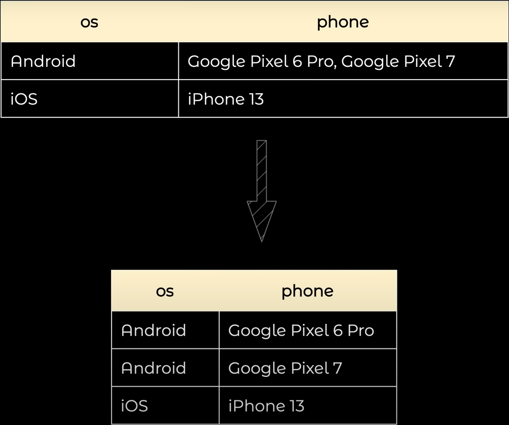
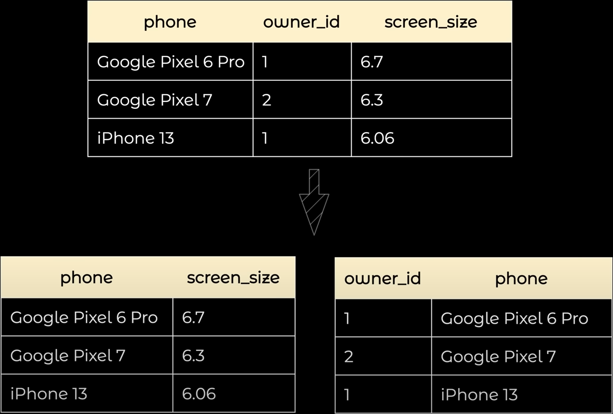
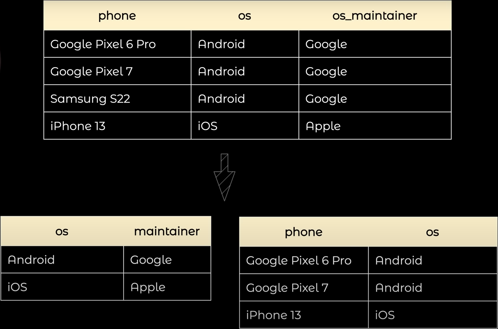

# Проектування схеми бази даних (БД)

Проектування схеми БД — це ключовий етап у створенні бази даних, де аналізується предметна область проекту для визначення необхідних таблиць для зберігання даних. Цей процес можна розділити на кілька кроків:

1. Виділення основних сутностей — спочатку ідентифікуються основні сутності в системі або проекті. Це можуть бути об'єкти, процеси або концепції, які мають важливий сенс для вашої бази даних.
2. Визначення зв'язків між сутностями — потім встановлюються зв'язки між цими сутностями. Це визначає, як сутності пов'язані між собою. Зазвичай це включає в себе визначення, які сутності взаємодіють одна з одною та які дані вони обмінюють.
3. Розгляд додаткових таблиць — іноді для зберігання даних ефективно необхідні додаткові таблиці, які допомагають організувати інформацію. Це можуть бути таблиці для зберігання історичних даних, журналів змін, тощо.
4. Визначення атрибутів кожної сутності — для кожної сутності визначаються атрибути або характеристики, які ви плануєте зберігати. Наприклад, якщо у вас є сутність «клієнт», то її атрибутами можуть бути ім'я, адреса, номер телефону тощо.
5. Написання SQL-коду для створення таблиць — останній крок — це перетворення цього дизайну в реальні таблиці БД. Для цього створюється SQL-код, який визначає структуру кожної таблиці, включаючи атрибути та їх типи даних, ключі та зв'язки між таблицями.

## Нормальні форми

Нормальна форма (NF) визначає стандарти організації даних у таблицях БД для забезпечення правильності та цілісності даних. Існують різні рівні нормальної форми, які включають:

1. Перша нормальна форма (1NF) — усі дані в таблиці повинні мати атомарні значення, тобто вони не можуть бути розділені на менші частини. Наприклад, в одному полі не повинно бути списку значень.

<figure>
    
    <figcaption>Перша нормальна форма (1NF)</figcaption>
</figure>

2. Друга нормальна форма (2NF) — кожен стовпець таблиці повинен залежати від первинного ключа таблиці, а не від інших стовпців.

<figure>
    
    <figcaption>Друга нормальна форма (2NF)</figcaption>
</figure>

3. Третя нормальна форма (3NF) — усі дані у таблиці, які не є частиною первинного ключа, повинні залежати від інших стовпців таблиці, а не від інших рядків.

<figure>
    
    <figcaption>Третя нормальна форма (3NF)</figcaption>
</figure>

### Переваги використання нормальної форми

- Цілісність даних — дані в БД зберігаються в такий спосі, щоб гарантувати їх правильність та зменшити ризик помилок.
- Ефективність — покращується продуктивність БД щодо швидкості виконання запитів та використання простору на диску.
- Менше дублювання даних — дані займають менше простору на диску, а також зменшується ризик втрати даних.
- Легкість обслуговування — таблиці легше обслуговувати, оновлювати та видаляти дані.
- Безпека — допомагає зменшити ризик втрати даних, помилок та несанкціонованого доступу до БД.
- Розширюваність — легше розширювати та модифікувати таблиці.

### Нормалізація та денормалізація

Нормалізація — це процес розбиття таблиць на менші та більш узагальнені таблиці для забезпечення цілісності даних та зменшення дублювання даних. Нормалізація допомагає уникнути аномалій даних і забезпечує консистентність даних.

Денормалізація — це процес об'єднання таблиць або додавання зайвих даних до таблиць для покращення продуктивності запитів та зменшення їх складності. Денормалізація може бути використана тоді, коли швидкість доступу до даних є критичним фактором.

Обираючи між нормалізацією та денормалізацією, розробники повинні враховувати конкретні вимоги проекту та забезпечувати баланс між цілісністю даних і продуктивністю запитів.

## Типи відносин

У реляційних базах даних існують різні типи відносин між таблицями, які визначають, як дані взаємозв'язані та як можуть бути використані в запитах.

- Один до одного (One-to-One) — в цьому типі відносин один запис в одній таблиці відповідає одному запису в іншій таблиці. Цей тип відносин використовується тоді, коли існує строго однозначний зв'язок між записами.
- Один до багатьох (One-to-Many) — в цьому типі відносин один запис в одній таблиці може відповідати багатьом записам в іншій таблиці. Наприклад, один автор може мати багато книг. Цей тип відносин дозволяє виразити ієрархічні зв'язки між даними.
- Багато до одного (Many-to-One) — цей тип відносин є оберненим до відношення «один до багатьох». Багато записів в одній таблиці відповідають одному запису в іншій таблиці. Наприклад, багато студентів можуть належати до одного університету.
- Багато до багатьох (Many-to-Many) — в цьому типі відносин багато записів в одній таблиці відповідають багатьом записам в іншій таблиці і навпаки. Цей тип відносин використовується для вираження складних зв'язків між даними. Наприклад, багато студентів може бути зареєстровано на багато курсів.
