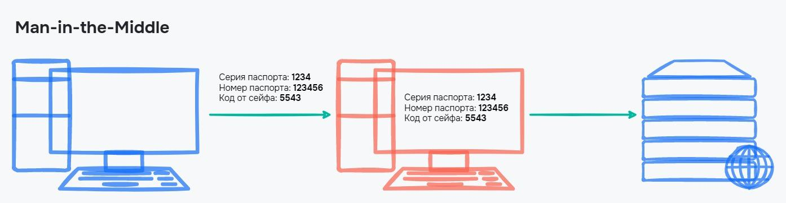
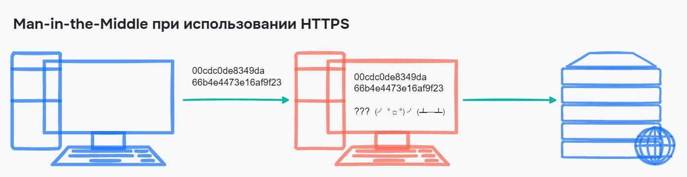

# Людина посередині

Людина посередині (Man-in-the-Middle, MITM) — це вид атаки на безпеку мережі, при якій зловмисник вбудовується між комунікуючими сторонами з метою отримання або модифікації передачі даних. В цьому випадку ні абонент, ні сервер не свідомі присутності атаки, оскільки зловмисник виконує операції з пересилання даних непомітно для них.

## Принцип роботи

1. Перехоплення комунікації: Зловмисник вставляється в комунікаційний потік між двома точками, наприклад, між клієнтом і сервером.
2. Перехоплення даних: Зловмисник може перехоплювати та читати дані, які передаються між сторонами, без їхнього відома.
3. Непомітність: Така атака може залишитися непоміченою, оскільки ні абонент, ні сервер не знають, що їхні дані перехоплюються та переглядаються.

Простим прикладом MITM-атаки є створення публічної Wi-Fi мережі в кафе. Користувачі, які підключаються до цієї мережі, можуть стати жертвами атаки, оскільки зловмисник може перехоплювати їхні дані.

<figure>
    
    <figcaption>Передача по HTTP</figcaption>
</figure>

Якщо використовується протокол HTTPS, зловмисник не зможе розшифрувати дані, навіть якщо він їх перехопить, завдяки шифруванню даних між клієнтом і сервером.

<figure>
    
    <figcaption>Передача по HTTPS</figcaption>
</figure>
