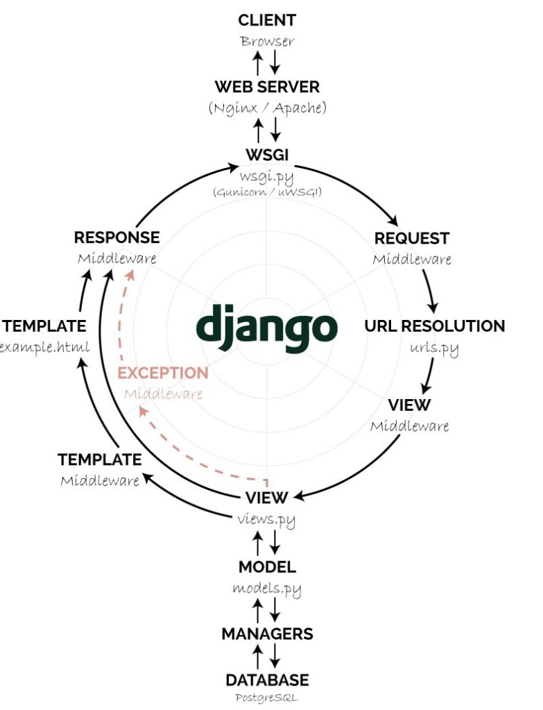
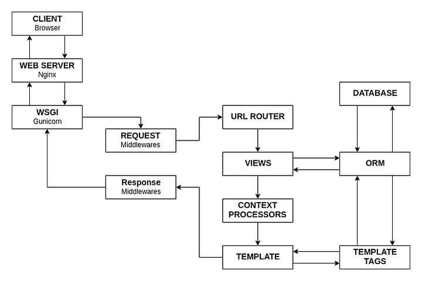

# Життєвий цикл застосунку Django





## Запит користувача

Все починається, коли користувач відправляє запит через браузер або іншу клієнтську програму до веб-сервера, який використовує Django.

## Веб-сервер (Nginx/Apache)

Nginx і Apache є популярними веб-серверами для обробки HTTP запитів. Вони можуть функціонувати як проксі-сервери, перенаправляючи запити до серверів WSGI.

## WSGI/ASGI

WSGI (Web Server Gateway Interface) — це стандарт взаємодії між веб-сервером та застосунком на Python, як Django. ASGI (Asynchronous Server Gateway Interface) — це новітній стандарт для асинхронних застосунків.

## Middleware

Middleware — це шар, який дозволяє обробляти запити до та відповіді від Django, виконуючи код до та після виклику функції представлення (view).

```py
def log_middleware(get_response):
    def middleware(request):
        print(">>> Middleware: код виконується перед викликом view.")

        response = get_response(request)

        print(">>> Middleware: код виконується після виклику view.")

        return response

    return middleware
```

## URL Router

URL маршрутизатор визначає шляхи URL у застосунку та асоціює їх з відповідними функціями у файлах представлень.

```py
from django.urls import path
from . import views

urlpatterns = [
    path('', views.index, name='index'),
]
```

## Представлення (Views)

Функції представлень відповідають за обробку вхідних запитів, взаємодію з моделями та передачу даних до шаблонів для генерації веб-сторінок.

## Моделі (Model)

Моделі в Django визначають структуру бази даних. Менеджери моделей дозволяють створювати запити до бази даних, оновлювати, видаляти та отримувати екземпляри моделей.

## Шаблони (Template)

Шаблони використовуються для генерації HTML, включаючи динамічний контент, що забезпечується контекстними процесорами, фільтрами та тегами, які викликаються під час генерації відповіді.

## Відповідь (Response)

Після обробки запиту, представлення генерує відповідь (наприклад, HTML-сторінку, JSON, або зображення), яка надсилається назад до клієнта.
