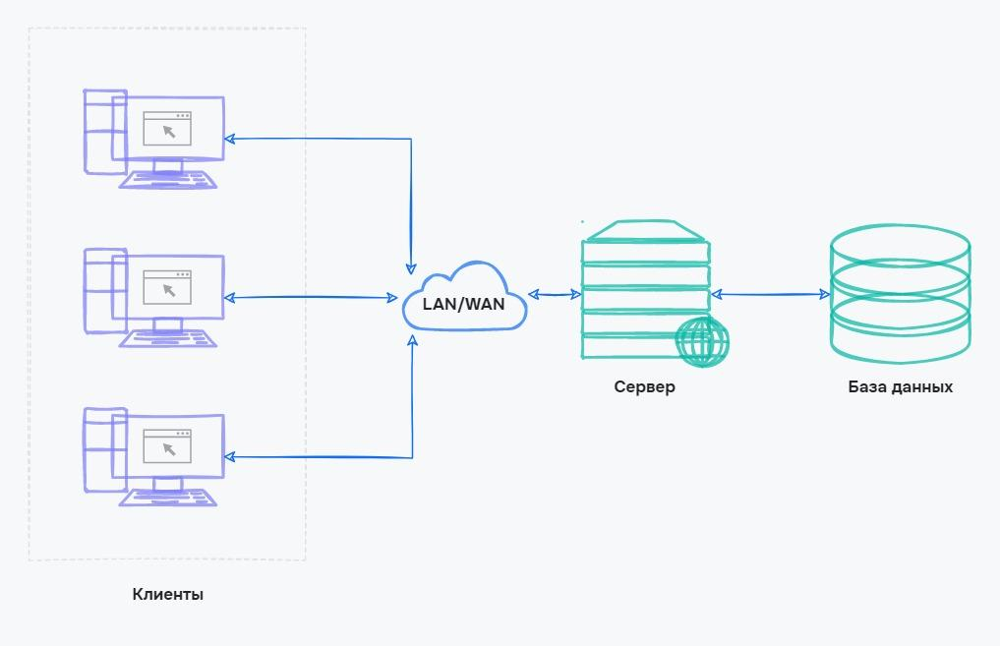
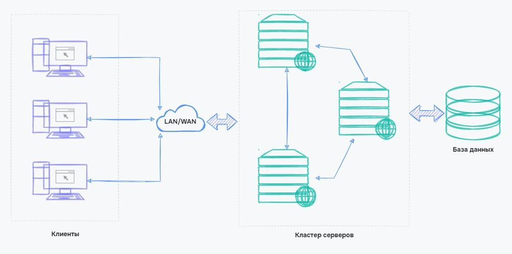
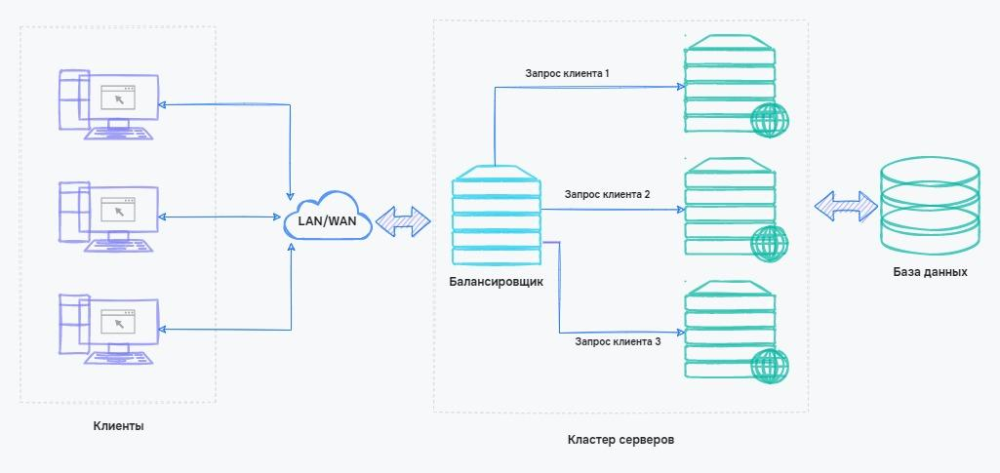

# Клієнт-серверна архітектура

-   Клієнт — це програма, яка забезпечує зв'язок із сервером і доступна користувачам без технічних знань.
-   Сервер — це комп'ютер, на якому зберігається сайт або програма. Сервери спілкуються з клієнтами та базами даних
-   База даних — це програма, в якій зберігаються всі дані застосунку. Для магазину це буде база клієнтів, товарів та замовлень

<figure>
    
    <figcaption>Клієнт-серверна архітектура</figcaption>
</figure>

## Плюси

-   Відсутність дублювання. Весь сайт або програма зберігається на одному комп'ютері-сервері. Це дозволяє використовувати його з різних пристроїв, будь то комп'ютер або мобільний телефон
-   Мінімальні вимоги до користувача. Від нього потрібна лише наявність програми-клієнта. Для роботи із сайтами достатньо мати браузер
-   Безпека. Дані зберігаються в базі даних, і користувачі не можуть їх переглядати. Це забезпечує безпеку для персональних даних
-   Продуктивність. Сервери зазвичай продуктивніші, ніж комп'ютери користувачів. Це дозволяє обробляти тисячі запитів від сотні різних користувачів одночасно

## Мінуси

-   Перевантаження сервера. Популярні портали можуть отримувати багато запитів одночасно. Наприклад, при десятці мільйонів запитів на секунду сервер може не витримати та вимкнутись
-   Вихід з ладу сервера чи бази даних. Це зробить сервіс недоступним для всіх користувачів
-   Висока вартість обладнання. Сервер схожий на простий комп'ютер, але його комплектуючі мають бути розраховані на безперебійну роботу 24/7. Така надійність забезпечується компонентами зі спеціальними функціями, через що вартість обладнання підвищується.
-   Витрати підтримки. Зазвичай недостатньо просто отримати сервер і забути про його існування. Має бути спеціаліст, який обслуговуватиме сервер і швидко реагуватиме у разі поломок

## Кластери серверів та балансування навантаження

Щоб уникнути проблем із клієнт-серверною архітектурою, розробники застосовують кластери серверів — коли програма знаходиться не на одному, а відразу на декількох серверах. Інформація на таких серверах дублюється. Якщо один сервер вийшов з ладу, його підміняє інший. Це дає час, щоб усунути несправності сервера так, що користувачі не помітять.

<figure>
    
    <figcaption>Взаємодія кластеру серверів</figcaption>
</figure>

Ще кластери використовуються, щоб розподіляти навантаження. Щоб визначити, на який сервер надіслати запит, використовуються балансувальник — сервіс, який пропускає всі запити через себе і стежить, щоб сервери не перевантажувалися.

<figure>
    
    <figcaption>Балансування навантаження</figcaption>
</figure>

Балансувальники та кластери можуть використовуватися не тільки для серверів з програмою, але і для баз даних. Так можна отримати незалежні кластери всієї програми, які зможуть підміняти один одного та допомагати в обробці запитів від користувачів.
