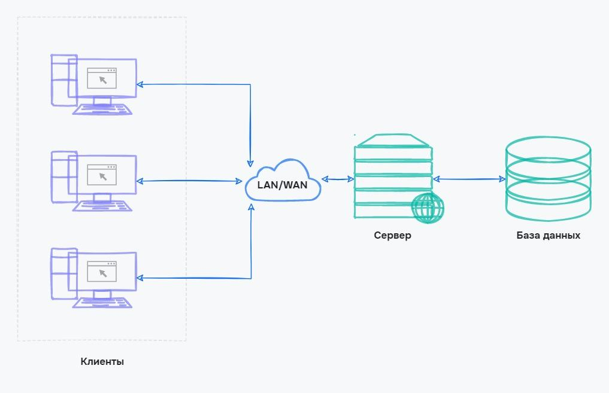

# Клієнт-серверна архітектура

## Основні компоненти

- Клієнт: програмне забезпечення, розроблене для взаємодії з сервером. Призначено для користувачів без технічних знань.
- Сервер: комп'ютер, на якому розміщено веб-сайт або програму, що взаємодіє з клієнтами та базами даних.
- База даних: програма для зберігання всіх даних застосунку, таких як клієнти, товари та замовлення.

<figure>
    
    <figcaption>Клієнт-серверна архітектура</figcaption>
</figure>

## Переваги

- Відсутність дублювання: сайт або програма зберігаються на одному сервері, що дозволяє користуватися ними з різних пристроїв.
- Мінімальні вимоги до користувача: для доступу до сайтів користувачам потрібна лише програма-клієнт або браузер.
- Безпека: дані зберігаються в базі даних, що гарантує конфіденційність особистої інформації.
- Продуктивність: сервери ефективно обробляють багато запитів від різних користувачів одночасно.

## Недоліки

- Перевантаження сервера: популярні портали можуть стикатися з перевантаженням, що може призвести до тимчасової недоступності.
- Вихід з ладу сервера чи бази даних: несправність сервера або бази даних призводять до недоступності сервісу для користувачів.
- Висока вартість обладнання: надійні сервери вимагають спеціалізованого обладнання, що підвищує вартість.
- Витрати підтримки: обслуговування сервера вимагає наявності фахівця та витрат на швидке реагування на несправності.
