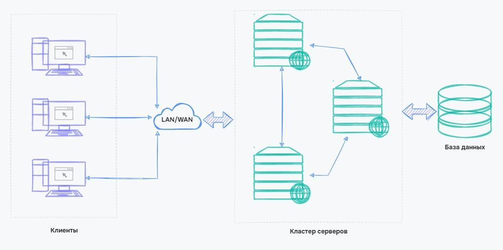
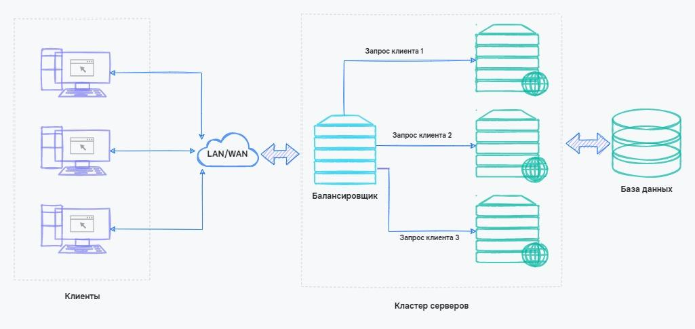

# Кластеризація та балансування навантаження

## Кластеризація

Кластер — це об'єднання кількох однорідних елементів, розглядуваних як самостійна одиниця з певними властивостями. У контексті серверів, кластер може включати декілька серверів, які співпрацюють для забезпечення вищої доступності та надійності.

<figure>
    
    <figcaption>Взаємодія кластеру серверів</figcaption>
</figure>

### Застосування кластерів

- Уникнення відмов: якщо один сервер виходить з ладу, інші можуть прийняти його функції, забезпечуючи безперервну роботу.
- Розподіл навантаження: забезпечення більш ефективного використання ресурсів шляхом розподілу завдань між серверами в кластері.

## Балансування навантаження

Балансувальник навантаження — це апаратне обладнання або програмне забезпечення, яке розподіляє запити між серверами для оптимізації ефективності та запобігання перевантаженню одного сервера.

<figure>
    
    <figcaption>Балансування навантаження</figcaption>
</figure>

### Методи балансування навантаження

- Круговий балансувальник: розподіляє запити циклічно між серверами.
- Ваговий балансувальник: призначає вагу кожному серверу відповідно до його потужності.
- Алгоритми на основі ресурсів: призначають сервер відповідно до його поточного навантаження та доступних ресурсів.

## Управління станом

Стан — це набір стійких значень змінних параметрів системи. Управління станом системи може бути вирішальним чинником при масштабуванні.

### Зберігання стану

- У базі даних: забезпечує передачу стану між серверами та довгострокове зберігання.
- У кеші: забезпечує швидкий доступ до стану для оперативного зберігання та оновлення.
- На жорсткому диску: використовується для передачі стану між процесами на одній машині.
- У пам'яті: належить лише одному процесу і не передається.

### Робота зі станом під час горизонтального масштабування

Одна з проблем, яка може виникнути під час горизонтального масштабування – у нас можуть бути сеанси, які зберігаються на одному сервері, але не на іншому, і ми не хочемо, щоб користувачам доводилося повторно вводити інформацію лише тому, що балансувальник навантаження надсилає їхні запити на новий сервер. Існують кілька підходів до вирішення проблеми сеансів.

- Липкі сесії: пересилання користувача на той же сервер для збереження стану. Може призвести до перевантаження одного сервера.
- Сесії бази даних: зберігання всіх сесій в базі даних для доступу з будь-якого сервера. Затримки через читання та запис в базу даних.
- Сесії на стороні клієнта: зберігання інформації локально в браузері користувача у вигляді файлів cookie. Питання безпеки та обчислювальні проблеми.

Немає універсального рішення, і вибір методу залежить від конкретних обставин та вимог системи.
