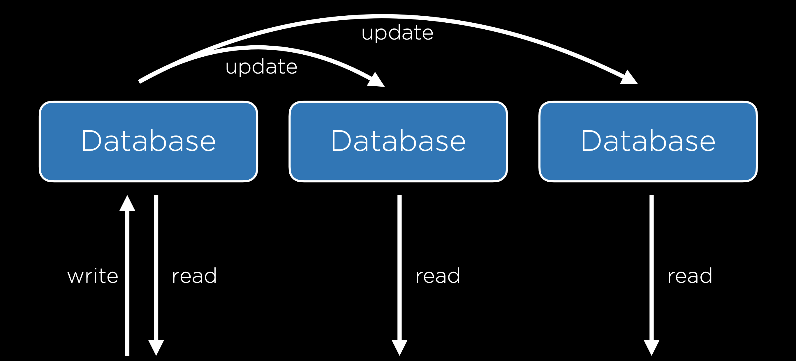
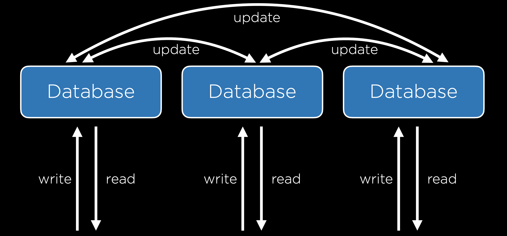

# Масштабування баз даних та реплікація

## Масштабування баз даних

Після масштабування серверів для обробки запитів, необхідно також розглянути масштабування баз даних. Існують декілька методів для вирішення цього завдання:

- Вертикальне секціонування: передбачає розділення даних на різні таблиці замість вміщення зайвої інформації в одну таблицю. Це може полегшити управління та підтримку бази даних.
- Горизонтальне секціонування: використовує різні таблиці з однаковим форматом, але різною інформацією. Наприклад, можна розділити таблицю рейсів на `domestic_flights` та `international_flights`. Однак об'єднання цих таблиць може бути дорогим.

## Реплікація баз даних

Реплікація баз даних є важливим елементом забезпечення надійності та доступності. Різні методи реплікації можуть вирішувати різні виклики.

### Single-Primary реплікація

У цьому методі є кілька баз даних, але тільки одна вважається основною, де можна читати та записувати. Інші бази даних оновлюються відповідно до основної. Однак це може мати єдину точку збою, коли йдеться про запис в базу даних.

<figure>
    
    <figcaption>Single-Primary реплікація</figcaption>
</figure>

### Multi-Primary реплікація

У цьому методі можна читати та записувати в усі бази даних. Це усуває проблему єдиної точки збою, але ускладнює синхронізацію та може викликати конфлікти.

<figure>
    
    <figcaption>Multi-Primary реплікація</figcaption>
</figure>

#### Конфлікти в Multi-Primary реплікації

- Конфлікт оновлення: два користувачі намагаються змінити один і той же рядок в різних базах даних.
- Конфлікт унікальності: поява одного і того ж унікального ідентифікатора для різних записів у різних базах даних.
- Конфлікт видалення: один користувач видаляє рядок, а інший намагається його оновити.

Вибір методу реплікації залежить від конкретних потреб системи та важливості уникнення конфліктів.
