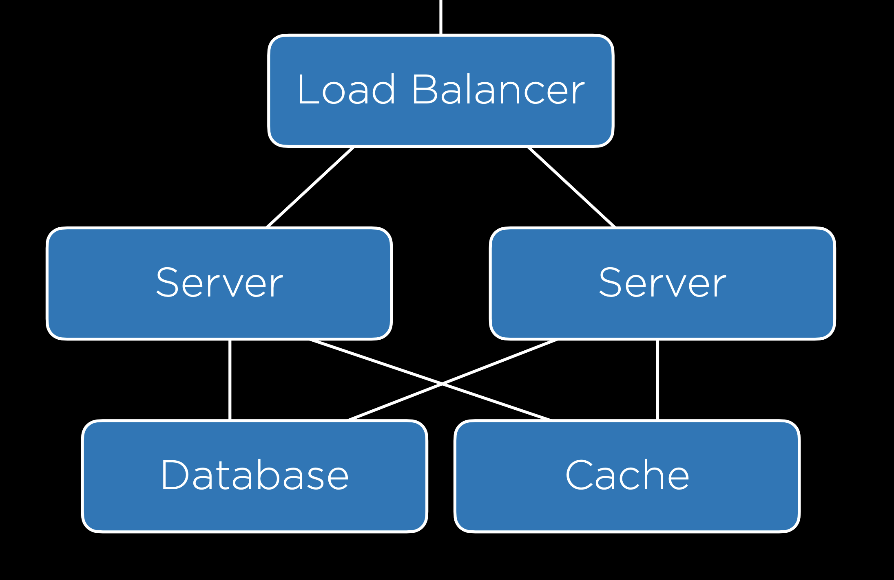

# Кешування

Кеш — це проміжний буфер зі швидким доступом, який містить інформацію, яка ймовірно буде запитана найближчим часом. Використання кешу може значно покращити продуктивність системи та зменшити навантаження на сервери.

## Кешування на стороні клієнта

Один зі способів вирішення проблеми завантаження ресурсів є кешування на стороні клієнта. Коли користувач завантажує сторінку, браузер може зберігати копії певних ресурсів (наприклад, зображень, стилів, скриптів) локально. При наступних запитах до тієї ж самої сторінки ці ресурси можуть бути завантажені з кешу браузера, що зменшує час завантаження та обтяження сервера.

Щоб контролювати кешування на стороні клієнта, можна використовувати HTTP-заголовки, такі як `Cache-Control`.

```
Cache-Control: max-age=86400
```

Це вказує браузеру не оновлювати ресурс протягом 86400 секунд (24 годин).

## Кешування на стороні сервера

Кешування може також використовуватися на стороні сервера для збереження результатів обчислень або важких операцій. Наприклад, при великому обсязі бази даних можна кешувати результати часто використовуваних запитів, щоб уникнути зайвих операцій читання з бази даних.

<figure>
    
    <figcaption>Кешування на стороні сервера</figcaption>
</figure>

### Django та кешування

У фреймворку Django є вбудована підтримка кешування, яка дозволяє використовувати кеш на різних рівнях:

- Кешування для кожного представлення: дозволяє кешувати результати функцій представлень (views). Наприклад, якщо сторінка рідко змінюється, можна кешувати її вміст.
- Кешування фрагментів шаблонів: можливість кешувати окремі частини шаблону. Наприклад, кешування навігаційного меню, яке майже ніколи не змінюється.
- API кешу низького рівня: надає гнучкіше кешування для будь-якої інформації, яку можна вважати кандидатом для кешування.

Використання кешування у Django дозволяє покращити продуктивність та оптимізувати використання ресурсів сервера.
