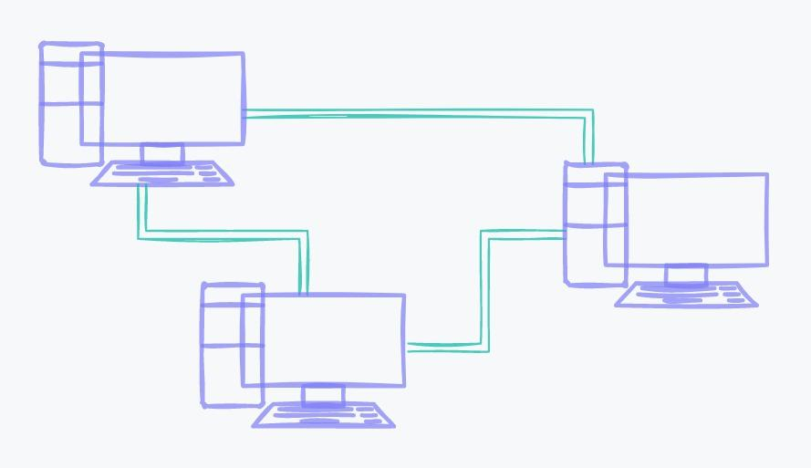
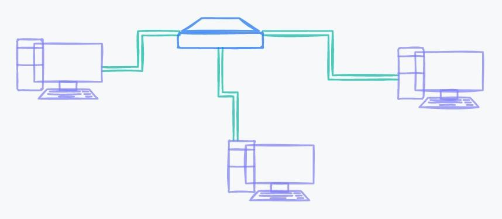
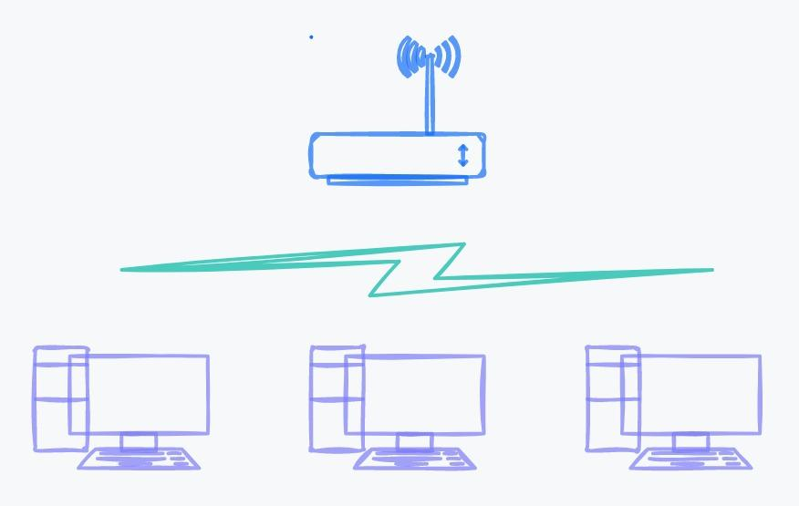
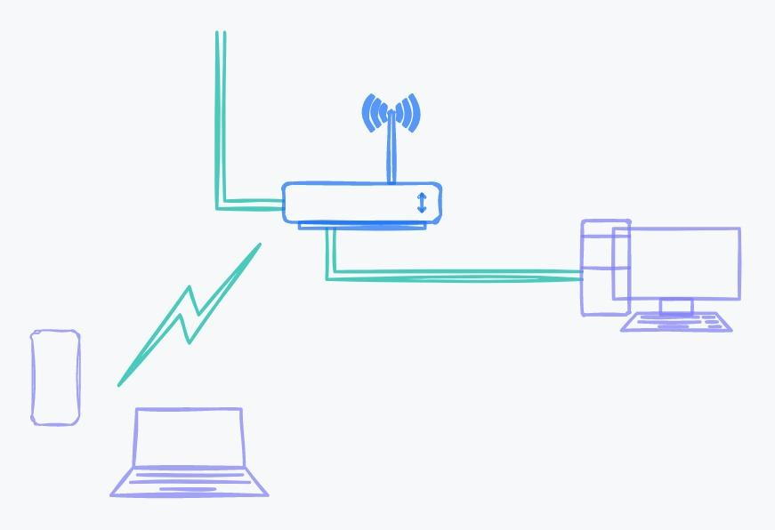

# Мережа

Коли ви об'єднали з другом два комп'ютери для спільної гри, утворилася комп'ютерна мережа — система, всередині якої комп'ютери обмінюються інформацією.

## Як з'єднуються комп'ютери

Є три способи, за допомогою яких можна з'єднати комп'ютери

-   Дротовий тип з'єднання — використовуються дроти, які фізично з'єднують комп'ютери один з одним
-   Супутникові мережі — комп'ютери з'єднуються за допомогою супутникового сигналу
-   Бездротовий тип з'єднання — використовується спеціальний пристрій, який підключається до інтернету та «роздає» його за допомогою радіохвиль

## Дротовий тип з'єднання

Для створення простої проводової мережі використовується два комп'ютери та провід, який підключається між ними. Дротове з'єднання використовується з моменту створення першої мережі та вважається найнадійнішим способом підключення, оскільки відсутні перешкоди у вигляді поганої погоди, цегляних стін та інших факторів, які порушують стабільну роботу при використанні бездротових з'єднань.

Щоб з'єднати два комп'ютери в єдину мережу за допомогою дроту, використовується кабель з роз'ємом 8P8C і дві мережеві плати. Провід з роз'ємом 8P8C називають патч-корд через англійську назву patching cord (сполучний шнур).

Щоб підключити два комп'ютери через патч-корд, додаткове обладнання не потрібне. Потрібно лише підключити провід та налаштувати самі комп'ютери.

<figure>
    
    <figcaption>Мережа з двох комп'ютерів</figcaption>
</figure>

Уявімо ситуацію, до нас вирішив підключитися ще один гравець. Тепер нам потрібно з'єднати три комп'ютери. Але на двох перших пристроях мережеві плати вже зайняті. У цьому випадку кожному комп'ютеру можна докупити мережну картку та з'єднати патч-кордами.

<figure>
    
    <figcaption>Мережа з трьох комп'ютерів</figcaption>
</figure>

Це дорогий підхід, тому що доведеться докупити три мережеві плати. Щоб підключити більше двох комп'ютерів, використовують додаткові пристрої — комутатор або свитч.

Комутатор — це пристрій із десятком мережевих плат, а комп'ютери підключаються до нього. Так можна не купувати нові мережеві плати та велику кількість проводів. Комутатори з'єднують комп'ютери за допомогою патч-кордів і зберігають дані про комп'ютери в мережі, щоб перенаправляти інформацію потрібному пристрою.

<figure>
    
    <figcaption>З'єднання за допомогою комунікатора</figcaption>
</figure>

У великій мережі із сотнями комп'ютерів одного комутатора недостатньо. Щоб поєднати багато комп'ютерів, з'єднують кілька комутаторів один з одним.

<figure>
    
    <figcaption>З'єднання за допомогою декількох комунікаторів</figcaption>
</figure>

## Бездротовий тип з'єднання

Бездротове з'єднання відрізняється від провідного тим, що для нього не потрібні дроти. Комп'ютери з'єднуються за допомогою радіосигналів, які приймають та передають спеціальні приймачі в комп'ютерах.

Найпоширеніший вид бездротового з'єднання — Wi-Fi. Сьогодні під цією назвою використовується кілька стандартів, які забезпечують зв'язок на різних швидкостях.

Wi-Fi не єдиний спосіб бездротового з'єднання. Щоб зв'язати обладнання одне з одним, використовують з'єднання Bluetooth та інфрачервоне з'єднання. Наприклад, через Bluetooth можна підключити до ноутбука навушники, клавіатуру та мишу. Тип з'єднання визначає лише спосіб підключення, але не те, навіщо це використовується. Тому Wi-Fi — це не інтернет, а лише спосіб з'єднання пристроїв один з одним.

Для створення бездротової мережі використовується точка доступу. Цей пристрій схожий на комутатор, але дані передаються через радіочастоти.

<figure>
    
    <figcaption>З'єднання за допомогою точки доступу</figcaption>
</figure>

Перевага бездротового з'єднання — зручність, оскільки між комп'ютерами не потрібно прокладати дроти. Але такий спосіб зв'язку накладає обмеження

-   Покриття. Бездротові технології використовуються у невеликих приміщеннях, оскільки не передають дані на великі відстані
-   Перешкоди. Радіосигнал не ізольований і схильний до перешкод. Навіть бетонна стіна може стати перепоною

## Спільне використання проводового та бездротового з'єднання

Різні види з'єднань можуть використовуватися всередині однієї мережі. Наприклад, у квартиру проведено інтернет з проводового з'єднання. Кабель підключається до точки доступу Wi-Fi, який створює бездротове з'єднання у квартирі.

Припустимо, стаціонарний комп'ютер можуть підключити до мережі за допомогою дроту, а ноутбук за допомогою Wi-F.

<figure>
    
    <figcaption>Одночасне використання провідного та бездротового з'єднання</figcaption>
</figure>

У цьому випадку в квартирі одночасно використовується провідне та бездротове з'єднання.

## Локальні та глобальні мережі

Існує два види мережі

-   Локальна обчислювальна мережа
-   Глобальна обчислювальна мережа

Погляньте на приклад підключення комп'ютерів за допомогою кількох комутаторів. Таким способом можна з'єднати сотню комп'ютерів між собою, але всі вони замкнуті в рамках єдиної системи, одного головного комутатора, який знаходиться вгорі на зображенні. Так утворилася локальна обчислювальна мережа — LAN (Local Area Network). Вона обмежена та поєднує в собі пристрої в квартирі, будинку, офісі. Особливість локальних мереж — замкнутість, тобто вони не мають виходу в інші мережі.

Якщо об'єднати локальні мережі, щоб обмінюватися інформацією, вийде глобальна обчислювальна мережа WAN (Wide Area Network). Така мережа поєднує необмежену кількість пристроїв.

Локальна мережа поєднує в собі не лише невелику ділянку — квартиру чи будинок. Наприклад, мережа всередині району теж буде локальною, якщо вона не має виходів в інші мережі, наприклад, інтернет.

Локальна та глобальна мережі відрізняються масштабністю, але вони мають одну головну подібність — вони з'єднують комп'ютери, якими можна передавати інформацію.
