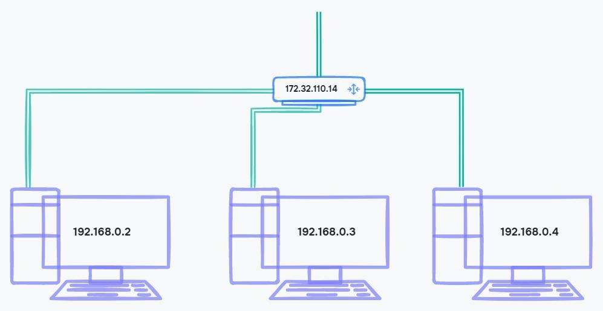
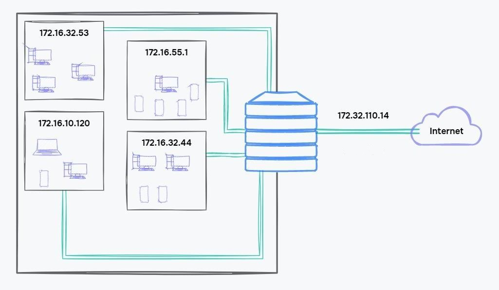
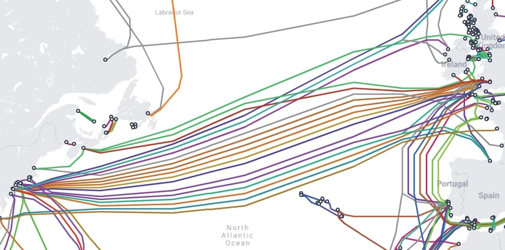

## IP-адреса

Для того, щоб спілкуватися з іншими пристроями в мережі, комп'ютер має унікальну адресу. Він став частиною угод і правил, які придумали інженери ARPANet і назвали Internet Protocol (IP). Унікальну адресу, яка описує адреси комп'ютерів у мережі, назвали IP-адресою.

### IP стандарти

IP-адреса має кілька стандартів

-   Стандарт IPv4
-   Стандарт IPv6

#### Стандарт IPv4

IP-адреса стандарту IPv4 складається з чотирьох числових блоків і записується у форматі десяткової системи числення — використовуються цифри від нуля до дев'яти. Кожен блок IP-адреси містить число від 0 до 255 — наприклад, 172.32.110.14.

У цьому стандарті виділяють два типи адрес

-   Приватні
-   Зовнішні

Приватні адреси працюють тільки в межах локальної мережі — не можна передати інформацію з глобальної мережі. В інтернеті налічується 22 085 632 таких адрес, вони виділяються за групами

-   10.0.0.0 — 10.255.255.255
-   100.64.0.0 — 100.127.255.255
-   172.16.0.0 — 172.31.255.255
-   192.168.0.0 — 192.168.255.255

Діапазони приватних адрес придумувалися розробниками в міру необхідності і в них немає прихованого сенсу. У кожному діапазоні різна кількість доступних адрес. Це зроблено, щоб використовувати діапазони залежно від завдання.

Є адреси, які використовують розробники, коли створюють веб-програми на комп'ютері. Наприклад, 127.0.0.1 — адреса комп'ютера, щоб звертатися до себе. За його допомогою проект не потрапляє до глобальної мережі до кінця розробки, і можна не підключатися до Інтернету.

Ще приватні адреси одержують домашні комп'ютери в районній мережі. Це буде IP-адреса, яка отримала ваш пристрій, що роздає інтернет у квартирі, наприклад, роутер. Він має зв'язок із глобальною мережею. Роутер визначає, кому пересилати інформацію в локальній мережі.

Пристрої в локальній мережі отримають адресу з приватної групи адрес, а якщо пристрій підключено до інтернету, він отримає зовнішню IP-адресу. Наприклад, адреса роутера 172.32.110.14 — це зовнішня адреса, а адреса комп'ютера, яка підключена до нього — 192.168.0.2 — приватна.

<figure>
    
    <figcaption>Приватні і зовнішні адреси</figcaption>
</figure>

Інформація надходить на зовнішню адресу роутера, який перенаправить її на потрібну приватну адресу пристрою.

Якщо від загальної кількості адрес відібрати приватні, то вийде, що зовнішні IP-адреси 4 272 881 664. Це невелика цифра, і кількість пристроїв в мережі збільшується, тому провайдерам доводиться економити IP-адреси.

##### Як економлять IP-адреси

Провайдери використовують два способи економії IP-адрес стандарту IPv4

-   Динамічні адреси — можна перевикористовувати, наприклад, коли пристрій виходить з мережі, його адреса звільняється і передається іншому користувачеві
-   Сірі IP — створюється велика локальна мережа, наприклад для житлового будинку. До глобальної мережі підключається лише один головний роутер, а до нього підключають сотні користувачів. У такій схемі зовнішній IP називається білий IP

<figure>
    
    <figcaption>Підключення за схемою сірих IP</figcaption>
</figure>

На схемі сірі IP-адреси взяті з діапазону приватних адрес 172.16.0.0 — 172.31.255.255. Приватні та сірі IP — це одне і теж. За таким способом можна підключити мільйон квартир до однієї білої IP-адреси.

Щоб використовувати способи динамічних і сірих ІР, потрібні витрати на обладнання. При цьому адреси все одно можуть закінчитись. Щоб вирішити цю проблему, придумали стандарт IPv6. Він запровадив новий спосіб адрес для комп'ютерів у мережі.

### Стандарт IPv6

Розмір адреси у стандарті IPv6 більший, ніж у стандарті IPv4. Він складається з восьми блоків і записується в шістнадцятковій системі числення — цифри від нуля до дев'яти і букви a, b, c, d, e, f. Наприклад, a391:5008:1081:a567:b:863e:5543:b2cc. Таких адрес налічується 340 282 366 920 938 463 463 374 607 431 768 211 456 – понад 340 ундетиліонів.

### Пакети

Дані між мережними пристроями передаються пакетами. Протоколи визначають розмір, склад та правила передачі пакетів між адресами.

IP-пакет — форматований блок інформації, що передається через комп'ютерну мережу, структура якого визначена протоколом IP. Кожен IP-пакет містить заголовок та дані. Заголовок включає IP-адреси джерела та призначення, а також інші поля, які допомагають маршрутизувати пакет. Дані — це фактичний вміст, наприклад, рядок літер або частина веб-сторінки.

Повідомлення може бути крихітним пінгом, щоб перевірити, чи підключений інший пристрій до мережі, або бути цілою веб-сторінкою. Але є межа тому, наскільки великими можуть бути повідомлення, оскільки є обмеження кількості даних, що передаються за один раз за допомогою фізичних мережевих підключень між пристроями. Ось чому багато мережевих протоколів розбивають кожне повідомлення на кілька невеликих пакетів.

### Процес маршрутизації пакета

Комп'ютер надсилає перший пакет найближчому маршрутизатору. Коли він отримує пакет, дивиться на IP-заголовок. Найбільш важливим полем є IP-адреса призначення, яка повідомляє маршрутизатору, куди має потрапити пакет.

У маршрутизатора є кілька шляхів, якими він може відправити пакет, і його мета — відправити пакет найближчому до кінцевого пункту призначення маршрутизатору. Як це вирішується? У маршрутизатора є таблиця маршрутизації, яка допомагає йому вибрати наступний шлях на основі IP-адреси призначення. Як тільки маршрутизатор знаходить найбільш підходящий, він відправляє пакет цим шляхом. Якщо все йде добре, пакет прибуває на найближчий маршрутизатор до одержувача, який точно знає, куди його відправити.

Якщо шлях до мережі більше не доступний, маршрутизатор обере інший шлях. Наявність кількох шляхів називається надмірністю мережі. Надмірність шляхів збільшує кількість можливих способів, якими пакет може досягти пункту призначення.

<figure>
    
    <figcaption>Підводна мережа через Атлантичний океан</figcaption>
</figure>

### Втрата пакетів

Протокол IP описує, як поділити повідомлення на кілька IP-пакетів та направити пакети до місця призначення шляхом перемикання від маршрутизатора до маршрутизатора. Однак, IP не обробляє всі наслідки пакетів. Наприклад, втрачені пакети, невпорядковані, повторювані, пошкоджені, випадкові дублі.

Надійну передачу пакетів забезпечує протокол TCP, який працює поверх IP. Він включає стратегії для впорядкування пакетів, повторної передачі та цілісності даних.

Якщо ви завантажуєте, наприклад, Discord до себе на комп'ютер, то втрата навіть одного байта не запустить програму. Тому TCP використовують багато протоколів рівня додатків.

### Комутатори і маршрутизатори

Мережевий комутатор і маршрутизатор є мережевими пристроями, які використовуються для з'єднання пристроїв у комп'ютерній мережі. Однак вони виконують різні функції і мають різні можливості.

Мережевий комутатор — це пристрій, який з'єднує кілька пристроїв у мережі, дозволяючи їм спілкуватися один з одним. Він працює на канальному рівні (рівні 2) моделі OSI та використовує MAC-адреси для пересилання пакетів даних між пристроями.

Маршрутизатор — це пристрій, який з'єднує декілька мереж. Він працює на мережевому рівні (рівні 3) моделі OSI та використовує IP-адреси для маршрутизації пакетів даних між мережами. Маршрутизатор можна використовувати для підключення пристроїв у різних географічних точках або для підключення локальної мережі до Інтернету. Маршрутизатори також можуть мати такі розширені функції, як брандмауер і протоколи безпеки для захисту мереж від несанкціонованого доступу.

Таким чином, мережевий комутатор використовується для з'єднання пристроїв у мережі, тоді як маршрутизатор використовується для з'єднання кількох мереж. Комутатор працює на канальному рівні та пересилає пакети даних на основі MAC-адрес, тоді як маршрутизатор працює на мережевому рівні та пересилає пакети даних на основі IP-адрес.
