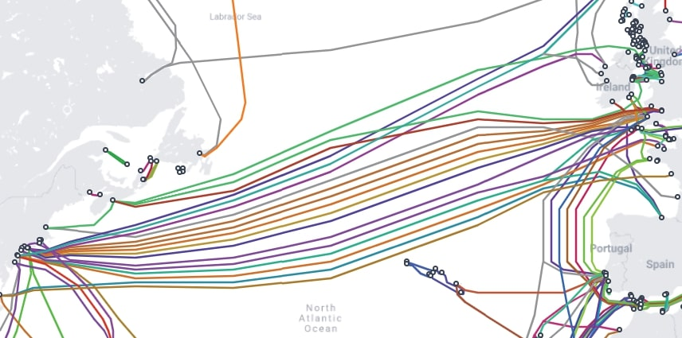

# Пакети

У мережевому зв'язку дані передаються у формі пакетів. Протоколи визначають розмір, структуру та правила передачі цих пакетів між пристроями.

IP-пакет — це структурована одиниця інформації, яка передається через комп'ютерну мережу і визначена протоколом IP (Internet Protocol). Кожен IP-пакет складається з заголовка та даних. У заголовку знаходяться IP-адреси джерела та призначення, а також інша інформація, яка допомагає в маршрутизації пакету. Дані включають в себе фактичний вміст пакету, наприклад, текстовий рядок або частину веб-сторінки.

Розмір пакету може коливатися від кількох байтів до кількох кілобайтів, але він обмежений фізичними обмеженнями мережевих підключень між пристроями. Це призводить до поділу великих повідомлень на кілька менших пакетів.

### Процес маршрутизації пакетів

Коли комп'ютер відправляє перший пакет, він спрямовує його до найближчого маршрутизатора. При отриманні пакету маршрутизатор перевіряє IP-заголовок. Головним полем є IP-адреса призначення, яка вказує маршрутизатору, куди направити пакет.

Маршрутизатор має таблицю маршрутизації, яка допомагає визначити наступний крок на основі IP-адреси призначення. Після вибору маршруту маршрутизатор відправляє пакет цим шляхом. Якщо все в порядку, пакет долає дорогу до найближчого маршрутизатора, який вже знає, куди його далі направити.

Якщо який-небудь зв'язок з мережею стає недоступним, маршрутизатори можуть вибрати альтернативний шлях. Наявність різних шляхів називається надмірністю мережі, що забезпечує надійність та доступність мережі. Надмірність шляхів розширює кількість можливих маршрутів для пакета.

<figure>
    
    <figcaption>Підводна мережа через Атлантичний океан</figcaption>
</figure>

### Втрата пакетів

Протокол IP відповідає за маршрутизацію пакетів, але не гарантує їхню безперервну доставку. Втрата пакетів може статися з різних причин, таких як конфлікти в мережі, недоступність шляху, перевантаження маршрутизаторів і т.д.

Для надійної передачі даних використовується протокол TCP (Transmission Control Protocol), який працює поверх протоколу IP. TCP включає в себе механізми для впорядкування, повторної відправки та перевірки цілісності пакетів даних.

Наприклад, якщо ви завантажуєте програму, втрата навіть одного пакету може призвести до неправильного функціонування програми. Тому багато додатків, як Discord, використовують протоколи верхнього рівня, такі як TCP, для забезпечення надійності передачі даних.

## Комутатори та маршрутизатори

Мережевий комутатор і маршрутизатор — це два основних мережевих пристрої, які грають важливу роль у побудові комп'ютерних мереж. Однак вони мають різні функції та завдання.

Мережевий комутатор — це пристрій, який з'єднує кілька пристроїв в мережі (наприклад, комп'ютери, принтери, інші комутатори) і дозволяє їм спілкуватися один з одним. Він працює на другому (канальному) рівні моделі OSI і використовує MAC-адреси для пересилання пакетів даних між пристроями. Мережеві комутатори є основою локальних мереж (LAN) і допомагають встановлювати швидке і надійне з'єднання між пристроями в мережі.

Маршрутизатор — це пристрій, який з'єднує різні мережі і призначений для маршрутизації пакетів даних між ними. Він працює на третьому (мережевому) рівні моделі OSI і використовує IP-адреси для визначення маршруту для пакетів. Маршрутизатори дозволяють підключати локальні мережі до Інтернету, забезпечують безпеку мережі, і виконують інші функції мережевого управління.

Отже, мережевий комутатор використовується для локального з'єднання пристроїв у мережі, тоді як маршрутизатор використовується для з'єднання різних мереж і маршрутизації даних між ними. Обидва ці пристрої важливі для побудови ефективних комп'ютерних мереж.
