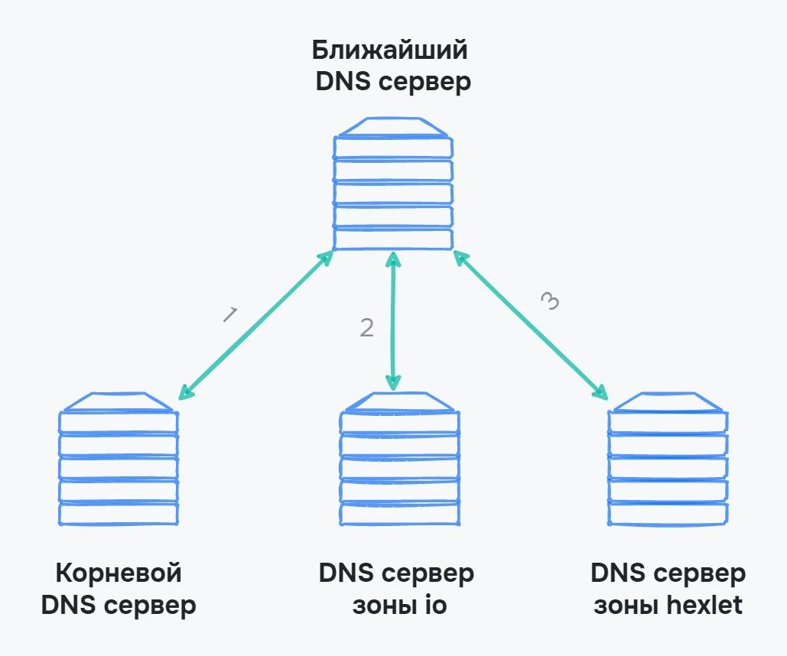

# DNS (Domain Name System / Система доменних імен)

Зі зростанням кількості комп'ютерів у мережі стандарт IPv4 було недостатнім для виділення унікальних IP-адрес кожному пристрою. У відповідь на це, був введений стандарт IPv6. Проте із зростанням числа IP-адрес стало важче зберігати та оновлювати їх адреси.

На початку розвитку ARPANet, коли в мережі було всього 50 комп'ютерів, користувачі просто зберігали адреси у звичайних блокнотах, подібно до телефонних книг. Однак із зростанням кількості комп'ютерів, цей метод став незручним. Крім того, адреси могли змінюватися, і потрібно було їх оновлювати.

Для полегшення життя користувачів та підтримки зручних імен комп'ютерів була введена система `hosts.txt`.

## Файл `hosts.txt`

У файлі `hosts.txt` описується структура виду IP-адреси — ім'я комп'ютера

```
# Адреса для звернення комп'ютера до себе
127.0.0.1      localhost

# Адреси комп'ютерів Google в мережі
216.239.35.0   Google.com
```

Цей формат дозволив вирішити дві проблеми:

- Користувачам не потрібно було зберігати адреси комп'ютерів в мережі самостійно.
- Комп'ютери отримали зручні імена для звернення, наприклад, адресу `216.239.35.0` можна було замінити на `Google.com`.

У випадку, коли адреса комп'ютера змінювалася, користувачі могли оновлювати файл `hosts.txt`, і не потрібно було запам'ятовувати нову адресу комп'ютера.

Проте, зі зростанням кількості користувачів, система зберігання адрес у файлі `hosts.txt` стала складною та неефективною.

## DNS

Для заміни файлу `hosts.txt` була розроблена система доменних імен, відома як DNS (Domain Name System) — автоматизований сервіс для зберігання адрес та імен комп'ютерів у мережі.

Завданням DNS є перетворення імен комп'ютерів у їхні IP-адреси. Тепер користувачам не потрібно надавати та оновлювати адреси кожного комп'ютера вручну. DNS стала великою базою даних, яка допомагає комп'ютерам у мережі спілкуватися один з одним. Комп'ютер, на якому запущений DNS-сервер, називається DNS-сервером. Ця система працює на локальному та глобальному рівнях. Коли комп'ютер надсилає запит на інший пристрій, він запитує IP-адресу одержувача у DNS-сервера.

Маючи на увазі, що в мережі існує велика кількість пристроїв і майже два мільярди веб-сайтів, неможливо зберігати всі ці дані на одному DNS-сервері. Тому існують розподілені DNS-сервери, кожен з яких відповідає за свою область. Наприклад, DNS-сервер `.ua` знає про розташування домену `my-site.ua`, а DNS-сервер домену `m.my-site.ua` знає про свої піддомени.

## Робота DNS

1. Коли комп'ютер відправляє запит, він спочатку звертається до відомого йому DNS-сервера, як правило, DNS-сервера провайдера. DNS провайдера має інформацію про те, які IP-адреси відповідають конкретним доменам і повертає відповідь до комп'ютера.
2. Якщо DNS-сервер провайдера не має інформації про потрібний домен, запит відправляється на кореневий DNS-сервер.
3. Кореневий DNS-сервер знає про DNS-сервери доменів верхнього рівня, які відповідають за ці домени. Він повертає адресу DNS-сервера домену верхнього рівня (наприклад, `.ua`).
4. DNS-сервер домену верхнього рівня повертає IP-адресу DNS-сервера для домену `m.my-site.ua`, і запит надсилається на цей сервер.
5. DNS-сервер домену `m.my-site.ua` повертає IP-адресу для піддомену `.m`, і відповідь надсилається назад на комп'ютер.

<figure>
    
    <figcaption>Розбиття DNS-сервера за рівнями</figcaption>
</figure>

## Домен

Адреса домену `m.my-site.ua` має кілька рівнів:

- Домен 0-го рівня (кореневий) (`.`) — найвищий рівень ієрархії доменів. Він використовується для ідентифікації кореневого рівня мережі і не може бути піддоменом іншого домену.
- Домен 1 рівня (верхнього) (`.ua`) — зазвичай вказує на географічну або національну приналежність домену або вказує на його призначення (наприклад, комерційний `.com`, освітній `.edu`, тощо).
- Домен 2 рівня (`.my-site`) — основна частина домену, яка зазвичай ідентифікує конкретну організацію, компанію або проект.
- Домен 3 рівня (піддомен домену) (`.m`) — використовується для створення піддоменів або підрозділів головного домену. Він додає додатковий рівень ієрархії до структури домену.

### Реєстрація домену

Для реєстрації домену користувачі повинні звертатися до реєстраторів доменів, які є авторизованими організаціями для реєстрації і управління доменами в конкретних доменних розширеннях. Під час реєстрації користувач обирає доступний домен, оплачує за нього і надає контактну інформацію.

Зареєстрований домен можна пов'язати з веб-сервером або іншими мережевими службами за допомогою налаштувань DNS (Domain Name System). Таким чином, коли користувач вводить доменну адресу в веб-браузері (наприклад, `m.my-site.ua`), DNS вирішує, який IP-адреса відповідає цьому домену і направляє запит до відповідного сервера.
