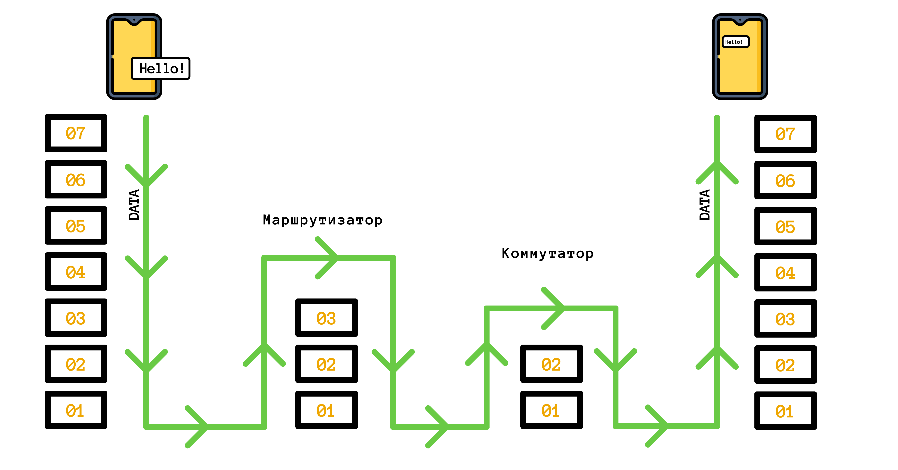

## Мережева модель OSI

OSI (Open Systems Interconnection) — модель, заснована на концепції багаторівневості. Вона розроблена Міжнародною організацією зі стандартизації. Має вертикальний набір шарів, кожен із яких виконує свої функції.

Основна мета моделі OSI — провести проектування та розробку обладнання, пристроїв та програмного забезпечення таким чином, щоб вони могли максимально ефективно взаємодіяти.

Говорячи простими словами, OSI — це модель процесу передачі даних, який поділений на сім частин. У кожній із цих частин використовуються свої протоколи, які додають до корисної інформації власні дані або перетворюють їх. Доповнення потрібні, щоб інформація дійшла до одержувача.

OSI має рекомендаційний характер. Це такий ідеальний варіант, щоб інформація дійшла успішно. Також вона дозволяє зрозуміти, як проходять дані на вже існуючих проектах, де ця інформація може бути втрачена або перехоплена, а також прискорити передачу даних.

Кожен рівень абстрагований від інших і нічого не знає про їхнє існування

1. Фізичний рівень — дроти, комутатори, переведення у біти
2. Канальний рівень — доставлення до кінця, виправлення помилок
3. Мережевий рівень — маршрутизація та адресація
4. Транспортний рівень — надійність, порядок передачі даних
5. Сеансовий рівень — підтримка сеансу зв'язку, синхронізація
6. Рівень представлення — переведення даних, шифрування, стиснення
7. Прикладний рівень — обробка користувальницької інформацію

Усі мережні пристрої працюють за моделлю OSI. Деякі використовують усі сім рівнів, інші — менше. Наприклад, комп'ютер або смартфон використовують усі рівні, маршрутизатор (роутер) — три нижні рівні, комутатор — лише два нижні рівні.

Використання меншої кількості рівнів у маршрутизаторів і комутаторів дозволяє обробляти дані у кілька разів швидше.

### 7 Прикладний рівень (Application)

Саме з цього рівня починається надсилання повідомлення, коли програма передає дані по мережі. Цей рівень ініціює та дозволяє додатку використовувати різні мережеві служби. Наприклад, служби віддаленого доступу до файлів, взаємодія за протоколами, базою даних, перегляд інтернет-сторінок тощо.

Це єдиний рівень, який безпосередньо взаємодіє із даними користувачів. При цьому самі програми не є частиною рівня. На цьому рівні обробляється інформація із додатків.

Протоколи тут не замислюються про гарантію доставки інформації чи маршрутизації, цим займаються рівні нижче. На прикладному рівні потрібна реалізація конкретних дій. Наприклад, отримання HTML-коду або email-повідомлення конкретним адресатом.

Протоколи: HTTP, DNC, EMAIL, POP, FTP, SMTP.

### 6 Рівень представлення (Presentation)

Перетворює інформацію без зміни змісту на той вигляд, який зрозумілий для різних машин, тобто на різних операційних системах, у тому числі мобільних, мультимедійних системах, будь-яких мікропрограмах. Наприклад, коли потрібно з програми на iOS увімкнути програму на телевізорі, або віддалено підключитися до комп'ютера з іншою операційною системою.

Протоколи: TSL, SSL, SSH, MIME.

### 5 Сеансовий рівень (Session)

Тут відбувається відкриття та закриття зв'язку між двома комп'ютерами. Цей рівень відповідає за підтримку сеансу зв'язку між пристроями та їхньої синхронізації.

Уявіть, що ви говорите телефоном і збираєтеся пройти підземним переходом. Ви знаєте, що дзвінок продовжиться, але зв'язку не буде. Коли ви вийдете з переходу, зв'язок відновиться, і ви продовжите розмову. Цей рівень відповідає за те, щоб у момент припинення з'єднання надходили запити на повторне з'єднання через невеликий проміжок часу.

На цьому рівні також відбувається керування токенами та синхронізація.

Протоколи: TSL, SSL SSH.

### 4 Транспортний рівень (Transport)

Відповідає за надійність передачі, при цьому можуть бути різні ступені надійності. Тут же вирішується порядок передачі. Наприклад, для відеотрансляції максимально важливою є швидкість доставки.

Протоколи: TCP, UDP.

### 3 Мережевий рівень (Network)

Утворює єдину транспортну систему із мереж, побудованих за різними мережевими технологіями. Забезпечує маршрутизацію — куди якийсь потік даних направити. Надає адресу. Є протоколи, які забезпечують інформацію, наскільки навантажена мережа.

Протоколи: IP, RIP, OSPF.

### 2 Канальний рівень (Data link)

У глобальних мережах забезпечує доставку між двома сусідніми вузлами. У локальних мережах, де багато рівнів OSI відсутні, на цей рівень покладено доставку даних від початку до кінця.

На другому рівні перевіряються та виправляються помилки передачі. Тут ми оперуємо поняттями "фрейм" або "кадр". Це корисні дані, яким додано додаткову службову інформацію, наприклад адресу відправника та одержувача. Нам також потрібно повідомляти, від кого і кому призначаються дані, що пересилаються.

Тут з'являються перші ідентифікатори MAC-адреси. MAC-адреса — це унікальний номер мережного обладнання або мережевого порту, тобто фізична адреса. Він потрібен для ідентифікації пристрою в одній мережі. Тобто MAC-адреса — це адреса пристрою на канальному рівні. Цьому рівню належать такі пристрої, як комутатори-перемикачі, які потрібні для підключення вузлів комп'ютерної мережі.

Протоколи: Ethernet (дротовий зв'язок), PPP (протокол "точка-точка", який транспортує IP пакети).

### 1 Фізичний рівень (Physical)

Рівень дротів, який передає дані в мережу, не вникаючи в зміст інформації, що передається. Керується канальним рівнем.

Інформація кодується в біти, щоб комп'ютер міг їх зрозуміти.

Технології: Ethernet, Bluetooth, WI-FI, USB, інфрачервоний порт.

### Основні моменти

-   Модель OSI — це теоретична еталонна модель
-   Передача між рівнями визначено протоколами
-   При переході з рівня до рівня дані доповнюються або перетворюються
-   Рівні можуть поєднувати подібні функції
