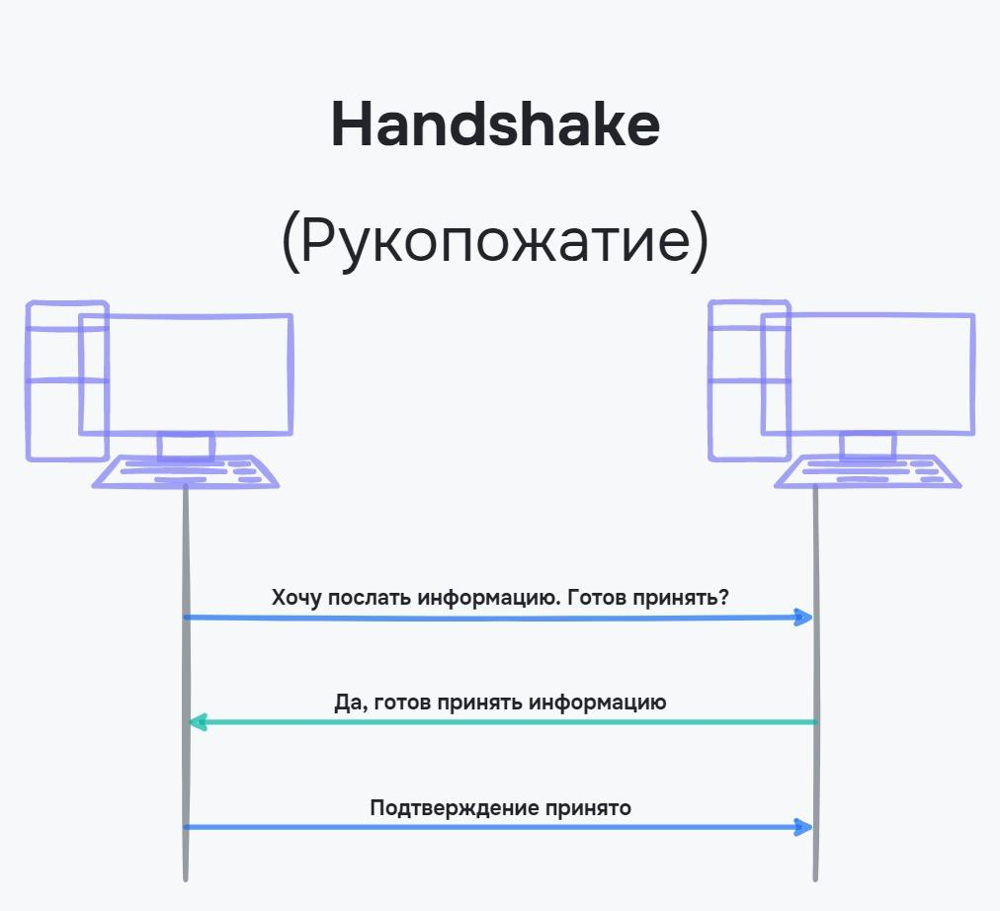
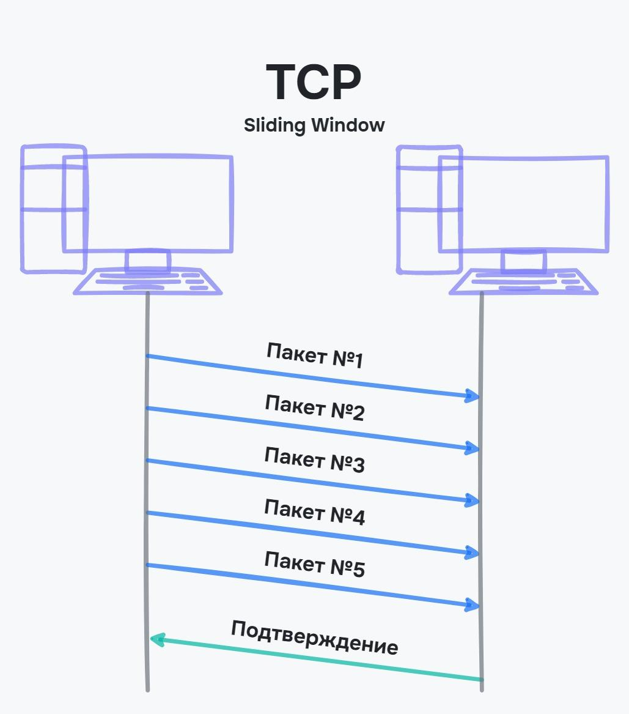

# TCP і UDP

## TCP (Transmission Control Protocol / Протокол керування передачею)

TCP — транспортний протокол, який використовується поверх IP та забезпечує надійну передачу пакетів.

Перед тим, як надіслати пакети TCP, встановлюється зв'язок між комп'ютерами. На мові системних адміністраторів такий механізм з'єднання називається потрійним рукостисканням (three-way handshake)

1. Комп'ютер, який надсилає дані, відправляє пакет із бітом SYN (синхронізувати?)
2. У відповідь чекає пакет із бітом ASK (підтвердженням готовності до прийому інформації) та бітом SYN
3. Комп'ютер надсилає пакет із бітом ASK (запит, що отримав підтвердження)

<figure>
    
    <figcaption>Механізм потрійного рукостискання</figcaption>
</figure>

Це спрощена схема, але в ній видно, що комп'ютер, який надсилає інформацію, не тільки надсилає запит на передачу, а й підтверджує, що йому прийшов дозвіл. Такий спосіб ненадовго затримує час до надсилання інформації, але гарантує, що обидва пристрої можуть обмінюватися інформацією.

Пакети TCP передаються з постійним підтвердженням. Кожен пакет маркуються порядковим номером, відправляється та підтверджується окремо

<figure>
    
    <figcaption>Підтвердження пакетів за протоколом TCP</figcaption>
</figure>

Якщо при передачі пакета сталася помилка, наприклад, обірвався зв'язок, і не було підтвердження, то пакет надсилається ще раз. Для цього кожен пакет має таймер, протягом якого очікується підтвердження

<figure>
    
    <figcaption>Очікування підтвердження</figcaption>
</figure>

Приймати підтвердження на кожен пакет потрібно в умовах поганого зв'язку або передачі важливої ​​інформації. Ця процедура не відбувається миттєво і чим більше даних, тим більше часу йде на підтвердження пакетів.

Щоб не підтверджувати отримання кожного пакета, використовується протокол ковзного вікна або Sliding Window Protocol. І тут підтверджується не один пакет, а відразу кілька. В іншому відмінностей немає — якщо прийшло підтвердження, то надсилаються наступні пакети, якщо підтвердження немає, то повторюється пересилання пакетів. Якщо адресат не відповідає після кількох спроб, сесія розривається. Тобто, цей протокол точно доставить вірні дані, якщо сесія не розірвалася.

<figure>
    
    <figcaption>Протокол ковзного вікна</figcaption>
</figure>

### Задачі TCP

-   Доставляє пакети даних по порядку
-   Якщо пакети даних губляться в дорозі або пошкоджуються (бітова помилка), то інформує про це відправника (посилає повідомлення про помилку)
-   Повторно передає пакети даних, якщо є проблема

### Відкриття TCP-з'єднання

Для нового ресурсу відкривається нове з'єднання і на це витрачається час. Прискорення продуктивності досягається відкриттям TCP-з'єднання заздалегідь — тобто передзавантаженням контенту.

Прискорити продуктивність досить легко. Існують значення атрибуту 'rel' для тега 'link', які віддають команди на попередні дії

```
<link rel="preload" href="fonts/cicle_fina-webfont.woff2" as="font" type="font/woff2" crossorigin>
<link rel="prefetch" href="image-product-122.png" as="image">
<link rel="prerender" href="https://example.com/prices" />
<link rel="preconnect" href="//google-analytics.com" crossorigin>
<link rel="dns-prefetch" href="//google-analytics.com">
```

-   `preload` — використовується, якщо вам знадобиться ресурс протягом кількох секунд. Віддає команду браузеру, що потрібно цей ресурс завантажити та кешувати, але поки що нічого не робить з цим ресурсом. Надає його лише тоді, коли його вимагають. Можна використовувати для кастомних шрифтів.
-   `prefetch` — завантажує ресурси з мінімальним пріоритетом, тобто після завантаження решти. Його варто використовувати для завантаження ресурсів, які знадобляться на наступній сторінці.
-   `prerender` — просить завантажити URL-адресу. При цьому завантажується вся сторінка та її ресурси, але не завантажується та не виконується JavaScript. Варто використовувати для найпопулярнішої сторінки, на яку переходить більше половини користувачів.
-   `dns-prefetch` — заздалегідь просять підключитися до DNS зовнішніх сайтів. Наприклад, Google Maps або Facebook.
-   `preconnect` — теж отримує DNS, але йде далі та встановлює з'єднання з ресурсом. Може стати в нагоді для додатків, які запитують інформацію зі сторонніх сервісів, наприклад, для турагентств. Або програми бібліотеки термінів, яка надає посилання на зовнішні сайти.

## UDP (User Datagram Protocol / Протокол датаграм користувача)

UDP — транспортний протокол, який використовують у ситуаціях, коли потрібно швидко відреагувати на отриману інформацію. Наприклад, запит про IP-адресу, дії в грі, потокова передача відео та аудіо. Під час потокової передачі не очікується завантаження файлу, а відтворюється та частина, яка вже завантажилася.

Від UDP потрібно лише надіслати інформацію. Чи буде вона отримана, пошкоджена або продубльована — не важливо. Тому протокол використовується для передачі невеликої інформації.

<figure>
    
    <figcaption>Передача пакетів за протоколом UDP</figcaption>
</figure>

Якщо пакет з якоїсь причини не дійшов, його повторне відправлення не відбудеться. Тому UDP не використовується для передачі важливої ​​або великої інформації.

Уявіть гру онлайн, де вашому персонажу потрібно стрибати. Якщо передавати інформацію по протоколу TCP, то виникне затримка між натисканням клавіші та отриманням інформації в грі. Затримка невелика, але в змагальних іграх вона може призвести до програшу. Інформація про дію персонажа невелика, тому її можна надіслати за допомогою протоколу UDP. Звичайно, якщо інформація не дійде, то взагалі не буде жодної дії. Але ймовірність у цього досить маленька, і розробники мають намір нехтувати надійністю для швидкості.

## Порівняння TCP і UDP

TCP

-   Підходить для передачі великої інформації
-   Повільна передача пакетів
-   Гарантія передачі пакетів

UDP

-   Підходить для передачі короткої інформації
-   Швидка передача пакетів
-   Відсутність гарантії передачі пакетів
