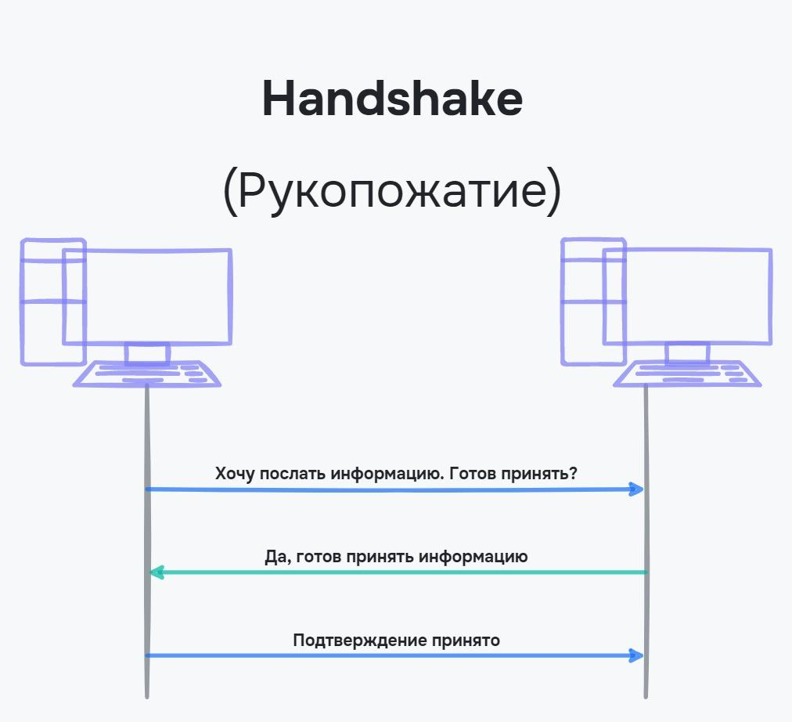
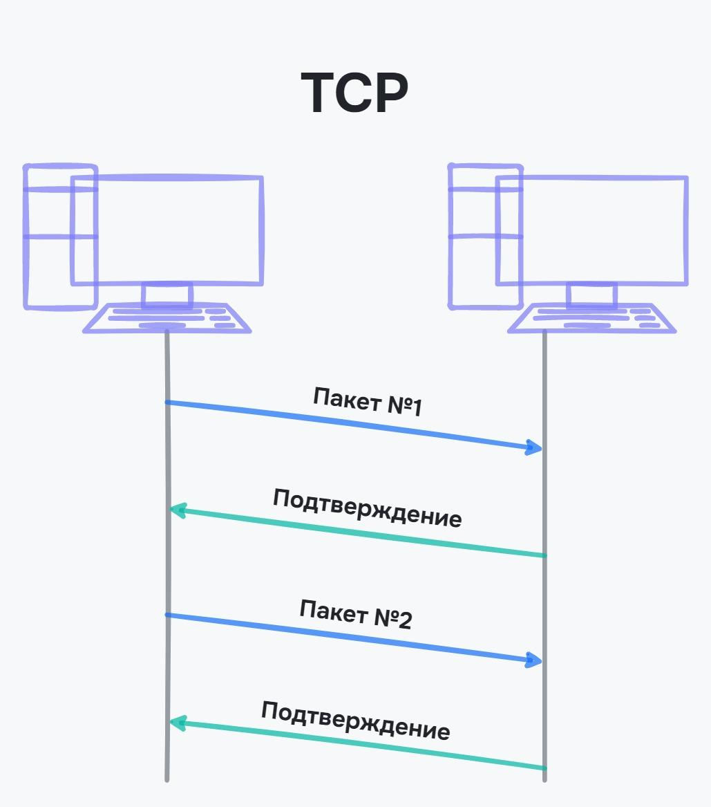
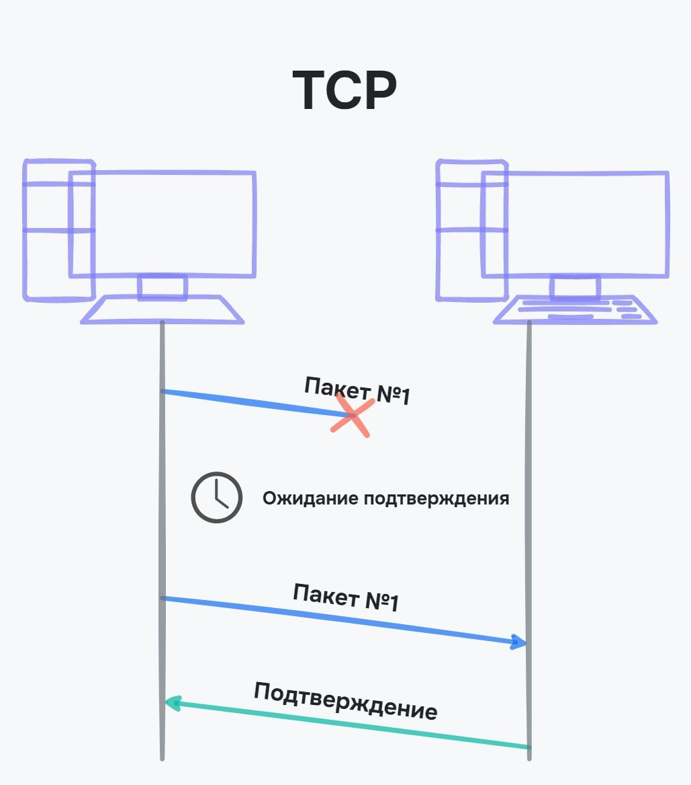
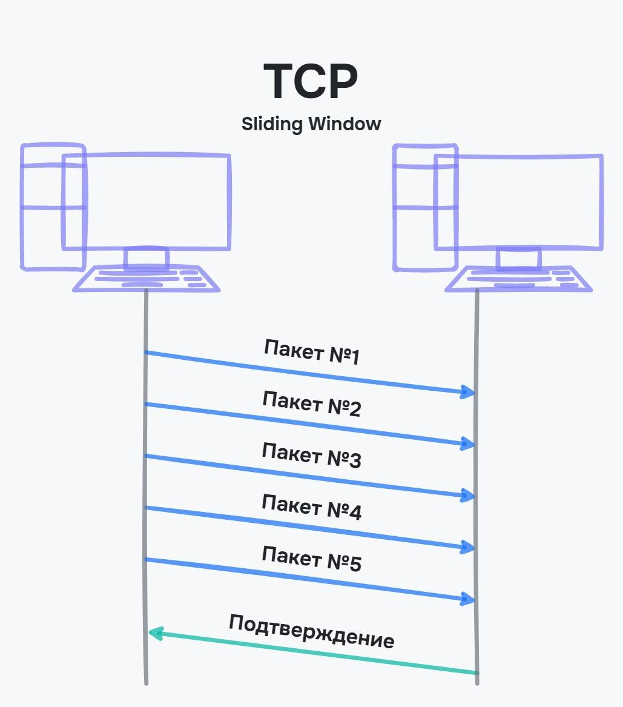
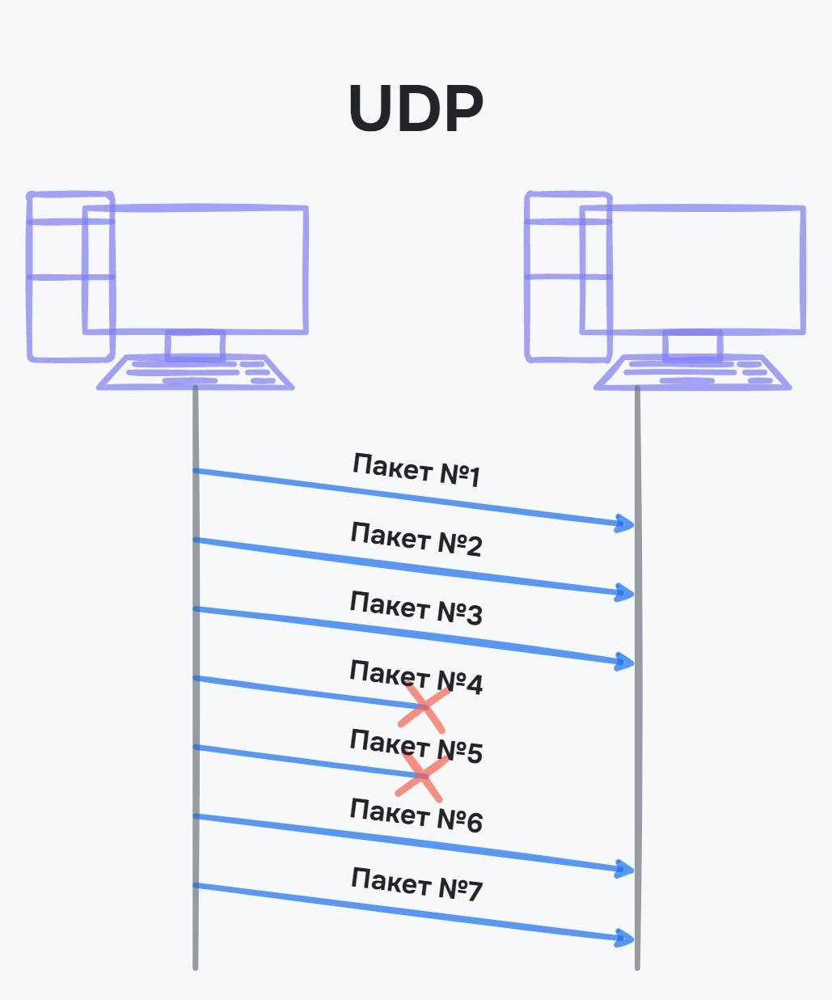

# TCP і UDP

## TCP (Transmission Control Protocol / Протокол керування передачею)

TCP — транспортний протокол, який використовується поверх IP для забезпечення надійної передачі пакетів.

Перед тим, як надіслати пакети через TCP, встановлюється з'єднання між комп'ютерами. Цей механізм з'єднання відомий як "потрійний рукостискання" (three-way handshake):

1. Комп'ютер, який надсилає дані, відправляє пакет із бітом SYN (синхронізувати?).
2. У відповідь очікується пакет із бітом ACK (підтвердженням готовності приймати інформацію) та бітом SYN.
3. Комп'ютер, що надсилає дані, надсилає пакет із бітом ACK (підтвердженням отримання попереднього пакета).

<figure>
    
    <figcaption>Механізм потрійного рукостискання</figcaption>
</figure>

Це спрощена схема, вона показує, що комп'ютер, що надсилає інформацію, не просто надсилає запит на передачу, а також підтверджує готовність для прийому. Цей механізм, хоч і додає невеликий час затримки перед передачею даних, гарантує надійну комунікацію між пристроями.

Пакети TCP передаються з постійним підтвердженням. Кожен пакет маркується порядковим номером, відправляється та підтверджується окремо.

<figure>
    
    <figcaption>Підтвердження пакетів за протоколом TCP</figcaption>
</figure>

Якщо при передачі пакета сталася помилка, наприклад, з'єднання було розірвано і не отримано підтвердження, то пакет надсилається ще раз. Для цього кожен пакет має таймер, під час якого очікується підтвердження.

<figure>
    
    <figcaption>Очікування підтвердження</figcaption>
</figure>

Процедура підтвердження на кожен пакет є необхідною в умовах поганого зв'язку або для передачі важливої ​​інформації. Однак вона не відбувається миттєво, і чим більше даних, тим більше часу потрібно для підтвердження пакетів.

Щоб уникнути підтвердження кожного окремого пакета, використовується протокол ковзного вікна, або Sliding Window Protocol. У цьому випадку підтверджується не кожен окремий пакет, а кілька пакетів одночасно. У разі відсутності підтвердження пакетів, вони надсилаються повторно. Якщо адресат не відповідає після кількох спроб, з'єднання розривається. Тобто цей протокол гарантує доставку вірних даних, якщо з'єднання не було розірвано.

<figure>
    
    <figcaption>Протокол ковзного вікна</figcaption>
</figure>

### Завдання TCP

- Забезпечує доставку пакетів даних в правильному порядку.
- Якщо пакети даних загублені або пошкоджені (бітова помилка), TCP інформує відправника і надсилає повідомлення про помилку.
- Повторно надсилає пакети даних у випадку проблеми.

### Встановлення з'єднання за допомогою TCP

Створення нового з'єднання для нового ресурсу вимагає певного часу. Прискорення продуктивності можливе за допомогою передзавантаження контенту через відкриття TCP-з'єднання наперед:

Для цього використовуються значення атрибуту `rel` для тега `link`, які вказують браузеру, які дії потрібно виконати наперед:

```html
<link
  rel="preload"
  href="fonts/cicle_fina-webfont.woff2"
  as="font"
  type="font/woff2"
  crossorigin
/>
<link rel="prefetch" href="image-product-122.png" as="image" />
<link rel="prerender" href="https://example.com/prices" />
<link rel="preconnect" href="//google-analytics.com" crossorigin />
<link rel="dns-prefetch" href="//google-analytics.com" />
```

- `preload` — використовується, якщо ресурс може бути потрібним у найближчий час. Вказує браузеру завантажити та кешувати ресурс, але не завантажує його, поки не знадобиться. Це корисно для кастомних шрифтів та інших ресурсів.
- `prefetch` — використовується для завантаження ресурсів з мінімальним пріоритетом, тобто після завантаження інших ресурсів. Зазвичай використовується для ресурсів, які будуть використовуватися на наступних сторінках.
- `prerender` — запитує браузер завантажити і рендерити сторінку повністю, але не виконує JavaScript. Використовується для найпопулярніших сторінок, на які переходить більше половини користувачів.
- `dns-prefetch` — заздалегідь просять браузер виконати DNS-підключення до зовнішніх сайтів, таких як Google Maps або Facebook.
- `preconnect` — також виконує DNS-підключення, але також встановлює з'єднання з ресурсом. Використовується для застосунків, які вимагають інформацію зі сторонніх сервісів, наприклад, для турагентств або бібліотек термінів, які посилаються на зовнішні сайти.

## UDP (User Datagram Protocol / Протокол датаграм користувача)

UDP — це транспортний протокол, який використовується в ситуаціях, коли необхідно швидко реагувати на отриману інформацію, такі як запити про IP-адреси, дії в іграх, аудіо- та відеопотоки. Під час передачі даних по UDP не очікується завантаження файлу в цілому, а замість цього відтворюється та частина, яка вже була отримана.

В UDP важливо лише надіслати інформацію. Чи буде вона отримана, пошкоджена або втрачена — не є головною проблемою. Тому протокол використовується для передачі невеликих обсягів інформації.

<figure>
    
    <figcaption>Передача пакетів за протоколом UDP</figcaption>
</figure>

Якщо пакет з якихось причин не був отриманий, він не буде автоматично повторно відправлений. Тому UDP не використовується для передачі важливої ​​або великої інформації.

Уявіть онлайн-гру, де вашому персонажу потрібно виконувати швидкі дії, наприклад, стрибати. Якщо використовувати TCP для передачі інформації, то може виникнути затримка між натисканням клавіші та відгуком у грі. Ця затримка, хоч і невелика, може призвести до невдачі в змагальних іграх. Оскільки інформація про дії персонажа великого обсягу, її можна надсилати за допомогою протоколу UDP. Звісно, якщо інформація не дійде, то дія не відбудеться, але ймовірність цього досить невелика, і розробники зазвичай обирають швидкість перед надійністю.

## Порівняння TCP і UDP

TCP:

- Підходить для передачі великих обсягів інформації.
- Повільна передача пакетів.
- Забезпечує гарантовану доставку пакетів.

UDP:

- Підходить для передачі коротких повідомлень або даних.
- Швидка передача пакетів.
- Немає гарантії доставки пакетів.
