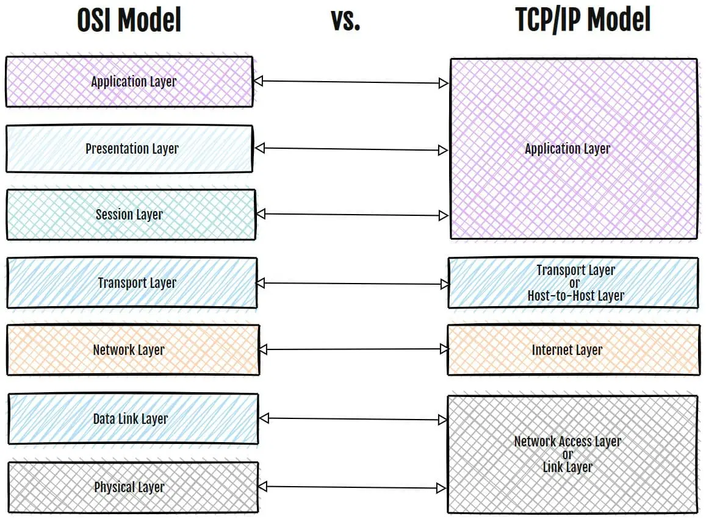

# TCP/IP

TCP/IP — це стандартний стек протоколів, який використовується для кожної мережі. Він забезпечує адресацію додатків та маршрутизацію в мережі.

Важливим завданням стека є забезпечення просування пакетів даних через мережу. Звичайно, для такого просування потрібно адресувати вузли, і для цього використовується IP.

Модель складається не тільки з протоколів TCP та IP, але вони є основними, тому за нею закріпили таку назву.

Комп'ютери відрізняються один від одного за виробником, типом операційної системи, програмною начинкою. Щоб вони розуміли одне одного, процес комунікації повинен дотримуватися правил. Наприклад, є правила передачі файлів і передачі повідомлень між поштовими скриньками. У комп'ютерних мережах їх визначають протоколи передачі.

## Важливі моменти стеку TCP/IP

-   Контролює, щоб дані йшли далі
-   Фрагментує пакети даних під технології передачі
-   Передає трафік різного виду
-   Може розібратися з вимогами надійності, швидкості передачі, безпеки
-   Може здійснити логічне з'єднання
-   Надає у межах сеансу відносно рівномірну швидкість

## Архітектура TCP/IP

Мережева модель ділиться на 4 рівні, у кожному з яких застосовуються протоколи для роботи тієї чи іншої функції

1. Канальний рівень (Link Layer) — найнижчий рівень. На цьому рівні описуються протоколи, які забезпечують зв'язок комп'ютерів у мережі, обробку даних пристроями. Дротове, супутникове, бездротове з'єднання, мережеві плати та свитчі — все це стосується канального рівня. На цьому рівні використовуються протоколи Ethernet, IEEE 802.11, Wi-Fi
2. Мережевий рівень (Network Layer) — протоколи взаємодії мереж між собою. У моделі TCP/IP на цьому рівні використовується протокол IP
3. Транспортний рівень (Transport Layer) — протоколи передачі інформації. В Інтернеті на цьому рівні використовуються протоколи TCP та UDP
4. Прикладний рівень (Application Layer) — протоколи зв'язку мережевих програм. Ці протоколи дозволяють відкривати сайти, дивитися онлайн-фільми

### Рівень мережевих інтерфейсів

Відповідає за розміщення та прийом пакетів. TCP/IP розроблено так, щоб не залежати від методу доступу до мережі, формату пакетів та носія.

TCP/IP не вдається у подробиці, просто знає, поверх якої технології зараз знаходиться: локальної, міської, глобальної чи телефонної. Він просто фрагментує дані під цю технологію і далі надсилає ці фрагменти. Нижні технології він розглядає як передавач даних. Це дозволяє такій технології працювати незалежно від технології, поверх якої будується.

Цей рівень співвідноситься з канальним та фізичним рівнями моделі OSI. Тут триває підготовка пакетів передачі наступного рівня.

Протоколи: Ethernet (дротовий зв'язок), PPP (протокол "точка-точка", який транспортує IP пакети).

### Інтернет рівень

Мета цього рівня — адресувати пакет, запакувати та скласти маршрут до мережі призначення. Далі мережа доставляє ці дані остаточно тому вузлу, якому вони були адресовані. На цьому рівні IP додає до пакетів заголовок, який відомий як IP-адреса.

Протоколи: IP (інтернет-протокол), ARP (протокол дозволу адрес), ICMP (інтернет-протокол керуючих повідомлень, відповідає за надання функцій діагностики та повідомлення про помилки через невдалу доставку IP-пакетів).

### Транспортний рівень

Транспортний протокол відповідає за транспортування інформації між комп'ютерами. Коли між пристроями передається велика кількість інформації, вона розбивається на невеликі частини пакети, які посилаються по черзі. Комп'ютер збирає всі пакети разом і перевіряє їхню цілісність за угодами, якщо це визначено в протоколі.

Розмір інформації, яку можна передати у пакеті, залежить від різних обставин, обмежень, угод. Наприклад, від способу підключення, обмежень провайдера та особливостей обладнання. У середньому це значення становить 1500-2000 байт чи 1.5-1.9 кілобайта. Наприклад, якщо нам потрібно передати музичну композицію вагою 5120 кілобайт, то знадобляться ~3414 пакети.

Щоб така кількість інформації коректно передавалась, на транспортному рівні визначається

-   Як нумеруються пакети
-   Чи перевіряється доставка пакетів
-   Чи перевіряється цілісність пакетів — чи не містять відправлений та отриманий пакети відмінностей
-   Скільки пакетів прийшло і скільки ще чекати

Протоколи: TCP (протокол керування передачею), UDP (протокол датаграм користувача).

### Прикладний рівень

Дозволяє користувачам отримувати доступ до послуг глобального чи приватного Інтернету.

Протоколи: протокол передачі гіпертексту (HTTP), система доменних імен (DNS), передача файлів (FTP), транспортний протокол реального часу (RTP), віртуальний термінал (TELNET), електронна пошта (SMTP).

Рівень додатків TCP/IP є комбінацією прикладного рівня, рівень представлення та сеансового рівня моделі OSI.

### Навіщо модель розділена на шари

-   Кожен шар діє окремий модуль. Тому кожен окремий модуль можна модифікувати, не торкаючись інших шарів
-   Кожен шар автономний і має окремі завдання. Тому кожен шар може зосередити всі свої ресурси на виконанні своєї роботи та не турбуватися про роботу інших шарів
-   Ієрархічна організація системи. Існує безперервний потік даних між різними рівнями, і немає жодної двозначності щодо виконання різних операцій. Є певний порядок виконання робіт, що спрощує проектування та використання систем зв'язку.

## Основні відмінності між TCP/IP та OSI

TCP/IP — це стандартний клієнт-сервер протокол, який використовується для кожної мережі, включаючи Інтернет. OSI — це не протокол, а еталонна модель. Вона стандартизує, як має розділятися праця під час передачі даних у різних програмних забезпеченнях. Вона важлива для розуміння та проектування архітектури системи.

<figure>
    
    <figcaption>Зіставлення моделі OSI зі стеком TCP/IP</figcaption>
</figure>
