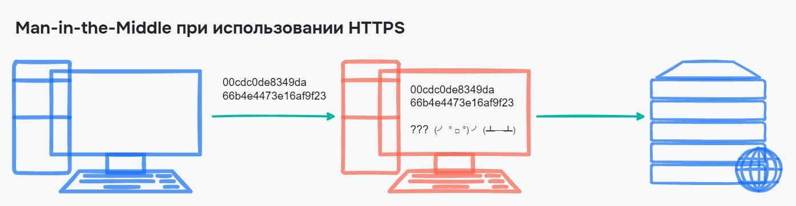

# Атаки на вразливість

## Man-in-the-Middle

Поки дані переходять від клієнта на сервер, їх можна перехопити і прочитати. Через те, що дані тільки читаються, то ні сервер, ні клієнт не помітять цього, отже нічого дивного для двох сторін не станеться.

Назву Man-in-the-Middle або «Людина посередині» атака отримала через те, що зловмисник вбудовується у процес передачі інформації. Спочатку вся інформація проходить через нього, а вже потім йде далі

<figure>
    
    <figcaption>Передача по HTTP</figcaption>
</figure>

Один із найпростіших способів здійснити таку атаку — створити свою публічну Wi-Fi мережу, наприклад, у кафе. У результаті користувач підключається до неї, і тепер зловмисник може бачити всі пакети, що пересилаються цією мережею.

Якщо використовується протокол HTTPS, між клієнтом та сервером встановлюється захищене з'єднання. Всі дані в ньому шифруються, а розшифрувати їх можна лише на одній із сторін, але не під час передачі. Навіть якщо зловмисник зможе перехопити пакети, замість даних він отримає безглузду інформацію

<figure>
    
    <figcaption>Передача по HTTPS</figcaption>
</figure>
