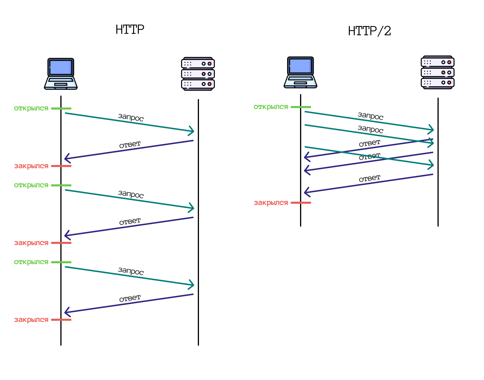
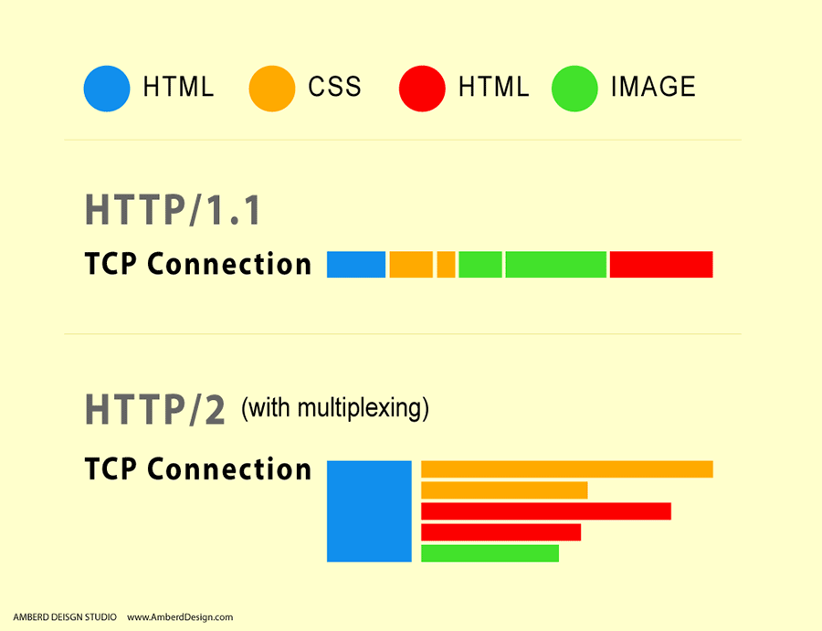
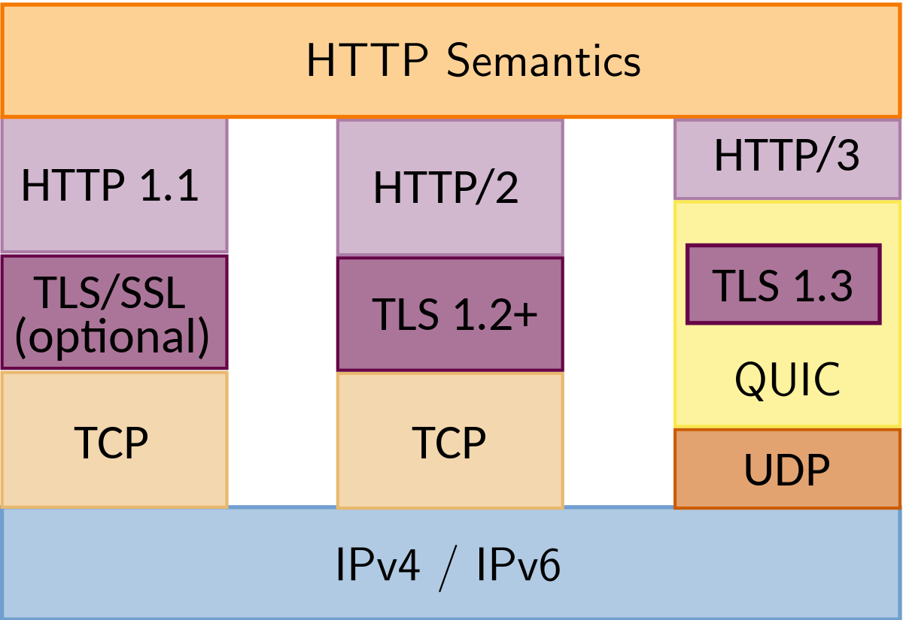
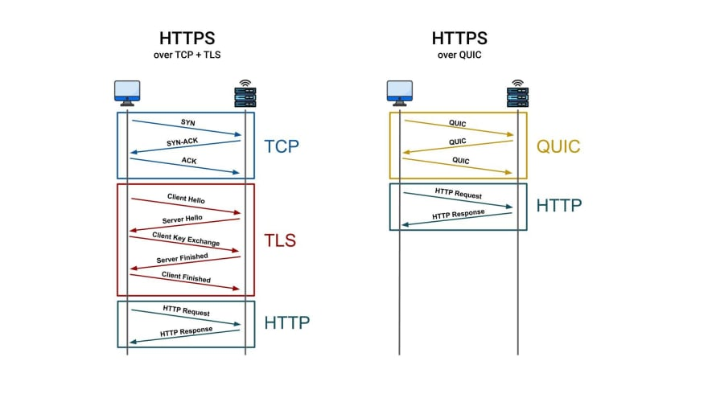

# Порівняння HTTP/1, HTTP/2, HTTP/3

HTTP/1 та HTTP/2 працюють поверх TCP. HTTP/3 працює поверх QUIC, який у свою чергу працює поверх UDP. Це означає, що при помилці надсилання пакетів при HTTP/1 і HTTP/2 буде запитуватися повторне відправлення, а в HTTP/3 — ні.

З точки зору синтаксису та семантичної структури HTTP/3 схожий на HTTP/2. HTTP/3 бере участь у тих же типах обміну повідомленнями запиту/відповіді з форматом даних, які містять методи, заголовки, коди стану та тіло.

## Порівняння HTTP/1 та HTTP/2

### Переваги HTTP/2

1. HTTP-повідомлення розбиваються на один або кілька кадрів із загальним заголовком. Це скорочує додатковий час прийому-передачі (RTT), прискорюючи завантаження сайту без оптимізації
2. Заголовки стискуються за допомогою алгоритму HPACK. Відбувається скорочення інформації обміну між браузером і сервером
3. HTTP/2 мультиплексований. У HTTP/1 для кожного запиту потрібно встановлювати окреме з'єднання TCP, і одноразова кількість з'єднань TCP обмежена. З HTTP/2 клієнт та сервер можуть надсилати безліч запитів та відповідей в одному TCP-з'єднанні. Як результат, швидше завантаження

<figure>
    
    <figcaption>Мультиплексований HTTP/2</figcaption>
</figure>

4. Паралельний запит статичних елементів

<figure>
    
    <figcaption>Паралельний запит статичних елементів у HTTP/2</figcaption>
</figure>

5. Реалізовано push-сервер — можливість сервера надсилати кілька відповідей на клієнтський запит. Наприклад, якщо клієнт запитує файл form.html, а для його завантаження потрібні файли form-script.js та icon-form.svg, то сервер відправить відразу три файли. У цьому випадку кеш-браузер може бути очищений або оновлений
6. HTTP/2 — це бінарний протокол, а не текстовий, як HTTP/1, що усуває проблеми безпеки, пов'язані з передачею тексту HTTP
7. У HTTP/2 покращено процес розподілу пріоритетів, тобто браузеру віддаються спочатку найважливіші файли
8. HTTP/2 менш схильний до помилок і займає менше місця в мережі
9. HTTP/2 передбачає використання веб-програмою безпечного з'єднання HTTPS
10. У HTTP/2 усі ресурси зберігаються у кеші

### Недоліки HTTP/2

1. Кожне з'єднання потребує більших обсягів пам'яті порівняно з HTTP/1
2. Веб-додатки з ресурсомісткими аудіо та відеопотоками працюють повільніше
3. Використання одночасних запитів збільшує навантаження на сервер, що призводить до тайм-аутів запитів. Для клієнтів із повільним мережним підключенням кількість пакетів поступово падатиме, і якість мережі погіршиться до одного підключення HTTP/2. Це сповільнює весь процес та блокує передачу даних

### Оптимізації HTTP/1 та HTTP/2

У міру розвитку веб-розробки були створені методи, які дають змогу прискорити завантаження веб-сайтів за протоколом HTTP/1. Після перемикання на HTTP/2 деякі з них відключаться, тому логічно їх скасувати.

Наприклад, загальна рекомендація для HTTP/1 полягає в тому, щоб зменшити кількість файлів CSS і Javascript, на які є посилання у вихідному коді, і об'єднати їх в одні файли. Це має сенс для протоколу HTTP/1, оскільки веб-сторінки поступово завантажуються, від початку до кінця. Швидше завантажити один великий файл з усіма CSS або JavaScript, ніж окремі файли для кожної частини веб-застосунку. Недоліком цієї практики є те, що при кожній невеликій зміні CSS та JavaScript ваш веб-сайт повинен оновлювати весь великий файл, а користувачам доводиться завантажувати непотрібний код.

Завдяки перевагам швидкості HTTP/2 можна завантажувати лише той код JavaScript або CSS, який дійсно потрібний користувачеві під час відвідування конкретної сторінки.

## Порівняння HTTP/2 та HTTP/3

### Подібності між HTTP/2 та HTTP/3

-   Server Push
-   Мультиплексування, що здійснюється через одне з'єднання через потоки
-   Приоритизація ресурсів виконується з урахуванням потоків
-   Стиснення заголовків як HPACK та QPACK, які прив'язані до порядку пакетів

### Відмінності між HTTP/2 та HTTP/3

Основна відмінність полягає в тому, що HTTP/3 заснований на QUIC як транспортному рівні для обробки потоків. HTTP/2 використовує TCP для обробки потоків на рівні HTTP.

<figure>
    
    <figcaption>Стек протоколів HTTP/3 порівняно з HTTP/1 і HTTP/2</figcaption>
</figure>

HTTP/3 забезпечує набагато швидше «рукостискання» для встановлення безпечного сеансу порівняно з HTTP/2, в якому це досягається за допомогою TCP та TLS. HTTP/3 може бути реалізований тільки безпечним та зашифрованим способом, тоді як HTTP/2 може бути реалізована без HTTPS.

<figure>
    
    <figcaption>Встановлення безпечного сеансу HTTP/3 порівняно з HTTP/2</figcaption>
</figure>
