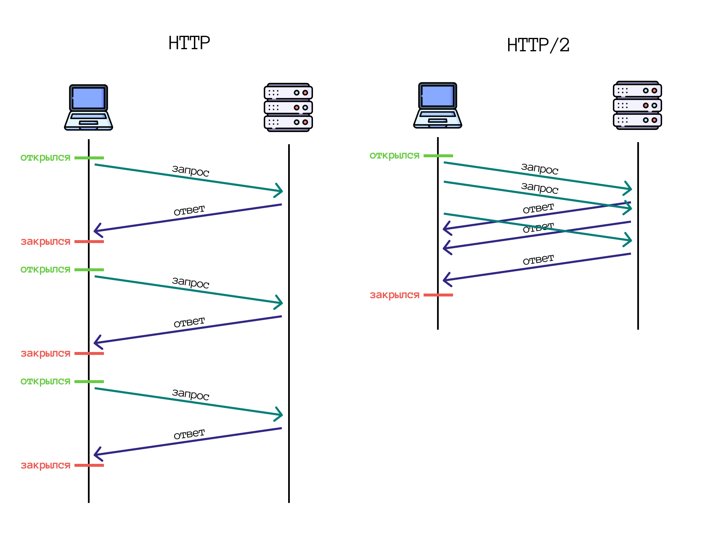
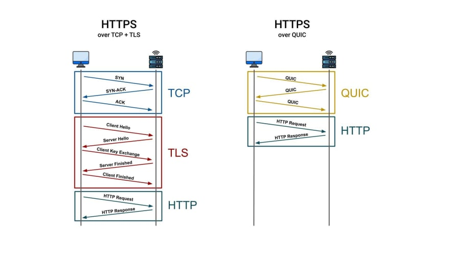

# Порівняння HTTP/1, HTTP/2 та HTTP/3

HTTP/1, HTTP/2 і HTTP/3 — це протоколи, які використовуються для забезпечення зв'язку між клієнтом і сервером в Інтернеті.

## Порівняння HTTP/1 та HTTP/2

HTTP/1 і HTTP/2 працюють поверх протоколу TCP.

### Переваги HTTP/2

- Мультиплексування — HTTP/2 дозволяє відправляти кілька запитів та відповідей через одне TCP-з'єднання, зменшуючи затримки завантаження сторінки.
- Стиснення заголовків — заголовки стискаються алгоритмом HPACK, що зменшує обсяг даних, що передається між клієнтом і сервером.
- Push-сервер — сервер може автоматично надсилати ресурси клієнту, що збільшує швидкість завантаження сторінки.
- Бінарний протокол — HTTP/2 є бінарним протоколом, що полегшує обробку та зменшує проблеми безпеки, пов'язані з передачею текстового HTTP.
- Пріоритизація ресурсів — ресурси обслуговуються в порядку, визначеному через потоки.

### Недоліки HTTP/2

- Більше пам'яті — кожне з'єднання HTTP/2 вимагає більше пам'яті порівняно з HTTP/1.
- Повільність для аудіо та відеопотоків — для веб-застосунків з ресурсомісткими аудіо та відеопотоками HTTP/2 може бути повільним.
- Збільшене навантаження на сервер — одночасні запити збільшують навантаження на сервер, що може призвести до тайм-аутів.

## Перехід до HTTP/2

З розвитком веб-розробки, багато з оптимізацій для HTTP/1 стають непотрібними при використанні HTTP/2. Наприклад, об'єднання CSS та JavaScript файлів більше не є обов'язковим, оскільки HTTP/2 дозволяє завантажувати лише необхідні ресурси.

<figure>
    
    <figcaption>Мультиплексований HTTP/2</figcaption>
</figure>

<figure>
    
    <figcaption>Паралельний запит статичних елементів у HTTP/2</figcaption>
</figure>

## Порівняння HTTP/2 та HTTP/3

### Подібності

- Server Push.
- Мультиплексування.
- Пріоритизація ресурсів.
- Стиснення заголовків.

### Відмінності

Основна відмінність між HTTP/2 та HTTP/3 полягає в транспортному рівні:

- HTTP/3 — використовує QUIC та UDP для обробки потоків, що забезпечує швидше «рукостискання» та обов'язкове шифрування.
- HTTP/2 — базується на TCP для обробки потоків.

<figure>
    
    <figcaption>Стек протоколів HTTP/1 і HTTP/2 порівняно з HTTP/3</figcaption>
</figure>

<figure>
    
    <figcaption>Встановлення безпечного сеансу HTTP/2 порівняно з HTTP/3</figcaption>
</figure>
