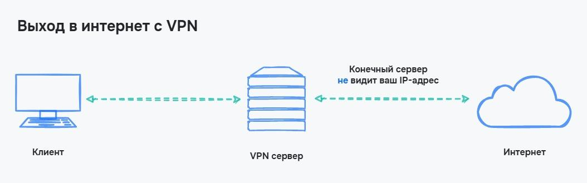

# Приватність та безпека

## VPN

VPN (Virtual Private Network / Віртуальна приватна мережа) — безпека забезпечується створенням приватної мережі поверх інтернету. У цьому випадку дані, що пересилаються, не відстежуються в інтернеті, а можуть додатково шифруватися

Сам собою VPN — це сервер, до якого користувачі підключаються в приватну мережу. З цієї мережі й походять запити до інтернету або до внутрішніх ресурсів мережі. Оскільки підключення до Інтернету відбувається не від клієнта, а від VPN сервера, то VPN використовують для обходу блокувань сайтів або додатків в інтернеті

<figure>
    
    <figcaption>Вихід в інтернет з VPN</figcaption>
</figure>

Безпека усієї системи забезпечується шифруванням ще до переходу даних до провайдера. Значить, немає місць, де можна перехопити інформацію, що передається. Щоб побачити це, проілюструємо процес підключення без VPN та з ним

<figure>
    
    <figcaption>Підключення до інтернету без VPN</figcaption>
</figure>

<figure>
    
    <figcaption>Підключення до інтернету з VPN</figcaption>
</figure>
