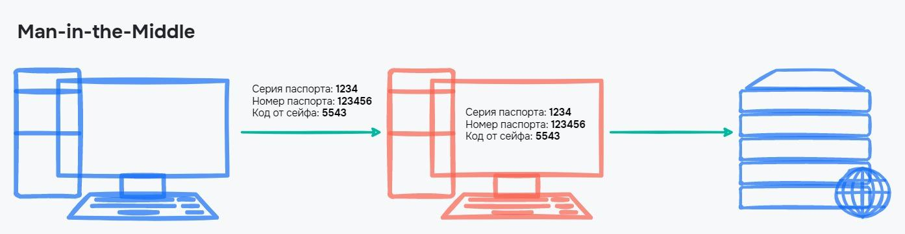

# Атаки на вразливість

## Man-in-the-Middle

Поки дані переходять від клієнта на сервер, їх можна перехопити і прочитати. Через те, що дані тільки читаються, то ні сервер, ні клієнт не помітять цього, отже нічого дивного для двох сторін не станеться.

Назву Man-in-the-Middle або «Людина посередині» атака отримала через те, що зловмисник вбудовується у процес передачі інформації. Спочатку вся інформація проходить через нього, а вже потім йде далі

<figure>
    
    <figcaption>Передача по HTTP</figcaption>
</figure>

Один із найпростіших способів здійснити таку атаку — створити свою публічну Wi-Fi мережу, наприклад, у кафе. У результаті користувач підключається до неї, і тепер зловмисник може бачити всі пакети, що пересилаються цією мережею.

Якщо використовується протокол HTTPS, між клієнтом та сервером встановлюється захищене з'єднання. Всі дані в ньому шифруються, а розшифрувати їх можна лише на одній із сторін, але не під час передачі. Навіть якщо зловмисник зможе перехопити пакети, замість даних він отримає безглузду інформацію

<figure>
    
    <figcaption>Передача по HTTPS</figcaption>
</figure>

## Фішинг

Фішинг — атака, при якій користувача обманом змушують розкрити особисту інформацію, часто за допомогою електронного листа, що вводить в оману. Фішер пропонує спокусливу приманку, переконливий веб-сайт. Якщо користувач потрапляє, фішер може отримати особисту інформацію.

Є новий вид фішингу, який ще популярніший і небезпечний — цільовий. Замість надсилання однакових повідомлень багатьом користувачам цільовий фішер досліджує конкретну людину та надсилає їй персональне повідомлення. Цільові атаки фішингу часто спрямовані на людей всередині організації, щоб отримати доступ до даних компанії. Якщо хоча б одна людина в організації випадково розкриває свої облікові дані або завантажує шкідливе програмне забезпечення на робочий комп'ютер, зловмисник може зламати всю базу даних. Це не дані однієї людини – це дані тисяч чи мільйонів людей.

## CSRF-атака

CSRF-атака відбувається тоді, коли "зла сторінка" надсилає запит на сайт, на якому можливо залогінений відвідувач.

Якщо сайт перевіряє лише куки, то такий запит буде прийнятий. Проте це не безпечно, оскільки такий запит може бути згенерований зловмисником.

Для захисту від атаки форм, що генерує зловмисник, використовують спеціальний токен. Токен підписує форми, які здійснюють дії від імені відвідувача і можуть бути об'єктом атаки.

Для підпису XMLHttpRequest токен записується в куку. Тоді JavaScript може прочитати її та додати до заголовка, а сервер — перевірити, що заголовок містить коректний токен.

Динамічно згенеровані форми підписуються аналогічно: токен з cookie додається як URL-параметр або додаткове поле.
