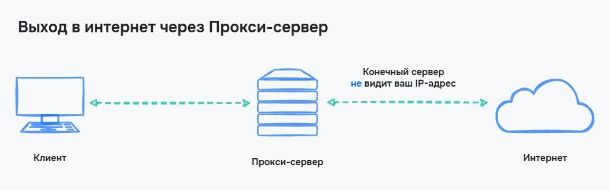
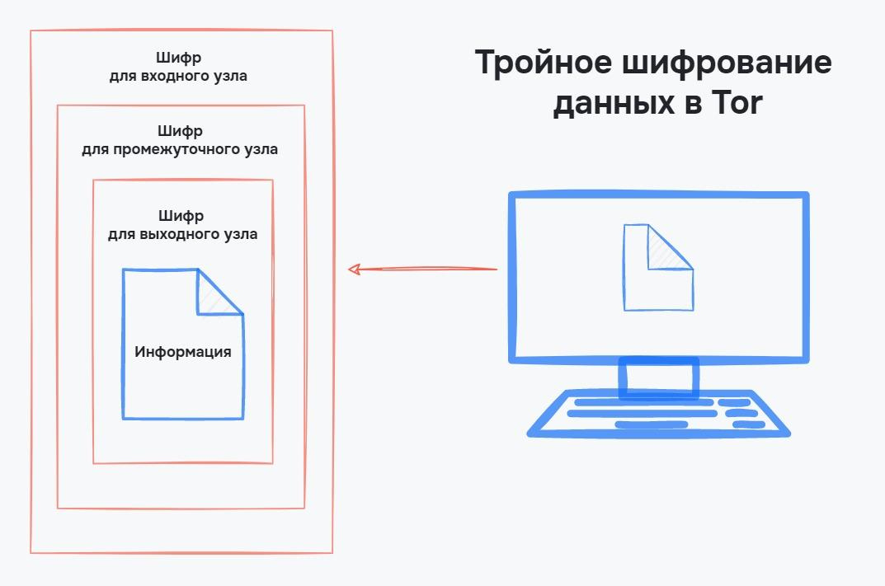

# Приватність та безпека

## VPN

VPN (Virtual Private Network / Віртуальна приватна мережа) — безпека забезпечується створенням приватної мережі поверх інтернету. У цьому випадку дані, що пересилаються, не відстежуються в інтернеті, а можуть додатково шифруватися

-   Virtual — віртуальна. На базі сервера VPN можна об'єднати кілька комп'ютерів в єдину мережу, якби створювалася стандартна локальна мережа. Різниця в способі підключення — комп'ютери можуть бути підключені звідки завгодно і не потрібно їх об'єднувати. Тому мережа і називається віртуальною
-   Private — приватна. До створеної віртуальної мережі не можна зайти без доступу, ця мережа не видно і з інтернету. Тому мережа і називається приватною
-   Network — мережа. VPN об'єднує комп'ютери в єдину систему, тому це мережа

Сам собою VPN — це сервер, до якого користувачі підключаються в приватну мережу. З цієї мережі й походять запити до інтернету або до внутрішніх ресурсів мережі. Оскільки підключення до Інтернету відбувається не від клієнта, а від VPN сервера, то VPN використовують для обходу блокувань сайтів або додатків в інтернеті

<figure>
    
    <figcaption>Вихід в інтернет з VPN</figcaption>
</figure>

Безпека усієї системи забезпечується шифруванням ще до переходу даних до провайдера. Значить, немає місць, де можна перехопити інформацію, що передається. Щоб побачити це, проілюструємо процес підключення без VPN та з ним

<figure>
    
    <figcaption>Підключення до інтернету без VPN</figcaption>
</figure>

<figure>
    
    <figcaption>Підключення до інтернету з VPN</figcaption>
</figure>

При використанні VPN кінцевий сервер, на який передаються дані, не бачить ні нашу IP-адресу, ні нашу геолокацію.

### Плюси VPN

-   Шифрування даних ще до моменту передачі інформації до провайдера
-   Можливість використання приватних мереж при віддаленій роботі
-   VPN дозволяє підключатися до будь-якого пристрою і з будь-якої точки світу
-   VPN забезпечує достатню приватність в Інтернеті

### Мінуси VPN

-   Додатковий сервер може загальмувати швидкість підключення
-   Неправильно налаштований сервер VPN може дозволити шахраям дізнатися нашу IP-адресу

## Проксі-сервер

Проксі-сервер — сервер, який є проміжною ланкою між користувачем та інтернетом. Як і при використанні VPN, клієнт надсилає дані не безпосередньо на кінцевий сервер, а через посередника. Цей спосіб дозволяє приховати нашу справжню IP-адресу від кінцевого сервера і обійти багато блокування провайдера

<figure>
    
    <figcaption>Підключення до інтернету через проксі-сервер</figcaption>
</figure>

Схема використання проксі-сервера трохи схожа використання VPN. Різниця в тому, що проксі — це просто ще один сервер, який допомагає приховати нашу справжню IP-адресу, але він не забезпечує безпеку даних, що передаються. При використанні проксі дані проходять без додаткового шифрування, що залишає можливість їх перехоплення.

### Плюси проксі-сервера

-   Приховування справжньої IP-адреси
-   Обхід обмежень провайдера

### Мінуси проксі-сервера

-   Низька швидкість з'єднання при використанні безкоштовних проксі-серверів
-   Можлива видача «поганих» IP-адрес, які забанені на різних ресурсах через порушення правил

## Tor

Tor (The Onion Router / Цибулевий маршрутизатор) — це браузер, створений для забезпечення анонімності в мережі Інтернет. Клієнтське програмне забезпечення Tor маршрутизує Інтернет-трафік через всесвітню мережу добровільно встановлених серверів з метою приховування розташування користувача.

Основа цибульної маршрутизації — використання кількох проксі-серверів між клієнтом та кінцевим сервером. Таких проксі-серверів три та повідомлення шифрується тричі. У результаті кожен проксі-сервер може розшифрувати лише одну частину, в якій зазначено, куди надсилати повідомлення далі

<figure>
    
    <figcaption>Передача інформації в Tor</figcaption>
</figure>

Кожен з проксі-серверів має своє ім'я

-   Вхідний проксі-сервер — перший проксі, на який надсилається інформація. Він може розшифрувати дані, у яких вказано шлях до проміжного проксі-сервера. Сервер не має виходу в інтернет
-   Проміжний проксі-сервер — як і вхідний, цей проксі-сервер не має виходу в інтернет і може передавати дані тільки всередині мережі Tor. Сервер розшифровує дані про розташування вихідного проксі-сервера
-   Вихідний проксі-сервер — сервер, який має вихід в інтернет. Адреса вихідного вузла буде відома кінцевому серверу, але через інші проксі-сервери адреса користувача залишається невідомою

Через те, що кожен проксі-сервер потроху розшифровує дані, технологія називається шифруванням цибулі. Процес схожий на поступове зняття шарів із цибулі

<figure>
    
    <figcaption>Потрійне шифрування в Tor</figcaption>
</figure>

Усередині Tor сформувалася своя глобальна мережа, до якої не можна потрапити з Інтернету. Так як дані багаторазово шифруються, відстежити відправника повідомлення вкрай важко.
