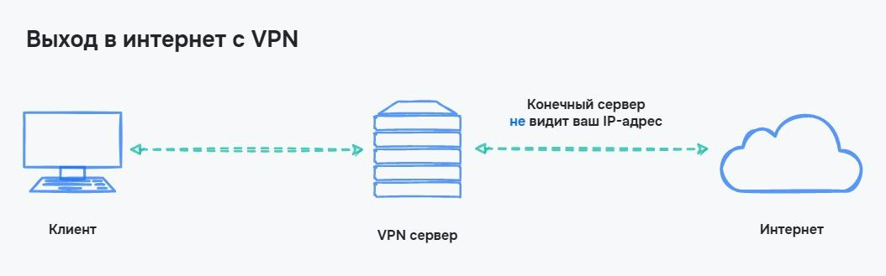
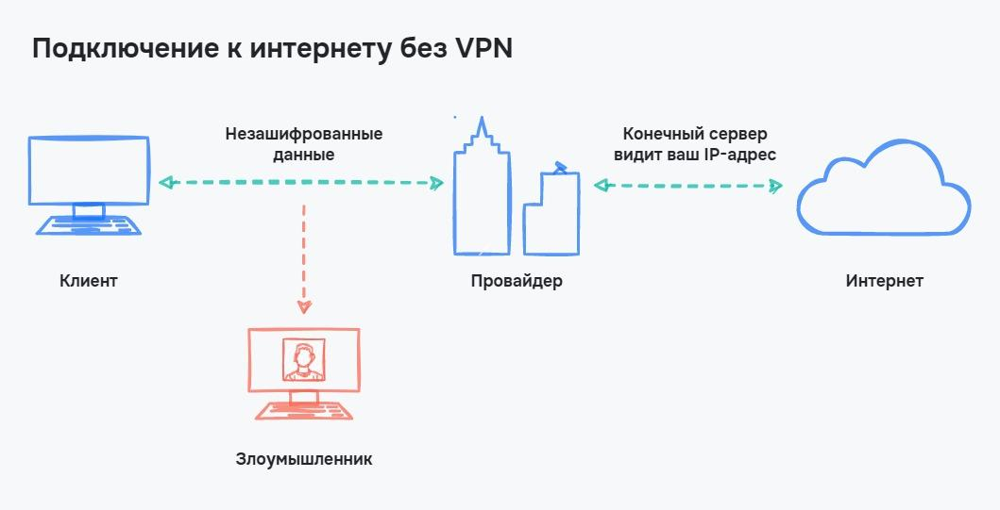
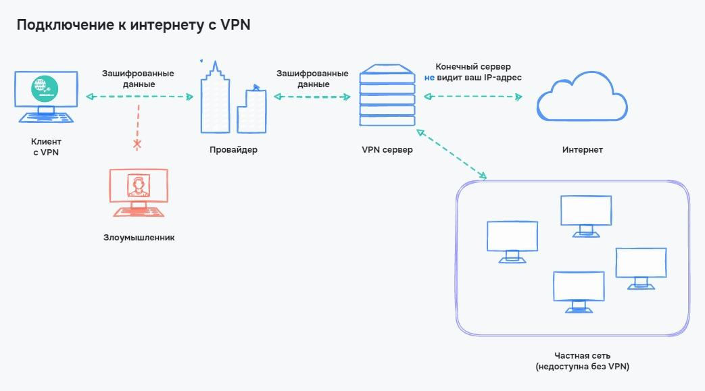
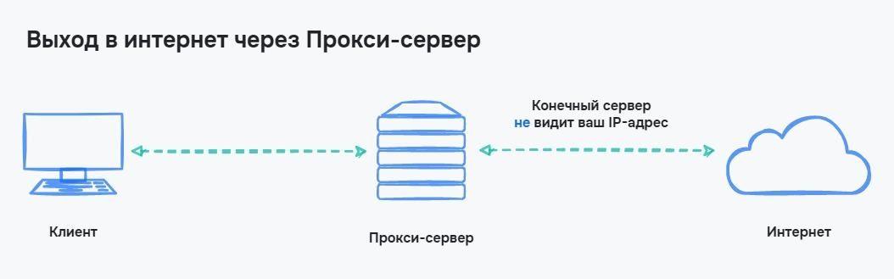
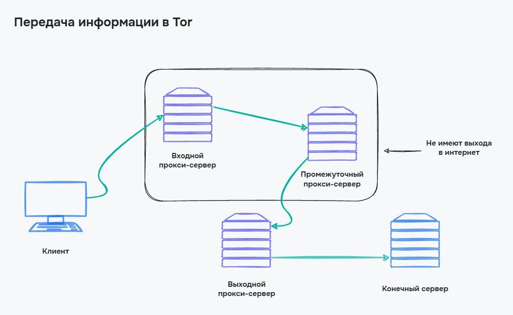
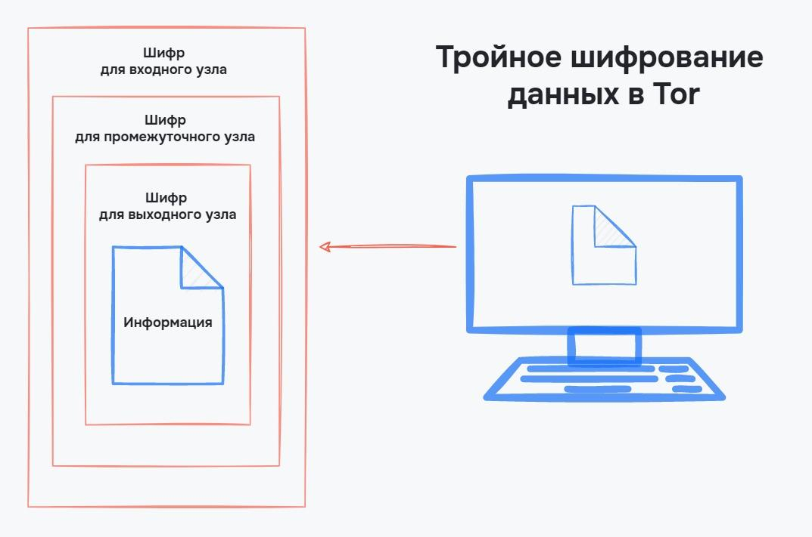

# Приватність

## VPN (Virtual Private Network / Віртуальна приватна мережа)

VPN — є засобом забезпечення приватності та безпеки в інтернеті. Вона працює, створюючи захищену приватну мережу поверх публічного Інтернету. Основні особливості VPN включають:

- Віртуальність (Virtual) — VPN дозволяє об'єднати кілька комп'ютерів в єдину мережу, навіть якщо вони фізично розташовані в різних місцях. Це створює віртуальний зв'язок, подібний до традиційної локальної мережі (LAN).
- Приватність (Private) — VPN створює приватну мережу, до якої можуть мати доступ лише авторизовані користувачі. Це означає, що дані, які пересилаються в мережі, залишаються конфіденційними.
- Мережа (Network) — VPN об'єднує комп'ютери в єдину мережу, де вони можуть обмінюватися даними безпечно і приватно.

<figure>
    
    <figcaption>Вихід в інтернет з VPN</figcaption>
</figure>

### Переваги VPN

- Шифрування даних — дані шифруються ще до їх передачі через Інтернет, що забезпечує їх конфіденційність і захищає від перехоплення.
- Віддалена робота — VPN дозволяє віддаленим користувачам підключатися до внутрішніх ресурсів компанії або мережі, забезпечуючи безпеку при віддаленій роботі.
- Анонімність в мережі — VPN приховує реальну IP-адресу користувача, забезпечуючи більшу анонімність в Інтернеті.
- Обхід обмежень — VPN може допомогти обійти обмеження і цензуру, що накладені на деякі веб-сайти або послуги провайдером.

<figure>
    
    <figcaption>Підключення до інтернету без VPN</figcaption>
</figure>

<figure>
    
    <figcaption>Підключення до інтернету з VPN</figcaption>
</figure>

### Недоліки VPN

- Збільшена навантаженість — використання VPN може знизити швидкість інтернет-з'єднання через додатковий обробник даних на сервері VPN.
- Настройка і підтримка — налаштування та підтримка VPN можуть вимагати додаткових зусиль і знань.
- Вибір надійного провайдера — для безпеки важливо обрати надійного провайдера VPN, оскільки ненадійний може потенційно загрожувати конфіденційності користувача.

## Проксі-сервер

Проксі-сервер — це проміжна ланка між користувачем та інтернетом, яка використовується для приховування справжньої IP-адреси користувача.

<figure>
    
    <figcaption>Підключення до інтернету через проксі-сервер</figcaption>
</figure>

### Переваги проксі-серверів

- Приховування IP-адреси — забезпечує анонімність користувача в Інтернеті.
- Обхід блокувань — допомагає обійти блокування сайтів і обмеження.
- Швидкість з'єднання — зазвичай проксі-сервери забезпечують швидкість з'єднання, оскільки додатковий шифрувальний шар, як у VPN, відсутній.

### Недоліки проксі-серверів

- Відсутність шифрування — проксі-сервери не завжди надають шифрування даних, що пересилаються, що може призвести до незахищеності інформації.
- Обмежена приватність — в порівнянні з VPN, проксі-сервери зазвичай надають меншу приватність користувачам.
- Швидкість з'єднання — низька швидкість з'єднання при використанні безкоштовних проксі-серверів.
- «Погані» IP-адреси — можлива видача IP-адрес, які забанені на різних ресурсах через порушення правил.

## Tor (Цибулевий маршрутизатор)

Tor (The Onion Router) — це браузер, створений для забезпечення анонімності в Інтернеті. Він працює, маршрутизуючи інтернет-трафік через мережу з вузлів, які волонтери надають для цієї мережі. Основні особливості Tor включають:

Основа цибульної маршрутизації — використання кількох проксі-серверів між клієнтом та кінцевим сервером. Таких проксі-серверів три та повідомлення шифрується тричі. У результаті кожен проксі-сервер може розшифрувати лише одну частину, в якій зазначено, куди надсилати повідомлення далі.

Кожен з проксі-серверів має своє ім'я:

- Вхідний проксі-сервер — перший проксі, на який надсилається інформація. Він може розшифрувати дані, у яких вказано шлях до проміжного проксі-сервера. Сервер не має виходу в інтернет.
- Проміжний проксі-сервер — як і вхідний, цей проксі-сервер не має виходу в інтернет і може передавати дані тільки всередині мережі Tor. Сервер розшифровує дані про розташування вихідного проксі-сервера.
- Вихідний проксі-сервер — сервер, який має вихід в інтернет. Адреса вихідного вузла буде відома кінцевому серверу, але через інші проксі-сервери адреса користувача залишається невідомою.

<figure>
    
    <figcaption>Передача інформації в Tor</figcaption>
</figure>

Через те, що кожен проксі-сервер потроху розшифровує дані, технологія називається шифруванням цибулі. Процес схожий на поступове зняття шарів із цибулі.

<figure>
    
    <figcaption>Потрійне шифрування в Tor</figcaption>
</figure>

### Переваги Tor

- Висока анонімність — Tor забезпечує високий рівень анонімності, оскільки IP-адреса користувача залишається прихованою.
- Обхід цензури — Tor дозволяє обійти цензуру і блокування.
- Захист приватності — інформація, що пересилається через Tor, залишається конфіденційною і захищеною від перехоплення.

### Недоліки Tor

- Знижена швидкість — маршрутизація через численні вузли може призвести до зниження швидкості з'єднання.
- Обмежена підтримка сайтів — деякі веб-сайти можуть блокувати доступ користувачам, які використовують Tor.
- Складність використання — Tor може бути складним для некваліфікованих користувачів, оскільки він вимагає спеціального браузера та налаштувань.
