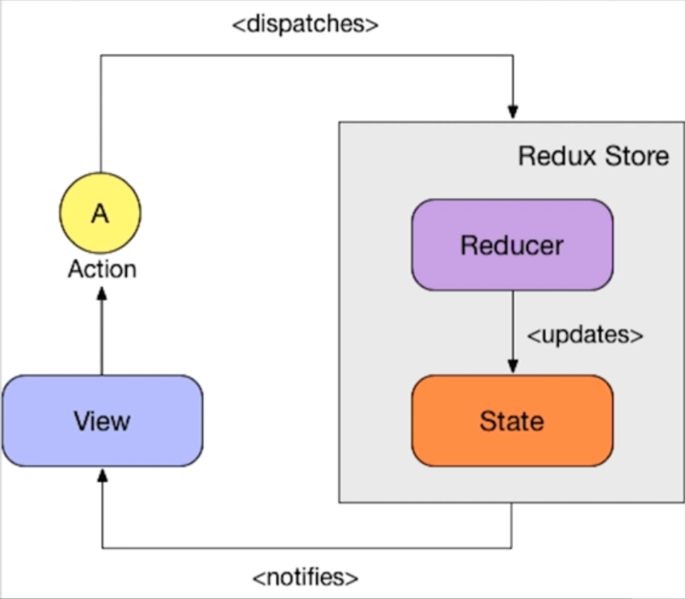

# Redux

Redux є бібліотекою для керування станом застосунків, яка реалізує патерн <a href='/Архитектура/Патерни/Архітектурні/Flux.md'>Flux</a>.



Основні особливості та концепції Redux:

-   Розв'язує проблему керування станом в застосунку, забезпечуючи одну джерело правди (single source of truth) для зберігання стану.
-   Забезпечує односпрямовану синхронізацію зі сховищем до представлення через підписку.
-   Взаємодія між View і Store відбувається за допомогою Action.
-   Сховище (Store) пов'язане з компонентами не безпосередньо, а за допомогою HOC (Higher Order Components) `connect` або хуків `useSelector` та `useDispatch`.
-   Може бути використана будь-яка бібліотека або фреймворк для створення користувацького інтерфейсу (UI).

## Reducer

Reducer — це чиста функція, яка залежить виключно від стану (state) та дії (action), які вона отримує. Вона оновлює глобальний стан у відповідь на дію або повертає попередній стан, якщо дія не підходить.

## Проста реалізація Redux

Для початку, розглянемо просту реалізацію Redux.

```js
const createStore = (reducer, initialState) => {
    let state = initialState;

    return {
        dispatch: (action) => {
            state = reducer(state, action);
        },
        getState: () => state,
    };
};

const combineReducers = (reducersMap) => (state, action) => {
    const nextState = {};

    for (const [reducerName, reducer] of Object.entries(reducersMap)) {
        nextState[reducerName] = reducer(state[reducerName], action);
    }

    return nextState;
};

const todoReducer = (state, action) => {
    switch (action.type) {
        case "ADD_TODO":
            return [
                ...state,
                {
                    id: action.id,
                    text: action.text,
                    completed: false,
                },
            ];
        case "TOGGLE_TODO":
            return state.map((todo) => {
                if (todo.id === action.id) {
                    return { ...todo, completed: !todo.completed };
                }
                return todo;
            });
        default:
            return state;
    }
};

const counterReducer = (state, action) => {
    if (action.type === "ADD") return state + 1;
    return state;
};

const applyMiddleware = (middleware) => (createStore) => (reducer, state) => {
    const store = createStore(reducer, state);

    return {
        dispatch: (action) => middleware(store)(store.dispatch)(action),
        getState: store.getState,
    };
};

const rootReducer = combineReducers({
    todoState: todoReducer,
    counterState: counterReducer,
});
```

У цьому прикладі ми маємо функцію `createStore`, яка створює об'єкт `store` з методами `dispatch` та `getState`. Метод `dispatch` приймає дію (action) і викликає редуктор (reducer), оновлюючи стан згідно з дією. Метод `getState` повертає поточний стан.

Функція `combineReducers` дозволяє об'єднати кілька редукторів в один кореневий редуктор. Кожен редуктор відповідає за свою частину стану, і кореневий редуктор об'єднує їх у загальний стан.

Далі ми визначаємо два простих редуктора: `todoReducer` та `counterReducer`. `todoReducer` оновлює стан для списку справ (todos), додаючи або змінюючи елементи. `counterReducer` оновлює стан лічильника (counter), додаючи одиницю.

За допомогою `combineReducers` ми об'єднуємо ці два редуктора в один кореневий редуктор `rootReducer`, який відповідає за загальний стан застосунку.
